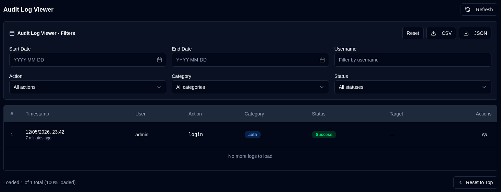

# 审计日志 {#audit-logs}

审计日志提供 **duplistatus** 中所有系统更改和用户操作的完整记录。这有助于跟踪配置更改、用户活动和系统操作，用于安全性和故障排除。

## 审计日志查看器 {#audit-log-viewer}

审计日志查看器按时间顺序显示所有已记录事件，包含以下信息：

- **Timestamp**：事件发生时间
- **User**：执行操作的用户名（自动操作为 "System"）
- **Action**：执行的具体操作
- **Category**：操作类别（Authentication、User Management、Configuration、Backup Operations、Server Management、System Operations）
- **Status**：操作是否成功
- **Target**：受影响的对象（如适用）
- **Details**：有关操作的附加信息

### 查看日志详情 {#viewing-log-details}

点击任意日志条目旁的 <IconButton icon="lucide:eye" /> 眼睛图标，查看详细信息，包括：
- 完整时间戳
- 用户信息
- 完整操作详情（例如：更改的字段、统计等）
- IP 地址和用户代理
- 错误消息（若操作失败）

### 导出审计日志 {#exporting-audit-logs}

您可以将筛选后的审计日志导出为两种格式：

| Button | Description |
|:------|:-----------|
| <IconButton icon="lucide:download" label="CSV"/> | 将日志导出为 CSV 文件，便于电子表格分析 |
| <IconButton icon="lucide:download" label="JSON"/> | 将日志导出为 JSON 文件，便于程序化分析 |

:::note
导出仅包含根据当前活动筛选器可见的日志。要导出所有日志，请先清除所有筛选器。
:::
