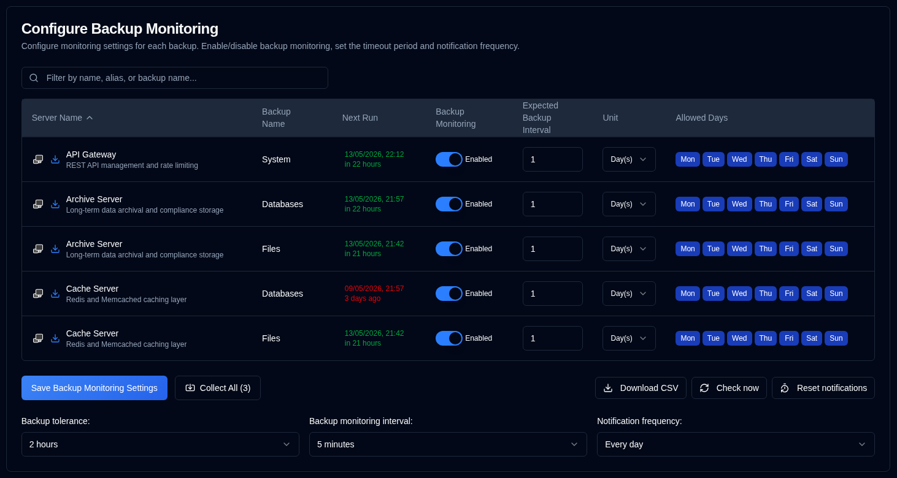

# 备份监控 {#backup-monitoring}

## 服务器筛选 {#server-filtering}

此页面上的服务器列表可使用筛选字段进行筛选。

**筛选匹配项：**
- 服务器 ID
- 服务器 URL
- 备份任务名称

这使您能在管理众多系统时，在监控设置中快速定位特定服务器或备份。

## 配置按备份监控设置 {#configure-per-backup-monitoring-settings}

-  **Server Name**：要监控逾期备份的服务器名称。
   - 点击 <SvgIcon svgFilename="duplicati_logo.svg" height="18"/> 打开 Duplicati 服务器的 Web 界面
   - 点击 <IIcon2 icon="lucide:download" height="18"/> 从此服务器收集备份日志。
- **Backup Name**：要监控逾期备份的备份名称。
- **Next Run**：下次计划备份时间，若计划在未来则显示为绿色，若已逾期则显示为红色。悬停在 "Next Run" 值上会显示工具提示，包含数据库中上次备份时间戳，格式为完整日期/时间和相对时间。
- **Backup Monitoring**：启用或禁用此备份的备份监控。
- **Expected Backup Interval**：预期的备份间隔。
- **Unit**：预期间隔的单位。
- **Allowed Days**：允许备份的星期几。

若服务器名称旁的图标为灰色，表示该服务器未在 [Settings → Server Settings](/user-guide/settings/server-settings) 中配置。

:::note
从 Duplicati 服务器收集备份日志时，**duplistatus** 会自动更新备份监控间隔和配置。
:::

:::tip
为获得最佳效果，在 Duplicati 服务器中更改备份任务间隔配置后，请重新收集备份日志。这能确保 **duplistatus** 与当前配置保持同步。
:::

## 全局配置 {#global-configurations}

这些设置适用于所有备份：

| Setting                         | Description                                                                                                                                                                                                                                                                                                                             |
|:--------------------------------|:----------------------------------------------------------------------------------------------------------------------------------------------------------------------------------------------------------------------------------------------------------------------------------------------------------------------------------------|
| **Backup Tolerance**            | 标记为逾期前添加到预期备份时间的宽限期（允许的额外时间）。默认为 **1 hour**。                                                                                                                                                                                                             |
| **Backup Monitoring Interval** | 系统检查逾期备份的频率。默认为 **5 minutes**。                                                                                                                                                                                                                                                            |
| **Notification Frequency**      | 发送逾期通知的频率：  **One time**：备份变为逾期时**仅发送一次**通知。   `Every day`：逾期期间**每天**发送通知（默认）。   `Every week`：逾期期间**每周**发送通知。   `Every month`：逾期期间**每月**发送通知。 |

## 可用操作 {#available-actions}

| Button                                                              | Description                                                                                                                           |
|:--------------------------------------------------------------------|:--------------------------------------------------------------------------------------------------------------------------------------|
| <IconButton label="Save Backup Monitoring Settings" />              | 保存设置，清除任何已禁用备份的计时器，并运行逾期检查。                                                |
| <IconButton icon="lucide:import" label="Collect All (#)"/>          | 从所有已配置服务器收集备份日志，括号内为要收集的服务器数量。                                   |
| <IconButton icon="lucide:download" label="Download CSV"/>           | 下载包含所有备份监控设置及数据库中 "Last Backup Timestamp (DB)" 的 CSV 文件。               |
| <IconButton icon="lucide:refresh-cw" label="Check now"/>            | 立即运行逾期备份检查。更改配置后很有用。还会触发 "Next Run" 重新计算。 |
| <IconButton icon="lucide:timer-reset" label="Reset notifications"/> | 重置所有备份上次发送的逾期通知。                                                                            |
