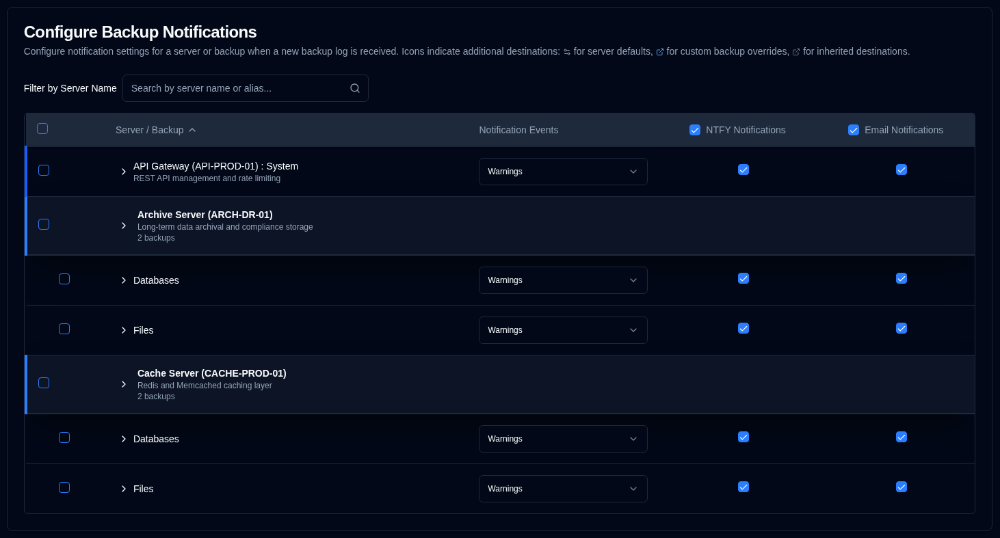
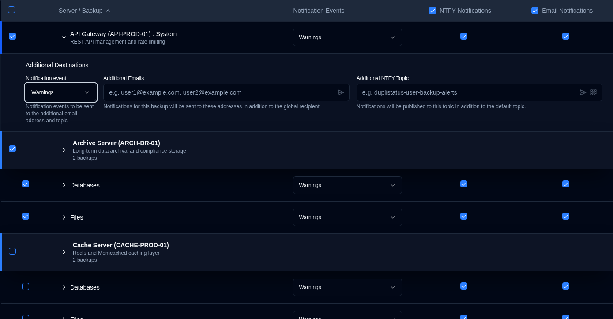

# 备份通知 {#backup-notifications}

使用此设置，在[收到新备份日志](../../installation/duplicati-server-configuration.md)时发送通知。

备份通知表格按服务器组织。显示格式取决于服务器拥有的备份数量：
- **Multiple backups**：显示服务器标题行，下方为各备份行。点击服务器标题可展开或折叠备份列表。
- **Single backup**：显示带蓝色左边框的**合并行**，显示：
  -  未配置服务器别名时为 **Server Name : Backup Name**，或
  -  已配置时为 **Server Alias (Server Name) : Backup Name**。

此页面具有自动保存功能。您所做的任何更改都会自动保存。

 

## 筛选 {#filter}

使用页面顶部的 **Filter by Server Name** 字段，按服务器名称或别名快速查找特定备份。表格会自动筛选，仅显示匹配条目。

 

## 配置按备份通知设置 {#configure-per-backup-notification-settings}

| Setting                       | Description                                               | Default Value |
| :---------------------------- | :-------------------------------------------------------- | :------------ |
| **Notification Events**       | 配置何时为新备份日志发送通知。 | **Warnings**    |
| **NTFY**                      | 启用或禁用此备份的 NTFY 通知。     | **Enabled**     |
| **Email**                     | 启用或禁用此备份的电子邮件通知。    | **Enabled**    |

**Notification Events Options:**

- **all**：为所有备份事件发送通知。
- **warnings**：仅对警告和错误发送通知（默认）。
- **errors**：仅对错误发送通知。
- **off**：禁用此备份的新备份日志通知。

 

## 附加目标 {#additional-destinations}

附加通知目标允许您向全局设置之外的特定电子邮件地址或 NTFY 主题发送通知。系统使用分层继承模型，备份可从其服务器继承默认设置，或使用备份专属值覆盖。

附加目标配置通过服务器和备份名称旁的情境图标指示：

- **Server icon** <IconButton icon="lucide:settings-2" style={{border: 'none', padding: 0, color: 'inherit', background: 'transparent'}} />：在服务器级别配置了默认附加目标时，显示在服务器名称旁。

- **Backup icon** <IconButton icon="lucide:external-link" style={{border: 'none', padding: 0, color: '#60a5fa', background: 'transparent'}} /> (blue)：配置了自定义附加目标（覆盖服务器默认值）时，显示在备份名称旁。

- **Backup icon** <IconButton icon="lucide:external-link" style={{border: 'none', padding: 0, color: '#64748b', background: 'transparent'}} /> (gray)：备份从服务器默认值继承附加目标时，显示在备份名称旁。

若未显示图标，表示该服务器或备份未配置附加目标。

### 服务器级默认值 {#server-level-defaults}

您可在服务器级别配置默认附加目标，该服务器上的所有备份将自动继承。

1. 前往 [Settings → Backup Notifications](backup-notifications-settings.md)。
2. 表格按服务器分组，服务器标题行显示服务器名称、别名和备份数量。
   - **Note**：对于只有一个备份的服务器，显示合并行而非单独的服务器标题。无法直接从合并行配置服务器级默认值。若需为单备份服务器配置服务器默认值，可临时向该服务器添加另一个备份，或该备份的 Additional Destinations 会自动继承任何现有服务器默认值。
3. 点击服务器行的任意位置，展开 **Default Additional Destinations for this server** 部分。
4. 配置以下默认设置：
   - **Notification event**：选择哪些事件会触发向附加目标发送通知（**all**、**warnings**、**errors** 或 **off**）。
   - **Additional Emails**：输入一个或多个电子邮件地址（逗号分隔），该服务器上所有备份的通知将发送给这些地址。点击 <IconButton icon="lucide:send-horizontal" style={{border: 'none', padding: 0, color: 'inherit', background: 'transparent'}} /> 图标按钮，向字段中的地址发送测试邮件。
   - **Additional NTFY Topic**：输入自定义 NTFY 主题名称，该服务器上所有备份的通知将发布到此主题。点击 <IconButton icon="lucide:send-horizontal" style={{border: 'none', padding: 0, color: 'inherit', background: 'transparent'}} /> 图标按钮向主题发送测试通知，或点击 <IconButton icon="lucide:qr-code" style={{border: 'none', padding: 0, color: 'inherit', background: 'transparent'}} /> 图标按钮显示主题二维码以配置设备接收通知。

**Server Default Management:**

- **Sync to All**：清除所有备份覆盖，使所有备份从服务器默认值继承。
- **Clear All**：清除服务器默认值和所有备份的附加目标，同时保持继承结构。

### 按备份配置 {#per-backup-configuration}

各备份自动继承服务器默认值，但您可以为特定备份任务覆盖它们。

1. 点击备份行的任意位置，展开其 **Additional Destinations** 部分。
2. 配置以下设置：
   - **Notification event**：选择哪些事件会触发向附加目标发送通知（**all**、**warnings**、**errors** 或 **off**）。
   - **Additional Emails**：输入一个或多个电子邮件地址（逗号分隔），除全局收件人外还会收到通知。点击 <IconButton icon="lucide:send-horizontal" style={{border: 'none', padding: 0, color: 'inherit', background: 'transparent'}} /> 图标按钮，向字段中的地址发送测试邮件。
   - **Additional NTFY Topic**：输入自定义 NTFY 主题名称，除默认主题外还会发布通知。点击 <IconButton icon="lucide:send-horizontal" style={{border: 'none', padding: 0, color: 'inherit', background: 'transparent'}} /> 图标按钮向主题发送测试通知，或点击 <IconButton icon="lucide:qr-code" style={{border: 'none', padding: 0, color: 'inherit', background: 'transparent'}} /> 图标按钮显示主题二维码以配置设备接收通知。

**Inheritance Indicators:**

- **Link icon** <IconButton icon="lucide:link" style={{border: 'none', padding: 0, color: '#3b82f6', background: 'transparent'}} /> in blue：表示该值从服务器默认值继承。点击字段将创建覆盖以供编辑。
- **Broken link icon** <IconButton icon="lucide:link-2-off" style={{border: 'none', padding: 0, color: '#3b82f6', background: 'transparent'}} /> in blue：表示该值已被覆盖。点击图标可恢复继承。

**Additional Destinations Behavior:**

- 配置后，通知会同时发送到全局设置和附加目标。
- 附加目标的通知事件设置与主通知事件设置独立。
- 若附加目标设置为 **off**，不会向这些目标发送通知，但主通知仍按主要设置工作。
- 当备份从服务器默认值继承时，对服务器默认值的任何更改会自动应用到该备份（除非已被覆盖）。

 

## 批量编辑 {#bulk-edit}

您可以使用批量编辑功能一次编辑多个备份的附加目标设置。当您需要将相同的附加目标应用到许多备份任务时特别有用。

1. 前往 [Settings → Backup Notifications](backup-notifications-settings.md)。
2. 使用第一列的复选框选择要编辑的备份或服务器。
   - 使用标题行的复选框选择或取消选择所有可见备份。
   - 选择前可使用筛选器缩小列表。
3. 选择备份后，会出现批量操作栏，显示所选备份数量。
4. 点击 **Bulk Edit** 打开编辑对话框。
5. 配置附加目标设置：
   - **Notification Event**：为所有所选备份设置通知事件。
   - **Additional Emails**：输入电子邮件地址（逗号分隔）以应用到所有所选备份。
   - **Additional NTFY Topic**：输入 NTFY 主题名称以应用到所有所选备份。
   - 批量编辑对话框中提供测试按钮，可在应用到多个备份前验证电子邮件地址和 NTFY 主题。
6. 点击 **Save** 将设置应用到所有所选备份。

**Bulk Clear:**

要从所选备份中移除所有附加目标设置：

1. 选择要清除的备份。
2. 点击批量操作栏中的 **Bulk Clear**。
3. 在对话框中确认操作。

这将移除所选备份的所有附加电子邮件地址、NTFY 主题和通知事件。清除后，备份将恢复从服务器默认值继承（若已配置）。

 
