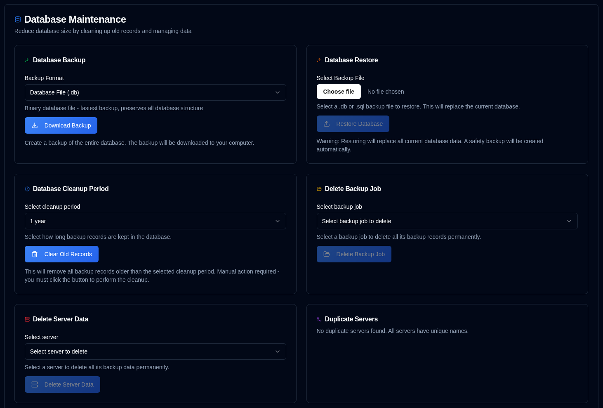

# 数据库维护 {#database-maintenance}

通过数据库维护操作管理备份数据并优化性能。

 

## 数据库备份 {#database-backup}

创建整个数据库的备份，用于保管或迁移。

1.  前往 [设置 → 数据库维护](database-maintenance.md)。
2.  在 **Database Backup** 部分，选择备份格式：
    - **Database File (.db)**：二进制格式——最快的备份方式，完全保留数据库结构
    - **SQL Dump (.sql)**：文本格式——人类可读的 SQL 语句，可在恢复前编辑
3.  点击 <IconButton icon="lucide:download" label="Download Backup" />。
4.  备份文件将下载到您的计算机，文件名包含时间戳。

**备份格式：**

- **.db 格式**：建议用于常规备份。使用 SQLite 的 backup API 创建数据库文件的精确副本，即使数据库正在使用也能保证一致性。
- **.sql 格式**：适用于迁移、检查或需要在恢复前编辑数据的情况。包含重建数据库所需的全部 SQL 语句。

**最佳实践：**

- 在重大操作（清理、合并等）前创建常规备份
- 将备份存储在与应用程序分开的安全位置
- 定期测试恢复流程以确保备份有效

 

## 数据库恢复 {#database-restore}

从先前创建的备份文件恢复数据库。

1.  前往 [设置 → 数据库维护](database-maintenance.md)。
2.  在 **Database Restore** 部分，点击文件输入框并选择备份文件：
    - 支持的格式：`.db`、`.sql`、`.sqlite`、`.sqlite3`
    - 最大文件大小：100MB
3.  点击 <IconButton icon="lucide:upload" label="Restore Database" />。
4.  在对话框中确认操作。

**恢复流程：**

- 恢复前会自动创建当前数据库的安全备份
- 当前数据库将被备份文件替换
- 为安全起见清除所有会话（用户须重新登录）
- 恢复后验证数据库完整性
- 清除所有缓存以确保数据最新

**恢复格式：**

- **.db 文件**：直接替换数据库文件。最快的恢复方式。
- **.sql 文件**：执行 SQL 语句重建数据库。可按需选择性恢复。

:::warning
恢复数据库将**替换所有当前数据**。此操作无法撤销。  
会自动创建安全备份，但建议在恢复前自行创建备份。
 
**重要：** 恢复后，为安全起见所有用户会话将被清除。您需要重新登录。
:::

**故障排除：**

- 若恢复失败，将从安全备份自动还原原始数据库
- 确保备份文件未损坏且格式正确
- 对于大型数据库，恢复过程可能需要数分钟

 

---

 

:::note
以下所有维护功能均适用：仪表板、详情页和图表上的所有统计均基于 **duplistatus** 数据库中的数据计算。删除旧信息将影响这些计算。
 
若误删数据，可使用 [采集备份日志](../collect-backup-logs.md) 功能恢复。
:::

 

## 数据清理周期 {#data-cleanup-period}

删除过期的备份记录以释放存储空间并提升系统性能。

1.  前往 [设置 → 数据库维护](database-maintenance.md)。
2.  选择保留周期：
    - **6 months**：保留最近 6 个月的记录。
    - **1 year**：保留最近 1 年的记录。
    - **2 years**：保留最近 2 年的记录（默认）。
    - **Delete all data**：删除所有备份记录和服务器。 
3.  点击 <IconButton icon="lucide:trash-2" label="Clear Old Records" />。
4.  在对话框中确认操作。

**清理效果：**

- 删除早于所选周期的备份记录
- 更新所有相关统计和指标

:::warning

选择「Delete all data」选项将**永久删除系统中的所有备份记录和配置设置**。

强烈建议在此操作前创建数据库备份。

:::

 

## 删除备份任务数据 {#delete-backup-job-data}

删除特定备份任务（类型）的数据。

1.  前往 [设置 → 数据库维护](database-maintenance.md)。
2.  从下拉列表中选择备份任务。
    - 备份按服务器别名或名称、再按备份名称排序。
3.  点击 <IconButton icon="lucide:folder-open" label="Delete Backup Job" />。
4.  在对话框中确认操作。

**删除效果：**

- 永久删除与此备份任务/服务器关联的所有数据
- 清理相关配置设置
- 相应更新仪表板统计

 

## 删除服务器数据 {#delete-server-data}

删除特定服务器及其所有关联备份数据。

1.  前往 [设置 → 数据库维护](database-maintenance.md)。
2.  从下拉列表中选择服务器。
3.  点击 <IconButton icon="lucide:server" label="Delete Server Data" />。
4.  在对话框中确认操作。

**删除效果：**

- 永久删除所选服务器及其所有备份记录
- 清理相关配置设置
- 相应更新仪表板统计

 

## 合并重复服务器 {#merge-duplicate-servers}

检测并合并名称相同但 ID 不同的重复服务器。使用此功能将它们合并为单一服务器条目。  

当 Duplicati 在升级或重装后 `machine-id` 发生变化时可能出现此情况。仅存在重复服务器时才会显示。若未检测到重复，该部分将显示所有服务器名称唯一的提示。

1.  前往 [设置 → 数据库维护](database-maintenance.md)。
2.  若检测到重复服务器，将显示 **Merge Duplicate Servers** 部分。
3.  查看重复服务器组列表：
    - 每组显示名称相同但 ID 不同的服务器
    - **Target Server**（按创建日期最新）会高亮显示
    - 将合并的 **Old Server IDs** 单独列出
4.  勾选每组旁的复选框以选择要合并的服务器组。
5.  点击 <IconButton icon="lucide:git-merge" label="Merge Selected Servers" />。
6.  在对话框中确认操作。

**合并流程：**

- 所有旧服务器 ID 合并到目标服务器（按创建日期最新）
- 所有备份记录和配置转移到目标服务器
- 删除旧服务器条目
- 自动更新仪表板统计

:::info[IMPORTANT]
此操作无法撤销。确认前建议创建数据库备份。  
:::

 
