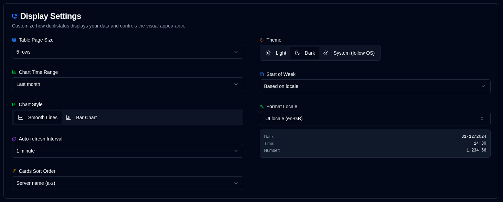

# 显示 {#display}

配置用户界面和显示偏好。

 

| Setting                   | Description                                         | Default Value      |
|:--------------------------|:----------------------------------------------------|:-------------------|
| **Table Size**            | 服务器详情页每页显示的行数。 | 5 rows             |
| **Theme**                 | 选择浅色、深色或跟随操作系统外观（prefers light/dark mode）。 | Follow OS when unset |
| **Chart Time Range**      | 图表显示的时间区间。可选：**1W**（最近 7 天）、**2W**（最近 14 天）、**1M**（最近 30 天）、**3M**（最近 90 天）。也可直接从图表标题切换时间范围。 | 1 month            |
| **Chart Style**           | 在平滑折线图或柱状图可视化之间选择。两种模式均使用时间桶聚合以优化显示。也可直接从图表标题切换。 | Smooth lines       |
| **Format Locale**         | 选择与 UI 语言独立的格式区域设置（支持 416 个区域设置）。影响日期、时间和数字的显示方式。选择后会显示实时预览。示例：UI 语言 = 德语，Format locale = English (UK) → 德语 UI 配合英国日期格式。 | Based on UI language |
| **Auto-refresh Interval** | 页面自动刷新的频率。              | 1 minute           |
| **Cards Sort Order**      | 仪表板上卡片的排序方式。              | Server name (a-z)  |
| **Start of Week**         | 配置每周起始日。                     | Based on locale    |

 

:::tip
**Quick Access**：右键点击应用工具栏中的自动刷新按钮可快速访问此页面。
:::
