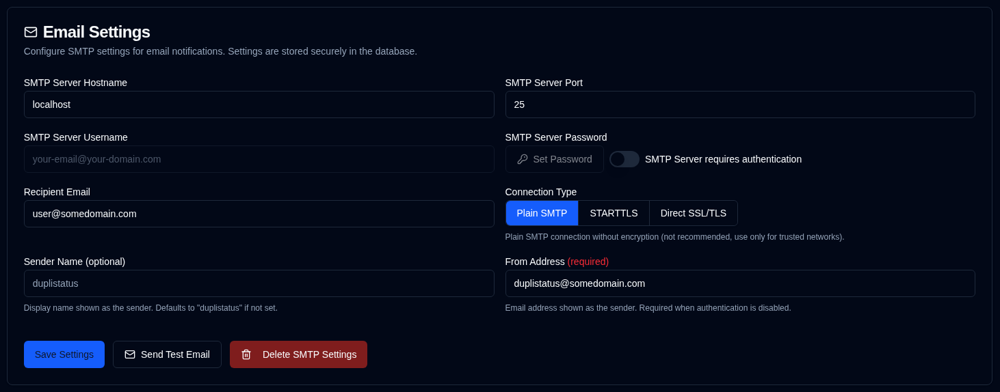

# 电子邮件 {#email}

**duplistatus** 支持通过 SMTP 发送电子邮件通知，作为 NTFY 通知的替代或补充。电子邮件配置现通过 Web 界面管理，并加密存储在数据库中以提高安全性。

| Setting                 | Description                                                      |
|:------------------------|:-----------------------------------------------------------------|
| **SMTP Server Host**    | 电子邮件提供商的 SMTP 服务器（例如 `smtp.gmail.com`）。      |
| **SMTP Server Port**    | 端口号（Plain SMTP 通常为 `25`，STARTTLS 为 `587`，Direct SSL/TLS 为 `465`）。 |
| **Connection Type**     | 在 Plain SMTP、STARTTLS 或 Direct SSL/TLS 之间选择。新配置默认为 Direct SSL/TLS。 |
| **SMTP Authentication** | 切换以启用或禁用 SMTP 认证。禁用时不需要用户名和密码字段。 |
| **SMTP Username**       | 您的电子邮件地址或用户名（启用认证时必填）。 |
| **SMTP Password**       | 您的电子邮件密码或应用专用密码（启用认证时必填）。 |
| **Sender Name**         | 电子邮件通知中显示的发件人名称（可选，默认为 "duplistatus"）。 |
| **From Address**        | 显示为发件人的电子邮件地址。Plain SMTP 连接或未启用认证时必填。启用认证时默认为 SMTP 用户名。请注意，某些电子邮件提供商会用 `SMTP Server Username` 覆盖 `From Address`。 |
| **Recipient Email**     | 接收通知的电子邮件地址。必须是有效的电子邮件格式。 |

侧边栏 **Email** 旁的 <IIcon2 icon="lucide:mail" color="green"/> 绿色图标表示您的设置有效。若图标为 <IIcon2 icon="lucide:mail" color="yellow"/> 黄色，表示您的设置无效或未配置。

当所有必填字段均已设置时图标显示为绿色：SMTP Server Host、SMTP Server Port、Recipient Email，以及（启用认证时的 SMTP Username + Password）或（未启用认证时的 From Address）。

配置未完全填写时，会显示黄色警告框，提示在正确填写电子邮件设置之前不会发送任何邮件。[Backup Notifications](backup-notifications-settings.md) 标签页中的 Email 复选框也会变为灰色并显示 "(disabled)" 标签。

 

## 可用操作 {#available-actions}

| Button                                                           | Description                                              |
|:-----------------------------------------------------------------|:---------------------------------------------------------|
| <IconButton label="Save Settings" />                             | 保存对 NTFY 设置的更改。              |
| <IconButton icon="lucide:mail" label="Send Test Email"/>         | 使用 SMTP 配置发送测试电子邮件。测试邮件显示 SMTP 服务器主机名、端口、连接类型、认证状态、用户名（如适用）、收件人电子邮件、发件地址、发件人名称和测试时间戳。 |
| <IconButton icon="lucide:trash-2" label="Delete SMTP Settings"/> | 删除/清除 SMTP 配置。                   |

 

:::info[IMPORTANT]
  在依赖通知功能之前，必须使用 <IconButton icon="lucide:mail" label="Send Test Email"/> 按钮确认您的电子邮件配置正常工作。

 即使您看到绿色 <IIcon2 icon="lucide:mail" color="green"/> 图标且一切看起来已配置，邮件也可能无法发送。

 **duplistatus** 仅检查 SMTP 设置是否已填写，并不验证邮件是否实际可送达。
:::

 

## 常见 SMTP 提供商 {#common-smtp-providers}

**Gmail:**

- Host: `smtp.gmail.com`
- Port: `587` (STARTTLS) or `465` (Direct SSL/TLS)
- Connection Type: STARTTLS for port 587, Direct SSL/TLS for port 465
- Username: Your Gmail address
- Password: Use an App Password (not your regular password). Generate one at https://myaccount.google.com/apppasswords
- Authentication: Required

**Outlook/Hotmail:**

- Host: `smtp-mail.outlook.com`
- Port: `587`
- Connection Type: STARTTLS
- Username: Your Outlook email address
- Password: Your account password
- Authentication: Required

**Yahoo Mail:**

- Host: `smtp.mail.yahoo.com`
- Port: `587`
- Connection Type: STARTTLS
- Username: Your Yahoo email address
- Password: Use an App Password
- Authentication: Required

### 安全最佳实践 {#security-best-practices}

 - 考虑使用专用电子邮件账户发送通知
 - 使用 "Send Test Email" 按钮测试您的配置
 - 设置加密存储在数据库中
 - **使用加密连接**——生产环境建议使用 STARTTLS 和 Direct SSL/TLS
 - Plain SMTP 连接（端口 25）可用于受信任的本地网络，但不建议在不信任的网络中用于生产环境
