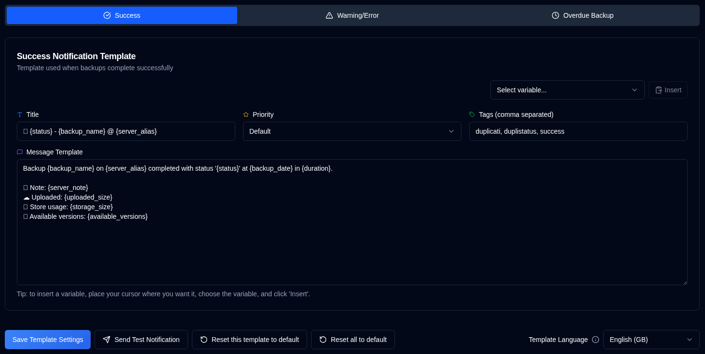

# 模板 {#templates}

**duplistatus** 使用三个模板来生成通知消息。这些模板同时用于 NTFY 和电子邮件通知。

页面包含 **Template Language** 选择器，用于设置默认模板的语言区域。更改语言会更新新默认值的区域设置，但**不会**更改现有模板的文本。要将新语言应用到模板，请手动编辑，或使用 **Reset this template to default**（当前标签页）或 **Reset all to default**（全部三个模板）。

| Template           | Description                                         |
| :----------------- | :-------------------------------------------------- |
| **Success**        | 备份成功完成时使用。            |
| **Warning/Error**  | 备份完成但有警告或错误时使用。 |
| **Overdue Backup** | 备份逾期时使用。                      |

 

## 模板语言 {#template-language}

页面顶部的 **Template Language** 选择器可让您选择默认模板的语言（English、German、French、Spanish、Portuguese）。更改语言会更新默认值的区域设置，但现有自定义模板会保留当前文本，直到您更新它们或使用重置按钮。

 

## 可用操作 {#available-actions}

| Button                                                              | Description                                                                                         |
|:--------------------------------------------------------------------|:----------------------------------------------------------------------------------------------------|
| <IconButton label="Save Template Settings" />                      | 更改模板时保存设置。该按钮保存当前显示的模板（Success、Warning/Error 或 Overdue Backup）。 |
| <IconButton icon="lucide:send" label="Send Test Notification"/>     | 更新模板后检查模板。测试时变量会替换为其名称。对于电子邮件通知，模板标题会成为邮件主题行。 |
| <IconButton icon="lucide:rotate-ccw" label="Reset this template to default"/> | 恢复**所选模板**（当前标签页）的默认模板。重置后请记得保存。 |
| <IconButton icon="lucide:rotate-ccw" label="Reset all to default"/> | 将三个模板（Success、Warning/Error、Overdue Backup）全部恢复为所选 Template Language 的默认值。重置后请记得保存。 |

 

## 变量 {#variables}

所有模板均支持会被实际值替换的变量。下表列出可用变量：

| Variable               | Description                                     | Available In     |
|:-----------------------|:------------------------------------------------|:-----------------|
| `{server_name}`        | 服务器名称。                             | All templates    |
| `{server_alias}`       | 服务器别名。                            | All templates    |
| `{server_note}`        | 服务器备注。                            | All templates    |
| `{server_url}`         | Duplicati Server Web 配置的 URL   | All templates    |
| `{backup_name}`        | 备份名称。                             | All templates    |
| `{status}`             | 备份状态（Success、Warning、Error、Fatal）。 | Success, Warning |
| `{backup_date}`        | 备份日期和时间。                    | Success, Warning |
| `{duration}`           | 备份耗时。                         | Success, Warning |
| `{uploaded_size}`      | 上传的数据量。                        | Success, Warning |
| `{storage_size}`       | 存储使用信息。                      | Success, Warning |
| `{available_versions}` | 可用备份版本数量。            | Success, Warning |
| `{file_count}`         | 处理的文件数量。                      | Success, Warning |
| `{file_size}`          | 已备份文件的总大小。                  | Success, Warning |
| `{messages_count}`     | 消息数量。                             | Success, Warning |
| `{warnings_count}`     | 警告数量。                             | Success, Warning |
| `{errors_count}`       | 错误数量。                               | Success, Warning |
| `{log_text}`           | 日志消息（警告和错误）              | Success, Warning |
| `{last_backup_date}`   | 上次备份日期。                        | Overdue          |
| `{last_elapsed}`       | 自上次备份以来的耗时。             | Overdue          |
| `{expected_date}`      | 预期备份日期。                           | Overdue          |
| `{expected_elapsed}`   | 自预期日期以来的耗时。           | Overdue          |
| `{backup_interval}`    | 间隔字符串（例如 "1D"、"2W"、"1M"）。       | Overdue          |
| `{overdue_tolerance}`  | 逾期宽限期设置。                      | Overdue          |
