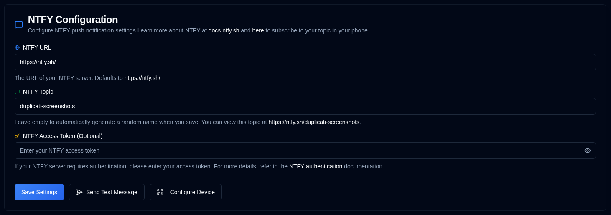

# NTFY {#ntfy}

 [NTFY](https://github.com/binwiederhier/ntfy) 是一种简单的通知服务，可向您的手机或桌面发送推送通知。本节用于设置通知服务器连接和认证。

| Setting               | Description                                                                                                                                   |
|:----------------------|:----------------------------------------------------------------------------------------------------------------------------------------------|
| **NTFY URL**          | 您的 NTFY 服务器 URL（默认为公共 `https://ntfy.sh/`）。                                                                      |
| **NTFY Topic**        | 通知的唯一标识符。若留空，系统会自动生成随机主题，您也可自行指定。 |
| **NTFY Access Token** | 用于已认证 NTFY 服务器的可选访问令牌。若服务器不需要认证，请留空此字段。               |

 

侧边栏 **NTFY** 旁的 <IIcon2 icon="lucide:message-square" color="green"/> 绿色图标表示您的设置有效。若图标为 <IIcon2 icon="lucide:message-square" color="yellow"/> 黄色，表示您的设置无效。
配置无效时，[`Backup Notifications`](backup-notifications-settings.md) 标签页中的 NTFY 复选框也会变为灰色。

## 可用操作 {#available-actions}

| Button                                                                | Description                                                                                                  |
|:----------------------------------------------------------------------|:-------------------------------------------------------------------------------------------------------------|
| <IconButton label="Save Settings" />                                  | 保存对 NTFY 设置的任何更改。                                                                  |
| <IconButton icon="lucide:send-horizontal" label="Send Test Message"/> | 向您的 NTFY 服务器发送测试消息以检查配置。                                         |
| <IconButton icon="lucide:qr-code" label="Configure Device"/>          | 显示二维码，便于快速配置移动设备或桌面以接收 NTFY 通知。 |

## 设备配置 {#device-configuration}

配置前，您应先在设备上安装 NTFY 应用程序（[参见此处](https://ntfy.sh/)）。点击 <IconButton icon="lucide:qr-code" label="Configure Device"/> 按钮，或右键点击应用工具栏中的 <SvgButton svgFilename="ntfy.svg" /> 图标，会显示二维码。扫描此二维码会自动为您的设备配置正确的 NTFY 通知主题。

 

 

:::caution
若您在没有访问令牌的情况下使用公共 **ntfy.sh** 服务器，任何知道您主题名称的人都可以查看您的
通知。

为提供一定程度的隐私，系统会生成随机的 12 字符主题，提供超过
3 sextillion（3,000,000,000,000,000,000,000）种可能组合，难以被猜测。

为提高安全性，请考虑使用[访问令牌认证](https://docs.ntfy.sh/config/#access-tokens)和[访问控制列表](https://docs.ntfy.sh/config/#access-control-list-acl)保护您的主题，或[自托管 NTFY](https://docs.ntfy.sh/install/#docker) 以获得完全控制。

⚠️ **您有责任保护您的 NTFY 主题。请自行斟酌使用此服务。**
:::

 
 

:::note
所有产品名称、徽标和商标均归其各自所有者所有。图标和名称仅用于识别，不代表背书。
:::
