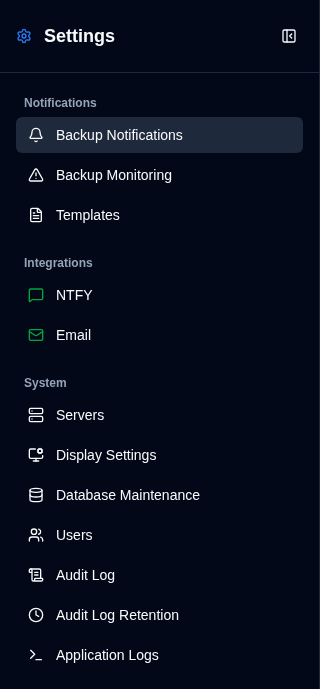
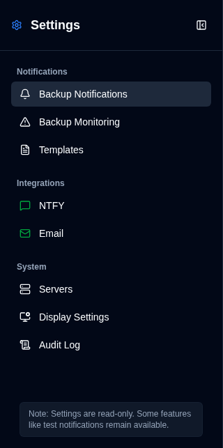

# 概览 {#overview}

设置页面提供了一个统一的界面，用于配置 **duplistatus** 的所有方面。您可以通过点击[应用程序工具栏](../overview.md#application-toolbar)中的 <IconButton icon="lucide:settings" /> **设置** 按钮来访问它。请注意，普通用户将看到一个功能较少的简化菜单，与管理员的菜单不同。

## 管理员视图 {#administrator-view}

管理员可以看到所有可用的设置。

<table>
  <tr>
    <td>
      
    </td>
    <td>
      <ul>
        <li>
          <strong>通知</strong>
          <ul>
            <li><a href="backup-notifications-settings.md">备份通知</a>：配置每个备份的通知设置</li>
            <li><a href="backup-monitoring-settings.md">备份监控</a>：配置逾期备份检测和警报</li>
            <li><a href="notification-templates.md">模板</a>：自定义通知消息模板</li>
          </ul>
        </li> 
        <li>
          <strong>集成</strong>
          <ul>
            <li><a href="ntfy-settings.md">NTFY</a>：配置 NTFY 推送通知服务</li>
            <li><a href="email-settings.md">邮件</a>：配置 SMTP 邮件通知</li>
          </ul>
        </li> 
        <li>
          <strong id="system">系统</strong>
          <ul>
            <li><a href="server-settings.md">服务器</a>：管理 Duplicati 服务器配置</li>
            <li><a href="display-settings.md">显示设置</a>：配置主题、图表时间范围、图表样式、格式区域设置、自动刷新间隔、卡片排序顺序和周开始</li>
            <li><a href="database-maintenance.md">数据库维护</a>：执行数据库清理（仅管理员）</li>
            <li><a href="user-management-settings.md">用户</a>：管理用户账户（仅管理员）</li>
            <li><a href="audit-logs-viewer.md">审计日志</a>：查看系统审计日志</li>
            <li><a href="audit-logs-retention.md">审计日志保留</a>：配置审计日志保留（仅管理员）</li>
            <li><a href="application-logs-settings.md">应用程序日志</a>：查看和导出应用程序日志（仅管理员）</li>
          </ul>
        </li>
      </ul>
    </td>
  </tr>
</table>

## 非管理员视图 {#non-administrator-view}

普通用户可以看到有限的设置。

<table>
  <tr>
    <td>
      
    </td>
    <td>
      <ul>
        <li>
          <strong>通知</strong>
          <ul>
            <li><a href="backup-notifications-settings.md">备份通知</a>：查看每个备份的通知设置（只读）</li>
            <li><a href="backup-monitoring-settings.md">备份监控</a>：查看逾期备份设置（只读）</li>
            <li><a href="notification-templates.md">模板</a>：查看通知模板（只读）</li>
          </ul>
        </li> 
        <li>
          <strong>集成</strong>
          <ul>
            <li><a href="ntfy-settings.md">NTFY</a>：查看 NTFY 设置（只读）</li>
            <li><a href="email-settings.md">邮件</a>：查看邮件设置（只读）</li>
          </ul>
        </li> 
        <li>
          <strong id="system">系统</strong>
          <ul>
            <li><a href="server-settings.md">服务器</a>：查看服务器配置（只读）</li>
            <li><a href="display-settings.md">显示</a>：配置主题、图表时间范围、图表样式、格式区域设置、自动刷新间隔、卡片排序顺序和周开始</li>
            <li><a href="audit-logs-viewer.md">审计日志</a>：查看系统审计日志（只读）</li>
          </ul>
        </li>
      </ul>
    </td>
  </tr>
</table>

## 状态图标 {#status-icons}

侧边栏在 **NTFY** 和 **邮件** 集成设置旁边显示状态图标：
- <IIcon2 icon="lucide:message-square" color="green"/> <IIcon2 icon="lucide:mail" color="green"/> **绿色图标**：您的设置有效且配置正确
- <IIcon2 icon="lucide:message-square" color="yellow"/> <IIcon2 icon="lucide:mail" color="yellow"/> **黄色图标**：您的设置无效或未配置

当配置无效时，[备份通知](backup-notifications-settings.md) 选项卡中相应的复选框将变为灰色且已禁用。有关更多详情，请参阅 [NTFY 设置](ntfy-settings.md) 和 [邮件设置](email-settings.md) 页面。

 

:::important
绿色图标并不一定意味着通知功能正常。在依赖通知之前，请务必使用可用的测试功能来确认您的通知可以正常工作。
:::

 
