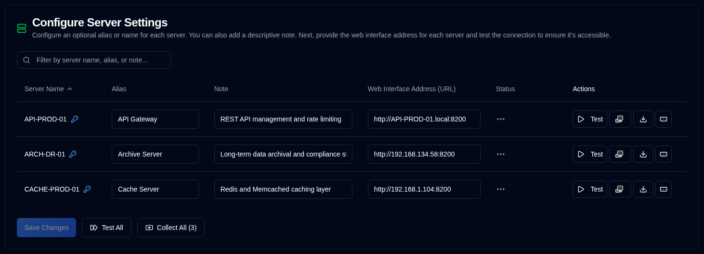

# 服务器 {#server}

您可在此为服务器配置备用名称（别名）、描述其功能的备注，以及 Duplicati Server 的 Web 地址。

| Setting                         | Description                                                                                                                                                                                  |
|:--------------------------------|:---------------------------------------------------------------------------------------------------------------------------------------------------------------------------------------------|
| **Server Name**                 | Duplicati 服务器中配置的服务器名称。若已为服务器设置密码，会显示 <IIcon2 icon="lucide:key-round" color="#42A5F5"/>。                                         |
| **Alias**                       | 服务器的昵称或易读名称。悬停在别名上会显示其名称；某些情况下为清晰起见，会显示别名和括号中的名称。 |
| **Note**                        | 描述服务器功能、安装位置或其他信息的自由文本。配置后，会显示在服务器名称或别名旁边。                 |
| **Web Interface Address (URL)** | 配置访问 Duplicati Server UI 的 URL。支持 `HTTP` 和 `HTTPS` URL。                                                                                           |
| **Status**                      | 显示测试或收集备份日志的结果                                                                                                                                              |
| **Actions**                     | 可测试、打开 Duplicati 界面、收集日志和设置密码，详见下文。                                                                                         |

 
:::note
若未配置 Web Interface Address (URL)，所有页面上的 <SvgIcon svgFilename="duplicati_logo.svg" /> 按钮
将被禁用，且该服务器不会显示在 [Duplicati Configuration](../duplicati-configuration.md) <SvgButton svgFilename="duplicati_logo.svg" href="../duplicati-configuration"/> 列表中。
:::

 

## 每个服务器的可用操作 {#available-actions-for-each-server}

| Button                                                                                                      | Description                                                             |
|:------------------------------------------------------------------------------------------------------------|:------------------------------------------------------------------------|
| <IconButton icon="lucide:play" label="Test"/>                                                               | 测试与 Duplicati 服务器的连接。                            |
| <SvgButton svgFilename="duplicati_logo.svg" />                                                              | 在新浏览器标签页中打开 Duplicati 服务器的 Web 界面。         |
| <IconButton icon="lucide:download" />                                                                       | 从 Duplicati 服务器收集备份日志。                          |
| <IconButton icon="lucide:rectangle-ellipsis" /> &nbsp; or <IIcon2 icon="lucide:key-round" color="#42A5F5"/> | 更改或设置 Duplicati 服务器密码以收集备份。 |

 

:::info[IMPORTANT]

为保护您的安全，您只能执行以下操作：
- 为服务器设置密码
- 完全删除（清除）密码

密码加密存储在数据库中，从不在用户界面中显示。
:::

 

## 所有服务器的可用操作 {#available-actions-for-all-servers}

| Button                                                     | Description                                     |
|:-----------------------------------------------------------|:------------------------------------------------|
| <IconButton label="Save Changes" />                        | 保存对服务器设置的更改。   |
| <IconButton icon="lucide:fast-forward" label="Test All"/>  | 测试与所有 Duplicati 服务器的连接。   |
| <IconButton icon="lucide:import" label="Collect All (#)"/> | 从所有 Duplicati 服务器收集备份日志。 |

 
