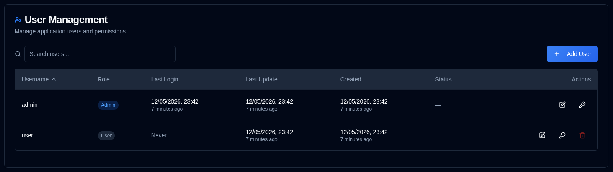

# 用户 {#users}

管理 **duplistatus** 的用户账户、权限和访问控制。本节允许管理员创建、修改和删除用户账户。

>[!TIP]
>默认 `admin` 账户可以被删除。为此，请先创建新的管理员用户，使用该账户登录，
> 然后删除 `admin` 账户。
>
> `admin` 账户的默认密码为 `Duplistatus09`。首次登录时您需要更改密码。

## 访问用户管理 {#accessing-user-management}

有两种方式访问用户管理部分：

1. **From the User Menu**：点击[应用工具栏](../overview.md#application-toolbar)中的 <IconButton icon="lucide:user" label="username" /> 并选择 "Admin Users"。

2. **From Settings**：点击 <IconButton icon="lucide:settings"/> 和设置侧边栏中的 **Users**

## 创建新用户 {#creating-a-new-user}

1. 点击 <IconButton icon="lucide:plus" label="Add User"/> 按钮
2. 输入用户详情：
   - **Username**：必须为 3-50 个字符，唯一，不区分大小写
   - **Admin**：勾选以授予管理员权限
   - **Require Password Change**：勾选以强制首次登录时更改密码
   - **Password**：
     - 选项 1：勾选 "Auto-generate password" 以创建安全的临时密码
     - 选项 2：取消勾选并输入自定义密码
3. 点击 <IconButton icon="lucide:user-plus" label="Create User" />。

## 编辑用户 {#editing-a-user}

1. 点击用户旁的 <IconButton icon="lucide:edit" /> 编辑图标
2. 修改以下任意项：
   - **Username**：更改用户名（必须唯一）
   - **Admin**：切换管理员权限
   - **Require Password Change**：切换密码更改要求
3. 点击 <IconButton icon="lucide:check" label="Save Changes" />。

## 重置用户密码 {#resetting-a-user-password}

1. 点击用户旁的 <IconButton icon="lucide:key-round" /> 钥匙图标
2. 确认密码重置
3. 将生成并显示新的临时密码
4. 复制密码并通过安全方式提供给用户

## 删除用户 {#deleting-a-user}

1. 点击用户旁的 <IconButton icon="lucide:trash-2" /> 删除图标
2. 在对话框中确认删除。**用户删除是永久性的，无法撤销。**

## 账户锁定 {#account-lockout}

多次登录失败后会自动锁定账户：
- **Lockout Threshold**：5 次失败尝试
- **Lockout Duration**：15 分钟
- 锁定的账户在锁定期结束前无法登录

## 恢复管理员访问 {#recovering-admin-access}

若丢失管理员密码或被锁定账户，可使用管理员恢复脚本恢复访问。请参阅 [Admin Account Recovery](../admin-recovery.md) 指南，了解在 Docker 环境中恢复管理员访问权限的详细说明。
