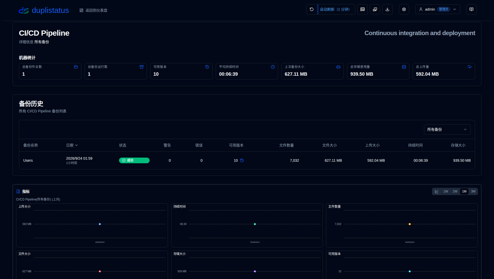
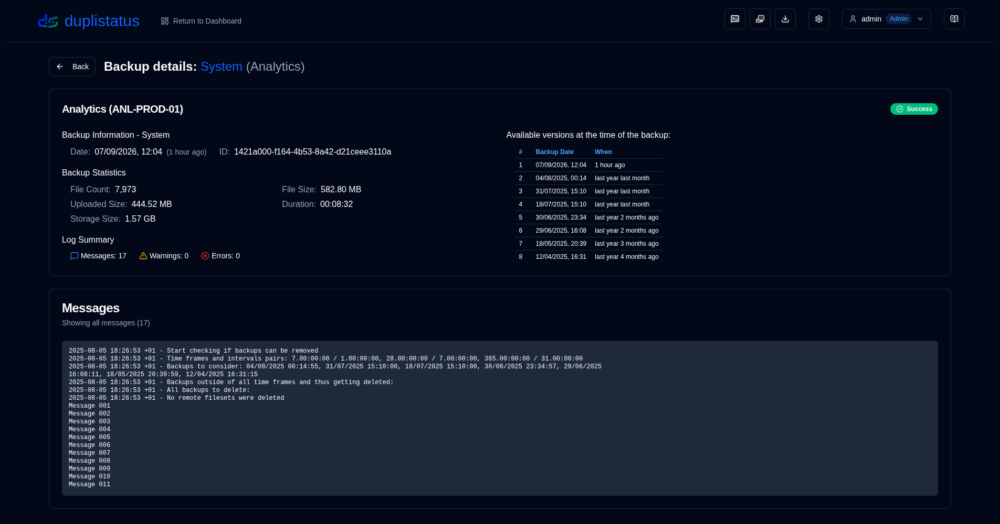

# 欢迎使用 duplistatus {#welcome-to-duplistatus}

**duplistatus** -  从单个仪表板监控多个 [Duplicati](https://github.com/duplicati/duplicati) 服务器

## 功能 {#features}

- **快速设置**：简单的容器化部署，提供在 Docker Hub 和 GitHub 上可用的镜像。
- **统一仪表板**：查看所有服务器的备份状态、历史记录、Duplicati 版本和详细信息。
- **备份监控**：自动检查和提醒过期的计划备份。
- **数据可视化和日志**：交互式图表和从 Duplicati 服务器自动收集的日志。
- **通知和警报**：集成NTFY和SMTP电子邮件支持，用于备份警报，包括过期备份通知。
- **用户访问控制和安全**：具有基于角色的访问控制（管理员/用户角色）的安全认证系统，可配置的密码策略，账户锁定保护和全面的用户管理。
- **API密钥**：可选的范围密钥用于Duplicati上传和主页小部件，以及可配置的上传大小和速率限制。
- **IP允许列表**：管理界面和外部API的单独CIDR列表（`/api/upload`，`/api/summary`，`/api/lastbackup*`）。
- **审计日志**：所有系统更改和用户操作的完整审计跟踪，具有高级过滤、导出功能和可配置的保留期限。
- **应用程序日志查看器**：仅管理员界面，可从Web界面直接查看、搜索和导出应用程序日志，具有实时监控功能。
- **多语言支持**：界面和文档支持英语、法语、德语、西班牙语、巴西葡萄牙语、印地语（罗马）和简体中文。

## 安装 {#installation}

应用程序可以使用 Docker、Portainer Stacks 或 Podman 部署。 
请参阅 [安装指南](installation/installation.md) 中的详细信息。

- 如果您从早期版本升级，您的数据库将在升级过程中自动
  [迁移](migration/version_upgrade.md) 到新模式。

- 当使用 Podman（作为独立容器或 pod 的一部分），并且如果您需要自定义 DNS 设置 
（例如 Tailscale MagicDNS、企业网络或其他自定义 DNS 配置），您可以手动 
指定 DNS 服务器和搜索域。请参阅安装指南以获取更多详细信息。

## Duplicati 服务器配置（必填） {#duplicati-servers-configuration-required}

一旦您的 **duplistatus** 服务器启动并运行，您需要配置您的 **Duplicati** 服务器将备份日志发送到 **duplistatus**，如 [Duplicati 配置](installation/duplicati-server-configuration.md) 
部分的安装指南中所述。没有此配置，仪表板将无法从您的 Duplicati 服务器接收备份数据。

## 用户指南 {#user-guide}

请参阅 [用户指南](user-guide/overview.md) 以获取有关如何配置和使用 **duplistatus** 的详细说明，包括初始设置、功能配置和故障排除。

## 屏幕截图 {#screenshots}

### 仪表板 {#dashboard}

### 备份历史记录 {#backup-history}

### 备份详细信息 {#backup-details}

### 过期备份 {#overdue-backups}

### 手机上的过期通知 {#overdue-notifications-on-your-phone}

## API 参考 {#api-reference}

有关可用端点、请求/响应格式和示例的详细信息，请参阅 [API 端点文档](api-reference/overview.md)。

## 开发 {#development}

有关下载、修改或运行代码的说明，请参阅 [开发设置](development/setup.md)。

该项目主要是使用 AI 帮助构建的。要了解如何构建，请参阅 [如何使用 AI 工具构建此应用程序](development/how-i-build-with-ai)。

## 致谢 {#credits}

- 首先，感谢 Kenneth Skovhede 创建了 Duplicati——这个令人惊叹的备份工具。同时也感谢所有的贡献者。

💙 如果您发现 [Duplicati](https://www.duplicati.com) 有用，请考虑支持开发者。在他们的网站或 GitHub 页面上有更多详细信息。

- Duplicati SVG 图标来自 https://dashboardicons.com/icons/duplicati
- ntfy SVG 图标来自 https://dashboardicons.com/icons/ntfy
- GitHub SVG 图标来自 https://github.com/logos

:::note
所有产品名称、标志和商标都是其各自所有者的财产。图标和名称仅用于识别目的，不意味着认可。
:::

## 许可 {#license}

本项目采用 [Apache License 2.0](LICENSE.md) 进行许可。

**Copyright 2026 Waldemar Scudeller Jr.**
