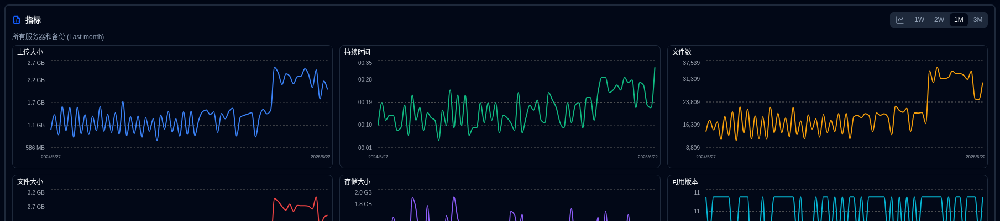

# 备份指标 {#backup-metrics}

备份指标随时间的图表显示在仪表板（表格视图）和服务器详细信息页面上。

- **仪表板**，图表显示在 **duplistatus** 数据库中记录的备份总数。如果您使用卡片布局，您可以选择一个服务器以查看其整合的指标（当侧面板显示指标时）。
- **服务器详细信息** 页面，图表显示所选服务器的指标（所有备份）或单个备份的指标。

## 内联图表控制 {#inline-chart-controls}

快速访问控制直接可用于图表面板标题，方便配置而无需导航到显示设置:

### 时间范围选择器 {#time-range-selector}

药丸按钮出现在图表标题中，用于快速选择时间范围： **1W | 2W | 1M | 3M**

- **1W**：最近 7 天（滚动窗口）
- **2W**：最近 14 天（滚动窗口）
- **1M**：最近 30 天（滚动窗口，默认）
- **3M**：最近 90 天（滚动窗口）

在此处进行的更改将与您的显示设置同步，因此您的首选项将在页面刷新之间保留。

### 图表样式切换 {#chart-style-toggle}

图表标题中的切换按钮允许您在以下两者之间切换:

- **平滑曲线**：使用平滑曲线连接数据点
- **条形图**：以离散条形显示每个时间段的数据

两种模式都使用时间桶聚合以实现最佳显示。空白时期在条形模式下不会显示条形。您的首选项将在页面刷新之间保留，并与显示设置同步。

## 图表数据整合 {#chart-data-consolidation}

当同一天发生多个备份时，**duplistatus** 在显示之前会整合数据:

- **SUM**：用于累积指标（持续时间，文件数，文件大小，上传大小）
- **LAST**：用于存储大小（一天中最新的值）
- **MAX**：用于可用版本（一天中最高的计数）

此整合发生在时间桶应用之前，确保准确的聚合指标。例如，5/12/26 日期的两个备份将在图表上产生一个整合的数据点。

## 指标定义 {#metric-definitions}

- **上传大小**：备份从 Duplicati 服务器到目标（本地存储，FTP，云提供商等）传输的数据总量，每天。
- **持续时间**：所有备份每天接收的总持续时间，以 HH:MM 表示。
- **文件数**：所有备份每天接收的文件数总和。
- **文件大小**：所有备份每天接收的文件大小总和，报告由 Duplicati 服务器提供。
- **存储大小**：备份目标每天使用的存储大小总和，报告由 Duplicati 服务器提供。
- **可用版本**：所有备份每天的可用版本总和。

:::note
您可以使用 [显示设置](settings/display-settings.md) 控制来配置图表的时间范围。
:::
