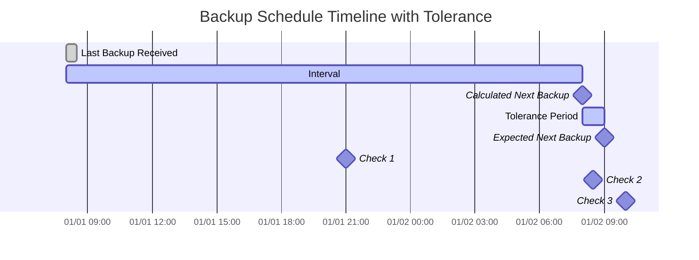

import { ZoomMermaid } from '@site/src/components/ZoomMermaid';

# 备份监控 {#backup-monitoring}

备份监控功能允许您跟踪和提醒过期的备份。通知可以通过 NTFY 或 电子邮件 发送。

在用户界面中，过期的备份将以警告图标显示。悬停在图标上将显示过期备份的详细信息，包括上次备份时间、预期备份时间、容忍期和预期下一次备份时间。

## 过期检查过程 {#overdue-check-process}

**它的工作原理：**

| **步骤** | **值**                  | **描述**                                   | **示例**        |
|:--------:|:---------------------------|:--------------------------------------------------|:-------------------|
|    1     | **上次备份**            | 上次成功备份的时间戳。      | `2024-01-01 08:00` |
|    2     | **预期间隔**      | 配置的备份频率。                  | `1 day`            |
|    3     | **计算下一次备份** | `Last Backup` + `Expected Interval`               | `2024-01-02 08:00` |
|    4     | **容忍期**              | 配置的宽限期（允许的额外时间）。 | `1 hour`           |
|    5     | **预期下一次备份**   | `Calculated Next Backup` + `Tolerance`            | `2024-01-02 09:00` |

如果当前时间晚于 `Expected Next Backup` 时间，则备份被认为是 **过期**。

<ZoomMermaid>

</ZoomMermaid>

**基于上述时间线的示例：**

- 在 `2024-01-01 21:00` （🔹检查 1）时，备份是 **按时**的。
- 在 `2024-01-02 08:30` （🔹检查 2）时，备份是 **按时**的，因为它仍然在宽限期内。
- 在 `2024-01-02 10:00` （🔹检查 3）时，备份是 **过期**的，因为这是在 `Expected Next Backup` 时间之后。

## 定期检查 {#periodic-checks}

**duplistatus** 在可配置的间隔内执行定期检查，以检测过期的备份。默认间隔为 20 分钟，但您可以在 [设置 → 备份监控](settings/backup-monitoring-settings.md) 中配置它。

## 自动配置 {#automatic-configuration}

当您从 Duplicati 服务器收集备份日志时，**duplistatus** 自动：

- 从 Duplicati 配置中提取备份计划
- 更新备份监控间隔以匹配
- 同步允许的星期和计划时间
- 保留您的通知首选项

:::tip
为了获得最佳结果，在更改Duplicati服务器的备份作业间隔后，请收集备份日志。这确保**duplistatus**与您的当前配置保持同步。
:::

查看[备份监控设置](settings/backup-monitoring-settings.md)部分以获取详细的配置选项。
