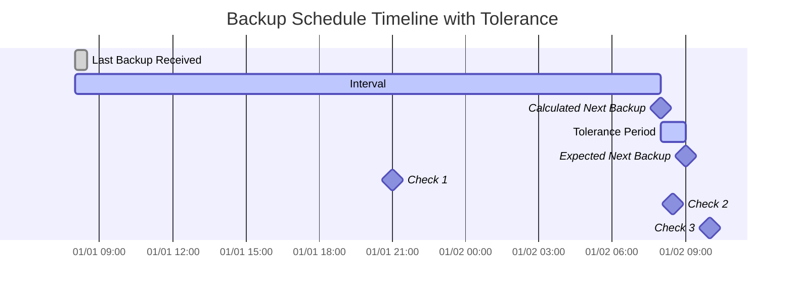

import { ZoomMermaid } from '@site/src/components/ZoomMermaid';

# 备份监控 {/* #backup-monitoring */}

备份监控功能允许您跟踪并警报过期的备份。通知可以通过 NTFY 或电子邮件发送。

在用户界面中，过期的备份会显示一个警告图标。将鼠标悬停在图标上会显示过期备份的详细信息，包括最后备份时间、预期备份时间、容忍期和预期下次备份时间。

## 过期检查过程 {/* #overdue-check-process */}

**工作原理：**

| **步骤** | **值**                  | **描述**                                   | **示例**        |
|:--------:|:---------------------------|:--------------------------------------------------|:-------------------|
|    1     | **最后备份**            | 最后一次成功备份的时间戳。      | `2024-01-01 08:00` |
|    2     | **预期间隔**      | 配置的备份频率。                  | `1 day`            |
|    3     | **计算的下次备份** | `Last Backup` + `Expected Interval`               | `2024-01-02 08:00` |
|    4     | **容忍期**              | 配置的宽限期（允许的额外时间）。 | `1 hour`           |
|    5     | **预期下次备份**   | `Calculated Next Backup` + `Tolerance`            | `2024-01-02 09:00` |

如果当前时间晚于 `Expected Next Backup` 时间，则备份被视为 **过期**。

<ZoomMermaid>

```mermaid
gantt
    title Backup Schedule Timeline with Tolerance
    dateFormat  YYYY-MM-DD HH:mm
    axisFormat %m/%d %H:%M

    Last Backup Received    :done, last-backup, 2024-01-01 08:00, 0.5h

    Interval                :active, interval, 2024-01-01 08:00, 24h
    Calculated Next Backup                :milestone, expected, 2024-01-02 08:00, 0h
    Tolerance Period        :active, tolerance period, 2024-01-02 08:00, 1h

    Expected Next Backup               :milestone, adjusted, 2024-01-02 09:00, 0h

    Check 1 : milestone, deadline, 2024-01-01 21:00, 0h
    Check 2 : milestone, deadline, 2024-01-02 08:30, 0h
    Check 3 : milestone, deadline, 2024-01-02 10:00, 0h

```

</ZoomMermaid>

**基于上述时间线的示例：**

- 在 `2024-01-01 21:00`（🔹检查 1）时，备份 **正常**。
- 在 `2024-01-02 08:30`（🔹检查 2）时，备份 **正常**，因为它仍在容忍期内。
- 在 `2024-01-02 10:00`（🔹检查 3）时，备份 **过期**，因为这在 `Expected Next Backup` 时间之后。

## 周期性检查 {/* #periodic-checks */}

**duplistatus** 会定期检查过期的备份，检查间隔可配置。默认间隔为 20 分钟，但您可以在 [设置 → 备份监控](settings/backup-monitoring-settings.md) 中进行配置。

## 自动配置 {/* #automatic-configuration */}

当您从 Duplicati 服务器收集备份日志时，**duplistatus** 会自动：

- 从 Duplicati 配置中提取备份计划
- 更新备份监控间隔以完全匹配
- 同步允许的工作日和计划时间
- 保留您的通知偏好

:::tip
为获得最佳结果，请在更改 Duplicati 服务器中的备份作业间隔后收集备份日志。这可确保 **duplistatus** 与您的当前配置保持同步。
:::

查看[备份监控设置](settings/backup-monitoring-settings.md)部分以获取详细的配置选项。
