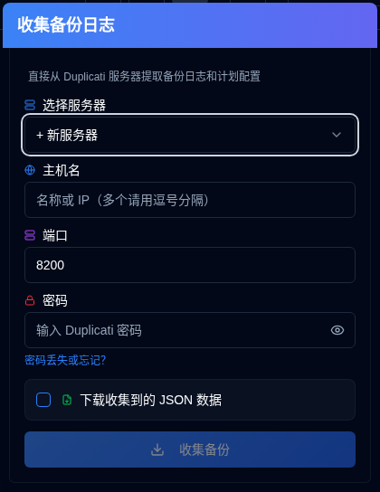
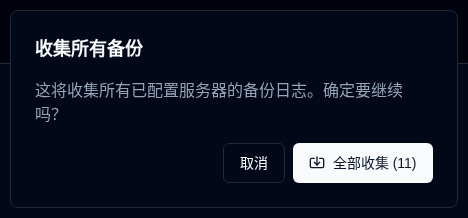

# 收集备份日志 {#collect-backup-logs}

**duplistatus** 可以直接从 Duplicati 服务器检索备份日志以填充数据库或恢复丢失的日志数据。应用程序会自动跳过数据库中已经存在的重复日志。

## 收集备份日志步骤 {#steps-to-collect-backup-logs}

### 手动收集 {#manual-collection}

1.  点击 [应用程序工具栏](overview.md#application-toolbar) 上的 <IconButton icon="lucide:download" /> **收集备份日志** 图标。

2.  选择服务器

如果您在 [设置 → 服务器设置](settings/server-settings.md) 中配置了服务器地址，您可以从下拉列表中选择一个以进行即时收集。如果您没有配置任何服务器，您可以手动输入 Duplicati 服务器详细信息。

3.  输入 Duplicati 服务器详细信息：
    - **主机名**：Duplicati 服务器的主机名或 IP 地址。您可以输入多个主机名，例如 `192.168.1.23,someserver.local,192.168.1.89`
    - **端口**：Duplicati 服务器使用的端口号（默认：`8200`）。
    - **密码**：如果需要，请输入身份验证密码。
    - **下载收集到的 JSON 数据**：启用此选项以下载 duplistatus 收集的数据。
4.  点击 **收集备份**。

***注意：***
- 如果您输入多个主机名，收集将使用相同的端口和密码进行所有服务器。
- **duplistatus** 将自动检测最佳连接协议（HTTPS 或 HTTP）。它首先尝试 HTTPS（带有适当的 SSL 验证），然后尝试 HTTPS 自签名证书，最后使用 HTTP 作为回退。

:::tip
[设置 → 备份监控](settings/backup-monitoring-settings.md) 和 [设置 → 服务器设置](settings/server-settings.md) 中有 <IconButton icon="lucide:download" /> 按钮，用于单服务器收集。
:::

 

### 批量收集 {#bulk-collection}

_右键点击_ 应用程序工具栏中的 <IconButton icon="lucide:download" /> **收集备份日志** 按钮以从所有配置的服务器中收集。

:::tip
您还可以使用 [设置 → 备份监控](settings/backup-monitoring-settings.md) 和 [设置 → 服务器设置](settings/server-settings.md) 页面中的 <IconButton icon="lucide:import" label="收集全部"/> 按钮从所有配置的服务器中收集。
:::

## 收集过程的工作原理 {#how-the-collection-process-works}

- **duplistatus** 自动检测最佳连接协议并连接到指定的 Duplicati 服务器。
- 它检索备份历史记录、日志信息和备份设置（用于备份监控）。
- **duplistatus** 数据库中已经存在的任何日志都将被跳过。
- 新数据将被处理并存储在本地数据库中。
- 使用检测到的协议的 URL 将被存储或更新在本地数据库中。
- 如果选择下载选项，它将下载收集到的 JSON 数据。文件名将采用此格式：`[serverName]_collected_[Timestamp].json`。时间戳使用 ISO 8601 日期格式（YYYY-MM-DDTHH:MM:SS）。
- 仪表板将更新以反映新信息。

:::note 收集后看到重复的服务器？
如果在收集备份日志后（或在重新安装/升级 Duplicati 后），同一台服务器出现多次，这通常是由更改的 `machine_id` 引起的，或者是由于 Duplicati API 错误混淆了 `identity` ID 和 `machine_id`。解决方法是在 Duplicati 服务器上对齐 ID（编辑 `identity.txt`/`machineid.txt` 或设置 **Duplicati → 设置 → 高级选项 → Machine-id**），重启 Duplicati，然后通过 [设置 → 数据库维护 → 合并重复服务器](settings/database-maintenance.md#merge-duplicate-servers) 合并 **duplistatus** 中的条目。有关完整步骤，请参阅[仪表板上的重复服务器](troubleshooting.md#duplicate-servers-on-the-dashboard)。
:::

## 故障排除收集问题 {#troubleshooting-collection-issues}

备份日志收集需要 Duplicati 服务器可以从 **duplistatus** 安装中访问。如果您遇到问题，请验证以下内容:

- 确认主机名（或 IP 地址）和端口号是正确的。您可以通过在浏览器中访问 Duplicati 服务器 UI 来测试它（例如 `http://hostname:port`）。
- 检查 **duplistatus** 是否可以连接到 Duplicati 服务器。一个常见的问题是 DNS 名称解析（系统无法通过其主机名找到服务器）。请参阅 [故障排除部分](troubleshooting.md#collect-backup-logs-not-working) 中的更多信息。
- 确保您提供的密码是正确的。
