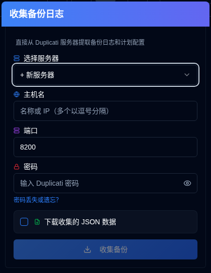
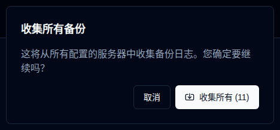

# 收集备份日志 {/* #collect-backup-logs */}

**duplistatus** 可以直接从 Duplicati 服务器检索备份日志，以填充数据库或恢复丢失的日志数据。应用程序会自动跳过数据库中已存在的任何重复日志。

## 收集备份日志的步骤 {/* #steps-to-collect-backup-logs */}

### 手动收集 {/* #manual-collection */}

1.  点击 [应用程序工具栏](overview.md#application-toolbar) 上的 <IconButton icon="lucide:download" /> **收集备份日志** 图标。

2.  选择服务器

如果您在 [设置 → 服务器设置](settings/server-settings.md) 中配置了服务器地址，可以从下拉列表中选择一个进行即时收集。如果没有配置任何服务器，可以手动输入 Duplicati 服务器的详细信息。

3.  输入 Duplicati 服务器的详细信息：
    - **主机名**：Duplicati 服务器的主机名或 IP 地址。您可以输入多个主机名，用逗号分隔，例如 `192.168.1.23,someserver.local,192.168.1.89`
    - **端口**：Duplicati 服务器使用的端口号（默认：`8200`）。
    - **密码**：如果需要，请输入身份验证密码。
    - **下载收集的 JSON 数据**：启用此选项以下载 duplistatus 收集的数据。
4.  点击 **收集备份**。

***注意：***
- 如果输入多个主机名，将使用相同的端口和密码对所有服务器进行收集。
- **duplistatus** 会自动检测最佳连接协议（HTTPS 或 HTTP）。它首先尝试 HTTPS（带有适当的 SSL 验证），然后尝试带有自签名证书的 HTTPS，最后作为回退使用 HTTP。

:::tip
[设置 → 备份监控](settings/backup-monitoring-settings.md) 和 [设置 → 服务器设置](settings/server-settings.md) 中的 <IconButton icon="lucide:download" /> 按钮可用于单服务器收集。
:::

 

### 批量收集 {/* #bulk-collection */}

_右键点击_ 应用程序工具栏中的 <IconButton icon="lucide:download" /> **收集备份日志** 按钮，以从所有配置的服务器收集。

:::tip
您还可以使用 [设置 → 备份监控](settings/backup-monitoring-settings.md) 和 [设置 → 服务器设置](settings/server-settings.md) 页面中的 <IconButton icon="lucide:import" label="收集所有"/> 按钮，从所有配置的服务器收集。
:::

## 收集过程的工作原理 {/* #how-the-collection-process-works */}

- **duplistatus** 自动检测最佳连接协议并连接到指定的 Duplicati 服务器。
- 它检索备份历史、日志信息和备份设置（用于备份监控）。
- 已存在于 **duplistatus** 数据库中的任何日志都会被跳过。
- 新数据将被处理并存储在本地数据库中，包括每个备份日志中报告的 Duplicati 版本。[仪表板版本](dashboard.md#duplicati-server-version) 取自最新存储的日志 — **duplistatus** 不会读取服务器上当前运行的版本。在 Duplicati 升级后，收集或等待新的备份，以便仪表板可以显示新版本。
- 使用的 URL（带有检测到的协议）将被存储或更新在本地数据库中。
- 如果选择了下载选项，它将在从 Duplicati 服务器接收到任何数据时下载收集的 JSON 数据 — 即使日志验证失败或无法导入到数据库中。文件名将采用以下格式：`[serverName]_collected_[Timestamp].json`。时间戳使用 ISO 8601 日期格式（YYYY-MM-DDTHH:MM:SS）。
- 仪表板更新以反映新信息。

:::note 收集后看到重复的服务器？
如果收集备份日志（或在 Duplicati 重新安装/升级后）后同一服务器出现多次，通常是由于 `machine_id` 发生了变化，或者 Duplicati API 存在混淆 `identity` id 和 `machine_id` 的错误。解决方法是对齐 Duplicati 服务器上的 id（编辑 `identity.txt`/`machineid.txt` 或设置 **Duplicati → 设置 → 高级选项 → 机器-id**），重新启动 Duplicati，然后通过 [设置 → 数据库维护 → 合并重复服务器](settings/database-maintenance.md#merge-duplicate-servers) 合并 **duplistatus** 中的条目。有关完整步骤，请参阅 [仪表板上的重复服务器](troubleshooting.md#duplicate-servers-on-the-dashboard)。
:::

## 故障排除收集问题 {/* #troubleshooting-collection-issues */}

备份日志收集需要 Duplicati 服务器能够从 **duplistatus** 安装中访问。如果遇到问题，请验证以下内容：

- 确认主机名（或 IP 地址）和端口号是否正确。您可以通过在浏览器中访问 Duplicati 服务器 UI 来测试这一点（例如，`http://hostname:port`）。
- 检查 **duplistatus** 是否可以连接到 Duplicati 服务器。常见问题包括 DNS 名称解析（系统无法通过主机名找到服务器）。更多信息请参见 [故障排除部分](troubleshooting.md#collect-backup-logs-not-working)。
- 确保您提供的密码是正确的。
- 在 Duplicati 2.4+ 中，当系统信息选项默认为空时，收集会从 Duplicati 服务器设置中读取机器 ID。
