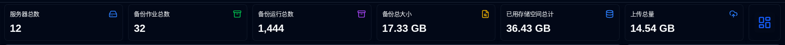
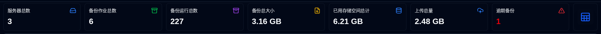
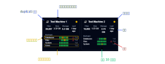
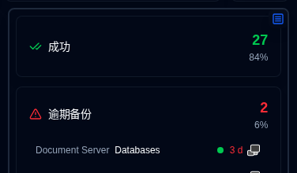
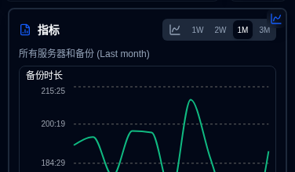
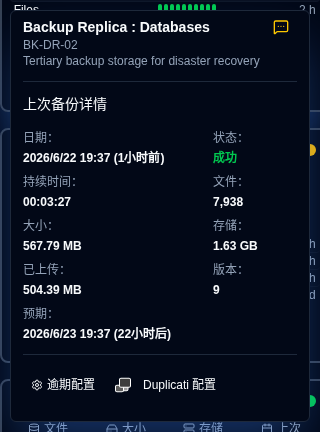
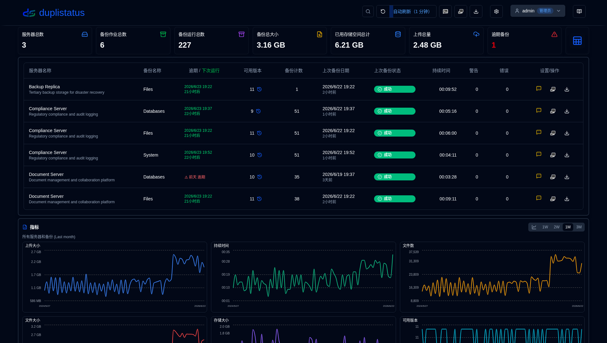
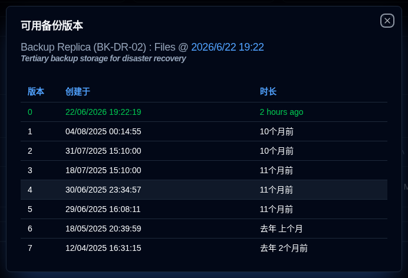

# 仪表盘 {#dashboard}

## 仪表盘概览 {#dashboard-summary}

本节显示所有备份的聚合统计信息。

- **服务器总数**: 被监控的服务器数量。                                                                                                             
- **备份作业总数**: 所有服务器配置的备份作业（类型）数量。                                                                                
- **备份运行总数**: 所有服务器收到的或收集的备份日志数量。                                                                   
- **备份总大小**: 所有源数据的综合大小，基于收到的最新备份日志。
- **已用存储空间总计**: 备份在备份目标（例如云存储、FTP服务器、局部驱动器）上使用的总存储空间，基于收到的最新备份日志。                
- **上传总量**: 从Duplicati服务器上传到目标（例如局部存储、FTP、云提供商）的数据总量。                                       
- **逾期备份**（表格）：逾期备份的数量。请参阅[备份通知设置](settings/backup-notifications-settings.md)                          
- **布局切换**: 在卡片布局（默认）和表格布局之间切换。

:::tip 看到重复的服务器?
如果同一服务器在仪表盘上出现多次，请使用[设置 → 数据库维护 → 合并重复服务器](settings/database-maintenance.md#merge-duplicate-servers)来合并它们。重复项可能发生在您重新安装或升级Duplicati时，因为服务器的`machine_id`可能会改变，**duplistatus**然后将其视为新服务器。
:::

## 服务器过滤 {#server-filtering}

您可以使用应用程序工具栏中的搜索字段来过滤仪表盘上显示的服务器和备份。单击过滤图标<IconButton icon="lucide:search" />显示搜索字段。

**过滤匹配：**
- 服务器 ID
- 服务器 URL
- 备份作业名称

**范围：**
- 过滤仪表盘上的卡片和表格视图
- 会话状态通过仪表盘服务器过滤器提供程序维护
- 刷新或离开仪表盘时清除

这使得您可以轻松地在许多被监控的系统中快速找到特定的服务器或备份。

## 卡片布局 {#cards-layout}

卡片布局显示每个备份收到的最新备份日志的状态。

- **服务器名称**: Duplicati服务器的名称（或别名）
  - 悬停在**服务器名称**上将显示服务器名称和注释
- **总体状态**: 服务器的状态。逾期备份将显示为**警告**状态
- **摘要信息**: 服务器的所有备份的文件、大小和存储使用情况的综合数量。还显示收到的最新备份的经过时间（悬停显示时间戳）
- **备份列表**: 一个表格，包含服务器配置的所有备份，具有3列:
  - **备份名称**: Duplicati服务器中的备份名称
  - **状态历史**: 收到的最新10个备份的状态。
  - **上次备份收到**: 自当前时间收到上次日志的经过时间。它将显示警告图标，如果备份逾期。
    - 时间以缩写格式显示：`m`表示分钟，`h`表示小时，`d`表示天，`w`表示周，`mo`表示月，`y`表示年。

卡片排序顺序和其他配置可以在[显示设置](settings/display-settings.md)中设置。

面板视图提供两个信息显示，通过单击侧面板的右上按钮即可访问：

- 状态：显示每个状态的备份作业统计信息，包括逾期备份和备份作业的警告/错误状态列表。

- 指标：显示聚合或选定服务器的持续时间、文件大小和存储大小随时间变化的图表。

### 备份详细信息 {#backup-details}

将鼠标悬停在列表中的备份上，显示最后一个备份日志的详细信息和任何逾期信息。

- **服务器名称 : 备份**：Duplicati 服务器和备份的名称或别名，也显示服务器名称和注释。
  - 别名和注释可以在 [设置 → 服务器设置](settings/server-settings.md) 中配置。
- **通知**：一个图标，显示新的备份日志的 [配置通知](#notifications-icons) 设置。
- **日期**：备份的时间戳和自上次屏幕刷新以来经过的时间。
- **状态**：最后一个备份的状态（成功、警告、错误、严重错误）。
- **持续时间、文件数、文件大小、存储大小、上传大小**：Duplicati 服务器报告的值。
- **可用版本**：备份时备份目标中存储的备份版本数。

如果此备份逾期，工具提示还显示：

- **预期备份**：备份预期的时间，包括配置的宽限期（在标记为逾期之前允许的额外时间）。

您也可以单击底部的按钮打开 [设置 → 备份通知](settings/backup-notifications-settings.md) 来配置监控设置或打开 Duplicati 服务器的 Web 界面。

## 表格布局 {#table-layout}

表格布局列出所有服务器和备份的最新备份日志。

- **服务器名称**：Duplicati 服务器的名称（或别名）
  - 名称下方是服务器注释
- **备份名称**：Duplicati 服务器中的备份名称。
- **可用版本**：备份目标中存储的备份版本数。如果图标灰显，日志中没有收到详细信息。请参阅 [Duplicati 配置说明](../installation/duplicati-server-configuration.md) 以获取详细信息。
- **备份计数**：Duplicati 服务器报告的备份数。
- **上次备份日期**：最后一个备份日志的时间戳和自上次屏幕刷新以来经过的时间。
- **上次备份状态**：最后一个备份的状态（成功、警告、错误、严重错误）。
- **持续时间**：备份的持续时间（HH:MM:SS）。
- **警告/错误**：备份日志中报告的警告/错误数。
- **设置**:
  - **通知**：一个图标，显示新的备份日志的配置通知设置。
  - **Duplicati 配置**：一个按钮，用于打开 Duplicati 服务器的 Web 界面

您可以使用 [显示设置](settings/display-settings.md) 来配置表格大小和其他配置。

### 通知图标 {#notifications-icons}

| 图标                                                                                                                               | 通知选项 | 描述                                                                                         |
|------------------------------------------------------------------------------------------------------------------------------------|---------------------|-----------------------------------------------------------------------------------------------------|
| <IconButton icon="lucide:message-square-off" style={{border: 'none', padding: 0, color: '#9ca3af', background: 'transparent'}} />  | 关闭                 | 收到新备份日志时不发送通知                                     |
| <IconButton icon="lucide:message-square-more" style={{border: 'none', padding: 0, color: '#60a5fa', background: 'transparent'}} /> | 全部                 | 无论其状态如何，都会为每个新备份日志发送通知。                      |
| <IconButton icon="lucide:message-square-more" style={{border: 'none', padding: 0, color: '#fbbf24', background: 'transparent'}} /> | 警告            | 只有当备份日志的状态为警告、未知、错误或严重错误时，才会发送通知。 |
| <IconButton icon="lucide:message-square-more" style={{border: 'none', padding: 0, color: '#f87171', background: 'transparent'}} /> | 错误              | 只有当备份日志的状态为错误或严重错误时，才会发送通知。                    |

:::note
此通知设置仅在 **duplistatus** 从 Duplicati 服务器接收到新备份日志时应用。逾期通知配置单独设置，并且无论此设置如何，都会发送。
:::

### 逾期详情 {#overdue-details}

悬停在逾期警告图标上会显示关于逾期备份的详细信息。

- **检查**: 上次逾期检查何时进行。配置频率在 [备份通知设置](settings/backup-notifications-settings.md) 中。
- **上次备份**: 上次备份日志何时接收。
- **预期备份**: 预期备份时间，包括配置的宽限期（在标记为逾期之前允许的额外时间）。
- **上次通知**: 上次逾期通知何时发送。

### 可用备份版本 {#available-backup-versions}

点击蓝色时钟图标会打开备份版本列表，显示备份时的可用备份版本，如 Duplicati 服务器报告的那样。

- **备份详细信息**: 显示服务器名称和别名，服务器注释，备份名称，以及备份执行时间。
- **版本详细信息**: 显示版本号，创建日期和时长。

:::note
如果图标变灰，则表示在消息日志中没有收到详细信息。
请参阅 [Duplicati 配置说明](../installation/duplicati-server-configuration.md) 以获取详细信息。
:::
