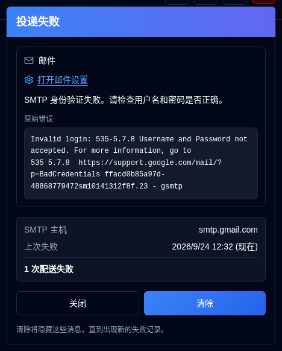

# 发送失败 {/* #delivery-failures */}

当电子邮件或 NTFY 发送失败时，管理员的[应用工具栏](overview.md#application-toolbar)中会显示一个带有浅红色调的 <IconButton icon="lucide:siren" tone="alert" /> 按钮。当两个通道均正常时，该按钮保持隐藏，且不会显示在登录页面。普通用户无法看到该按钮。

打开该按钮会为每个失败的通道（电子邮件、ntfy）显示一张卡片，而不是为每条审计记录显示一行。每张卡片显示：

- 错误信息，以及记录了 SMTP 回复时显示的等宽 **原始错误**
- SMTP 主机或 NTFY 主题
- 上次失败时间
- 自上次成功或自您上次清除该通道以来投递失败的次数

**打开电子邮件设置**会跳转到[设置 → 电子邮件](settings/email-settings.md)。**打开 NTFY 设置**会跳转到[设置 → NTFY](settings/ntfy-settings.md)。

**关闭**仅用于关闭面板。**清除**会隐藏列出的通道，直到记录新的失败，即使错误文本相同也是如此。后续成功的投递会使按钮保持隐藏状态。这包括 `email_sent`、`notification_sent` 以及该通道成功发送的[每日摘要](settings/daily-summary-settings.md)。
