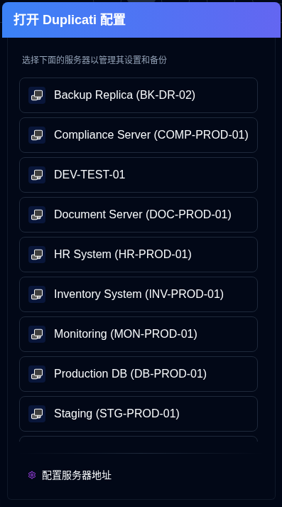

# Duplicati 配置 {#duplicati-configuration}

<SvgButton svgFilename="duplicati_logo.svg" /> 按钮位于 [应用程序工具栏](overview.md#application-toolbar) 上，打开 Duplicati 服务器的 web 界面在一个新标签页中。

您可以从下拉列表中选择一个服务器。如果您已经选择了一个服务器（通过点击其卡片）或正在查看其详细信息，则按钮将直接打开该特定服务器的 Duplicati 配置。

- 服务器列表将显示 `server name` 或 `server alias (server name)`。
- 服务器地址在 [设置 → 服务器](settings/server-settings.md) 中配置。
- 当您使用 <IconButton icon="lucide:download" height="16" href="collect-backup-logs" /> [收集备份日志](collect-backup-logs.md) 功能时，应用程序会自动保存服务器的 URL。
- 如果服务器地址未配置，服务器将不会出现在服务器列表中。

## 访问旧的 Duplicati UI {#accessing-the-old-duplicati-ui}

如果您遇到新的 Duplicati Web 界面（`/ngclient/`）登录问题，您可以右键单击应用程序工具栏上的 <SvgButton svgFilename="duplicati_logo.svg" /> 按钮或服务器选择弹出窗口中的任何服务器项，以在新标签页中打开旧的 Duplicati UI（`/ngax/`）。

  

:::note
所有产品名称、标志和商标都是其各自所有者的财产。图标和名称仅用于识别目的，不意味着认可。
:::
