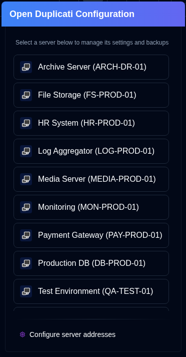

# Duplicati 配置 {/* #duplicati-configuration */}

点击 [应用程序工具栏](overview.md#application-toolbar) 上的 <SvgButton svgFilename="duplicati_logo.svg" /> 按钮，将在新标签页中打开 Duplicati 服务器的网页界面。

您可以从下拉列表中选择一个服务器。如果您已经选择了一个服务器（通过点击其卡片）或正在查看其详细信息，该按钮将直接打开该特定服务器的 Duplicati 配置。

- 服务器列表将显示 `server name` 或 `server alias (server name)`。
- 服务器地址在 [设置 → 服务器](settings/server-settings.md) 中配置。
- 应用程序会在您使用 <IconButton icon="lucide:download" height="16" href="collect-backup-logs" /> [收集备份日志](collect-backup-logs.md) 功能时自动保存服务器的 URL。
- 如果服务器的地址尚未配置，则不会在服务器列表中显示。

## 访问旧 Duplicati UI {/* #accessing-the-old-duplicati-ui */}

如果您在使用新 Duplicati 网页界面时遇到登录问题（`/ngclient/`），您可以右键点击 <SvgButton svgFilename="duplicati_logo.svg" /> 按钮或服务器选择弹出窗口中的任何服务器项，以在新标签页中打开旧 Duplicati UI（`/ngax/`）。

  

:::note
 所有产品名称、徽标和商标均为其各自所有者的财产。图标和名称仅用于识别目的，并不表示认可。
:::
