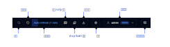
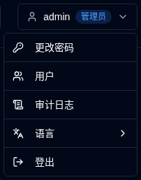
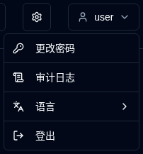

# 概览 {#overview}

欢迎来到 duplistatus 用户指南。本综合文档提供了有关使用 duplistatus 监控和管理 Duplicati 备份操作的详细说明，涵盖多个服务器。

## 什么是 duplistatus？ {#what-is-duplistatus}

duplistatus 是一种为 Duplicati 备份系统设计的强大监控仪表盘。它提供以下功能：

- 集中监控多个 Duplicati 服务器的单一界面
- 实时跟踪所有备份操作的状态
- 自动检测过期备份并提供可配置的警报
- 备份性能的综合指标和可视化
- 通过 NTFY 和电子邮件提供的灵活通知系统
- 多语言支持（英语、法语、德语、西班牙语、巴西葡萄牙语、印地语（罗马字）和简体中文）。

## 安装 {#installation}

有关先决条件和详细安装说明，请参阅 [安装指南](../installation/installation.md)。

## 访问仪表盘 {#accessing-the-dashboard}

安装成功后，按照以下步骤访问 duplistatus 网络界面：

1. 打开您喜欢的网络浏览器
2. 导航到 `http://your-server-ip:9666`
   - 将 `your-server-ip` 替换为 duplistatus 服务器的实际 IP 地址或主机名
   - 默认端口是 `9666`
3. 您将看到一个登录页面。

首次使用或从 pre-0.9.x 版本升级时使用以下凭据登录：
    - 用户名：`admin`
    - 密码：`Duplistatus09`

在右上角选择用户界面语言 <IconButton icon="lucide:languages" label="语言" />，或在登录后选择 <IconButton icon="lucide:user" label="用户名" />（见下文）。

4. 登录后，主仪表盘将自动显示（首次使用时无数据）

## 用户界面概览 {#user-interface-overview}

duplistatus 提供了一个直观的仪表盘，用于监控 Duplicati 备份操作，涵盖整个基础设施。

用户界面分为几个关键部分，以提供清晰和全面监控体验：

1. [应用程序工具栏](#application-toolbar)：快速访问基本功能和配置
2. [仪表盘摘要](dashboard.md#dashboard-summary)：所有监控服务器的概览统计信息
3. 服务器概览：[卡片布局](dashboard.md#cards-layout) 或 [表格布局](dashboard.md#table-layout) 显示所有备份的最新状态
4. [逾期详情](dashboard.md#overdue-details)：对于逾期备份，悬停时显示详细信息的视觉警告
5. [可用备份版本](dashboard.md#available-backup-versions)：单击蓝色图标以查看目标位置的可用备份版本
6. [备份指标](backup-metrics.md)：显示备份性能随时间变化的交互式图表
7. [服务器详情](server-details.md)：特定服务器的记录备份的综合列表，包括详细统计信息
8. [备份详情](server-details.md#backup-details)：个别备份的详细信息，包括执行日志、警告和错误

## 应用程序工具栏 {#application-toolbar}

应用程序工具栏提供了方便的访问关键功能和设置，组织了高效的工作流程。

| 按钮                                                                                                                                           | 描述                                                                                                                                                                                |
|--------------------------------------------------------------------------------------------------------------------------------------------------|--------------------------------------------------------------------------------------------------------------------------------------------------------------------------------------------|
| <IconButton icon="lucide:search" /> &nbsp; 过滤器                                                                                             | 按 ID、URL 或备份作业名称搜索和过滤服务器。                                                      |
| <IconButton icon="lucide:rotate-ccw" /> &nbsp; 刷新屏幕                                                                                     | 执行所有数据的立即手动屏幕刷新。                                                                                                                                     |
| <IconButton label="自动刷新" />                                                                                                              | 启用或禁用自动刷新功能。配置在 [显示设置](settings/display-settings.md)   _右键点击_ 打开显示设置页面                         |
| <SvgButton svgFilename="ntfy.svg" /> &nbsp; 打开 NTFY                                                                                           | 访问为您的配置通知主题设置的 ntfy.sh 网站。   _右键点击_ 显示配置设备以从 duplistatus 接收通知的二维码。               |
| <SvgButton svgFilename="duplicati_logo.svg" href="duplicati-configuration" /> &nbsp; [Duplicati 配置](duplicati-configuration.md)       | 打开选定的 Duplicati 服务器的 Web 界面   _右键点击_ 在新标签页中打开 Duplicati Legacy UI (`/ngax`)                                                              |
| <IconButton icon="lucide:download" href="collect-backup-logs" /> &nbsp; [收集日志](collect-backup-logs.md)                                   | 连接到 Duplicati 服务器并检索备份日志   _右键点击_ 收集所有配置服务器的日志                                                                       |
| <IconButton icon="lucide:settings" href="settings/backup-notifications-settings" /> &nbsp; [设置](settings/backup-notifications-settings.md) | 配置通知、监控、SMTP 服务器和通知模板                                                                                                               |
| <IconButton icon="lucide:user" label="用户名" />                                                                                               | 显示已连接的用户，用户类型 (`Admin`, `User`)，点击用户菜单（包括语言选择）。请参阅 [用户管理](settings/user-management-settings.md) 中的更多信息               |
| <IconButton icon="lucide:book-open-text" href="overview" /> &nbsp; 用户指南                                                                    | 打开 [用户指南](overview.md) 到您当前查看的页面相关部分。工具提示显示 "[页面名称] 的帮助" 以指示将要打开的文档。 |

### 用户菜单 {#user-menu}

单击用户按钮会打开一个包含特定于用户选项的下拉菜单。菜单选项会有所不同，具体取决于您是以管理员还是普通用户身份登录。这两种角色均可通过 **Language** 子菜单更改界面语言。支持的语言：英语、法语、德语、西班牙语、巴西葡萄牙语、印地语（罗马字）和简体中文。

<table>
  <tr>
    <th>管理员</th>
    <th>普通用户</th>
  </tr>
  <tr>
    <td style={{verticalAlign: 'top'}}></td>
    <td style={{verticalAlign: 'top'}}></td>
  </tr>
</table>

## 基本配置 {#essential-configuration}

1. 配置你的 [Duplicati 服务器](../installation/duplicati-server-configuration.md) 以发送备份日志消息到 duplistatus （必填）。
2. 收集初始备份日志 – 使用 [收集备份日志](collect-backup-logs.md) 功能来用所有 Duplicati 服务器的历史备份数据填充数据库。这也会自动更新备份监控间隔基于每个服务器的配置。
3. 配置服务器设置 – 在 [设置 → 服务器](settings/server-settings.md) 中设置服务器别名和备注，以使你的仪表板更具信息量。
4. 配置 NTFY 设置 – 在 [设置 → NTFY](settings/ntfy-settings.md) 中设置通知通过 NTFY。
5. 配置电子邮件设置 – 在 [设置 → 电子邮件](settings/email-settings.md) 中设置电子邮件通知。
6. 配置备份通知 – 在 [设置 → 备份通知](settings/backup-notifications-settings.md) 中设置每个备份或每个服务器的通知。

 

:::info[IMPORTANT]
请记得配置 Duplicati 服务器以发送备份日志到 duplistatus，如 [Duplicati 配置](../installation/duplicati-server-configuration.md) 部分所述。
:::

 

:::note
所有产品名称、标志和商标都是其各自所有者的财产。图标和名称仅用于识别目的，不意味着认可。
:::
