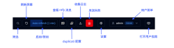
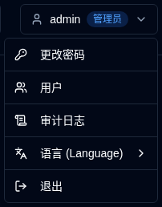
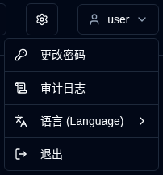

# 概述 {/* #overview */}

欢迎使用 duplistatus 用户指南。本综合文档提供了使用 duplistatus 监控和管理多个服务器上的 Duplicati 备份操作的详细说明。

## 什么是 duplistatus? {/* #what-is-duplistatus */}

duplistatus 是为 Duplicati 备份系统专门设计的强大监控仪表板。它提供：

- 从单一界面集中监控多个 Duplicati 服务器
- 所有备份操作的实时状态跟踪
- 可配置的自动过期备份检测和警报
- 备份性能的全面指标和可视化
- 通过 NTFY 和电子邮件的灵活通知系统
- 可选的[安全加固](../installation/security-hardening.md)功能
- 多语言支持（英语、法语、德语、西班牙语、巴西葡萄牙语、印地语和简体中文）。

## 安装 {/* #installation */}

有关先决条件和详细安装说明，请参阅[安装指南](../installation/installation.md)。

## 访问仪表板 {/* #accessing-the-dashboard */}

安装成功后，按照以下步骤访问 duplistatus 网络界面：

1. 打开您首选的网络浏览器
2. 导航至 `http://your-server-ip:9666`
   - 用实际的 IP 地址或主机名替换 `your-server-ip`
   - 默认端口是 `9666`
3. 您将看到一个登录页面。

首次使用（或从 0.9.x 之前的版本升级后）使用以下凭据：
    - 用户名：`admin`
    - 密码：`Duplistatus09`

在右上角选择用户界面语言 <IconButton icon="lucide:languages" label="语言" />，或在登录后在 <IconButton icon="lucide:user" label="用户名" /> 中（见下文）。

4. 登录后，主仪表板将自动显示（首次使用时无数据）

## 用户界面概述 {/* #user-interface-overview */}

duplistatus 提供了一个直观的仪表板，用于监控整个基础设施中 Duplicati 备份操作。

用户界面分为几个关键部分，以提供清晰和全面的监控体验：

1. [应用程序工具栏](#application-toolbar)：快速访问基本功能和配置
2. [仪表板摘要](dashboard.md#dashboard-summary)：所有监控服务器的概述统计信息
3. 服务器概述：[卡片布局](dashboard.md#cards-layout)或[表格布局](dashboard.md#table-layout)显示所有备份的最新状态，包括来自最后收到的备份日志的[Duplicati 服务器版本](dashboard.md#duplicati-server-version)
4. [过期详情](dashboard.md#overdue-details)：悬停时显示过期备份的可视化警告和详细信息
5. [可用备份版本](dashboard.md#available-backup-versions)：点击蓝色图标查看目标位置可用的备份版本
6. [备份指标](backup-metrics.md)：显示备份性能随时间的交互式图表
7. [服务器详情](server-details.md)：特定服务器的全面备份记录列表，包括详细统计信息
8. [备份详情](server-details.md#backup-details)：单个备份的深入信息，包括执行日志、警告和错误

## 应用工具栏 {/* #application-toolbar */}

应用工具栏提供了对关键功能和设置的便捷访问，组织成高效的工作流程。

| 按钮                                                                                                                                           | 描述                                                                                                                                                                                |
|--------------------------------------------------------------------------------------------------------------------------------------------------|--------------------------------------------------------------------------------------------------------------------------------------------------------------------------------------------|
| <IconButton icon="lucide:search" /> &nbsp; 过滤                                                                                            | 通过 ID、URL 或备份作业名称搜索和过滤服务器。                                                      |
| <IconButton icon="lucide:rotate-ccw" /> &nbsp; 刷新屏幕                                                                                    | 立即手动刷新所有数据                                                                                                                                     |
| <IconButton label="自动刷新" />                                                                                                              | 启用或禁用自动刷新功能。在 [显示设置](settings/display-settings.md) 中配置   _右键单击_ 打开显示设置页面                         |
| <SvgButton svgFilename="ntfy.svg" /> &nbsp; 打开 NTFY                                                                                            | 访问 ntfy.sh 网站以获取您配置的通知主题。   _右键单击_ 显示二维码以配置您的设备以接收来自 duplistatus 的通知。               |
| <SvgButton svgFilename="duplicati_logo.svg" href="duplicati-configuration" /> &nbsp; [Duplicati 配置](duplicati-configuration.md)       | 打开所选 Duplicati 服务器的网络界面   _右键单击_ 在新标签页中打开 Duplicati 旧版 UI (`/ngax`)                                                              |
| <IconButton icon="lucide:download" href="collect-backup-logs" /> &nbsp; [收集日志](collect-backup-logs.md)                                   | 连接到 Duplicati 服务器并检索备份日志   _右键单击_ 收集所有配置服务器的日志                                                                       |
| <IconButton icon="lucide:settings" href="settings/backup-notifications-settings" /> &nbsp; [设置](settings/backup-notifications-settings.md) | 配置通知、监控、SMTP 服务器和通知模板                                                                                                               |
| <IconButton icon="lucide:user" label="用户名" />                                                                                               | 显示已连接的用户、用户类型 (`Admin`, `User`)，点击用户菜单（包括语言选择）。在 [用户管理](settings/user-management-settings.md) 中查看更多信息               |
| <IconButton icon="lucide:book-open-text" href="overview" /> &nbsp; 用户指南                                                                    | 打开 [用户指南](overview.md) 到您当前查看的页面相关部分。工具提示显示“[页面名称] 的帮助”以指示将打开哪个文档。 |

### 用户菜单 {/* #user-menu */}

点击用户按钮会打开一个下拉菜单，其中包含特定于用户的选项。菜单选项根据您是以管理员身份还是普通用户身份登录而有所不同。两种角色都可以通过 **语言** 子菜单更改界面语言。所选语言会保存到此浏览器上的每个用户（不是系统范围的设置），因此不同的帐户可以保留不同的语言。支持的语言：英语、法语、德语、西班牙语、巴西葡萄牙语、印地语和简体中文。

<table>
  <tr>
    <th>管理员</th>
    <th>普通用户</th>
  </tr>
  <tr>
    <td style={{verticalAlign: 'top'}}></td>
    <td style={{verticalAlign: 'top'}}></td>
  </tr>
</table>

## 基本配置 {/* #essential-configuration */}

1. 配置您的 [Duplicati 服务器](../installation/duplicati-server-configuration.md) 以将备份日志消息发送到 duplistatus（必需）。
2. 收集初始备份日志 - 使用 [收集备份日志](collect-backup-logs.md) 功能将历史备份数据填充到数据库中，并自动更新备份监控间隔，基于每个服务器的配置。
3. 配置服务器设置 - 在 [设置 → 服务器](settings/server-settings.md) 中设置服务器别名和备注，以使您的仪表板更具信息性。
4. 配置 NTFY 设置 - 在 [设置 → NTFY](settings/ntfy-settings.md) 中设置 NTFY 通知。
5. 配置电子邮件设置 - 在 [设置 → 电子邮件](settings/email-settings.md) 中设置电子邮件通知。
6. 配置备份通知 - 在 [设置 → 备份通知](settings/backup-notifications-settings.md) 中设置每个备份或每个服务器的通知。
7. 可选地限制访问 - 如果您想保护 `/api/upload` 和管理界面，请创建 [API 密钥](settings/api-keys-settings.md) 和/或 [IP 允许列表](settings/ip-allowlist-settings.md)。两者默认均为关闭。

 

:::info[重要]
请记住配置 Duplicati 服务器以将备份日志发送到 duplistatus，如 [Duplicati 配置](../installation/duplicati-server-configuration.md) 部分所述。
:::

 

:::note
 所有产品名称、徽标和商标均为其各自所有者的财产。图标和名称仅用于识别目的，并不表示认可。
:::

<small>

> **关于 UI 和文档翻译的说明：** 除英语（英国）之外的所有界面和文档语言均使用 AI 进行翻译，使用 [ai-i18n-tools](https://wsj-br.github.io/ai-i18n-tools/); 翻译可能不够准确或存在错误。

</small>
