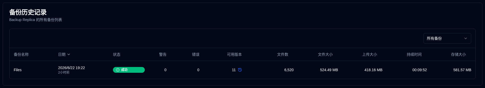

# 服务器详细信息 {#server-details}

从仪表板中点击一个服务器，将打开一个页面，显示该服务器的备份列表。您可以查看所有备份，或选择一个特定的备份，如果服务器有多个备份配置。

## 服务器/备份统计信息 {#serverbackup-statistics}

此部分显示服务器上所有备份或单个选定备份的统计信息。

- **备份作业总数**: 服务器上配置的备份作业总数。
- **备份运行总数**: 执行的备份运行总数（如Duplicati服务器报告）。
- **可用版本**: 可用版本数（如Duplicati服务器报告）。
- **平均持续时间**: 备份的平均（均值）持续时间，如**duplistatus**数据库中记录。
- **上次备份大小**: 来自上次备份日志的源文件大小。
- **已用存储空间总计**: 备份目标上的存储空间使用情况，如上次备份日志中报告。
- **总上传量**: **duplistatus**数据库中记录的所有上传数据的总和。

如果此备份或服务器上的任何备份（当**所有备份**被选中时）过期，则在摘要下方显示一条消息。

点击<IconButton icon="lucide:settings" href="settings/backup-monitoring-settings" label="配置"/>前往[设置 → 备份监控](settings/backup-monitoring-settings.md)。或者点击工具栏上的<SvgButton SvgButton svgFilename="duplicati_logo.svg" href="duplicati-configuration" />打开Duplicati服务器的Web界面并检查日志。

 

## 备份历史记录 {#backup-history}

此表格列出选定服务器的备份日志。

- **备份名称**: Duplicati服务器中的备份名称。
- **日期**: 备份的时间戳和自上次屏幕刷新以来的时间。
- **状态**: 备份的状态（成功、警告、错误、严重错误）。
- **警告/错误**: 备份日志中报告的警告/错误数量。
- **可用版本**: 备份目标上的可用备份版本数。如果图标灰显，则未接收到详细信息。
- **文件数、文件大小、上传大小、持续时间、存储大小**: Duplicati服务器报告的值。

:::tip 提示
• 使用**备份历史记录**部分中的下拉菜单选择**所有备份**或此服务器的特定备份。

• 您可以通过点击列标题对任何列进行排序，点击再次反转排序顺序。
 
• 点击行中的任何位置以查看[备份详细信息](#backup-details)。

:::

:::note
当**所有备份**被选中时，列表默认按最新到最旧的顺序显示所有备份。
:::

 

## 备份详细信息 {#backup-details}

在仪表板（表格视图）中点击状态徽章或备份历史记录表格中的任何行将显示详细的备份信息。

- **服务器详细信息**: 服务器名称、别名和注释。
- **备份信息**: 备份的时间戳和ID。
- **备份统计信息**: 报告的计数器、大小和持续时间的摘要。
- **日志摘要**: 报告的消息数。
- **可用版本**: 可用版本列表（仅在日志中接收到信息时显示）。
- **消息/警告/错误**: 完整的执行日志。子标题指示日志是否被Duplicati服务器截断。

 

:::note
参阅[Duplicati配置说明](../installation/duplicati-server-configuration.md)以了解如何配置Duplicati服务器以发送完整的执行日志并避免截断。
:::
