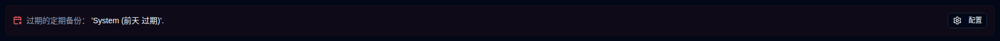
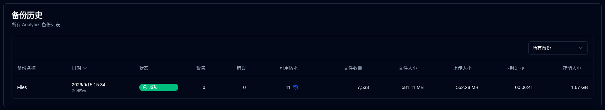

# 服务器详情 {/* #server-details */}

从仪表板点击服务器会打开一个页面，显示该服务器的备份列表。如果服务器配置了多个备份，您可以查看所有备份或选择特定的备份。

## 服务器/备份统计 {/* #serverbackup-statistics */}

此部分显示服务器上所有备份或单个选定备份的统计信息。

- **总备份作业数**：在此服务器上配置的备份作业总数。
- **总备份运行数**：执行的备份运行总数（由 Duplicati 服务器报告）。
- **可用版本**：可用版本的数量（由 Duplicati 服务器报告）。
- **平均持续时间**：在 **duplistatus** 数据库中记录的备份的平均（均值）持续时间。
- **上次备份大小**：从上次收到的备份日志中的源文件大小。
- **总存储使用量**：备份目标上使用的存储空间，如上次备份日志中报告的那样。
- **总上传量**：在 **duplistatus** 数据库中记录的所有上传数据的总和。

如果此备份或服务器上的任何备份（当选择了 **所有备份** 时）已逾期，则摘要下方会出现一条消息。

点击 <IconButton icon="lucide:settings" href="settings/backup-monitoring-settings" label="配置"/> 转到[设置 → 备份监控](settings/backup-monitoring-settings.md)。或者点击工具栏上的 <SvgButton SvgButton svgFilename="duplicati_logo.svg" href="duplicati-configuration" /> 打开 Duplicati 服务器的 Web 界面并检查日志。

 

## 备份历史 {/* #backup-history */}

此表列出了所选服务器的备份日志。

- **备份名称**：Duplicati 服务器中的备份名称。
- **日期**：备份的时间戳以及自上次屏幕刷新以来的经过时间。
- **状态**：备份的状态（成功、警告、错误、致命）。
- **警告/错误**：备份日志中报告的警告/错误数量。
- **可用版本**：备份目标上可用的备份版本数量。如果图标为灰色，则未收到详细信息。
- **文件数量、文件大小、上传大小、持续时间、存储大小**：Duplicati 服务器报告的值。

:::tip 提示
• 在 **备份历史** 部分使用下拉菜单选择此服务器的 **所有备份** 或特定备份。

• 您可以通过单击标题来对任何列进行排序，再次单击以反转排序顺序。
 
• 单击行上的任意位置以查看[备份详情](#backup-details)。

:::

:::note
当选择 **所有备份** 时，默认情况下列表按从新到旧的顺序显示所有备份。
:::

 

## 备份详情 {/* #backup-details */}

点击仪表板中的状态徽章（表格视图）或备份历史表中的任何行将显示详细的备份信息。

- **服务器详情**：服务器名称、别名和备注。
- **备份信息**：备份的时间戳及其 ID。
- **备份统计**：报告的计数器、大小和持续时间的摘要。
- **日志摘要**：报告消息的数量。
- **可用版本**：可用版本列表（仅在日志中接收到该信息时显示）。
- **消息/警告/错误**：完整的执行日志。副标题表明日志是否被 duplicati 服务器截断。

 

:::note
请参阅 [Duplicati 配置说明](../installation/duplicati-server-configuration.md)，了解如何配置 Duplicati 服务器以发送完整的执行日志并避免截断。
:::
