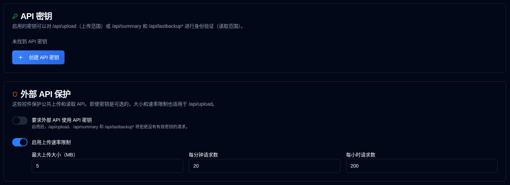

# API 密钥 {#api-keys}

管理员可以为 Duplicati 和 Homepage 使用的外部 HTTP API 创建范围限定的 API 密钥。默认情况下，密钥是可选的，因此现有的 Duplicati 任务仍然可以正常工作。



## 范围 {#scopes}

| 范围 | 端点 |
|-------|-----------|
| 上传 | `POST /api/upload` |
| 读取 | `GET /api/summary`, `GET /api/lastbackup/:id`, `GET /api/lastbackups/:id` |

上传密钥不能调用读取 API，而读取密钥不能上传报告。

## 创建密钥 {#creating-a-key}

1. 打开**设置 → API 密钥**。
2. 点击 API 密钥卡片底部的**创建 API 密钥**。
3. 输入名称，选择范围，并可选地设置过期时间（`YYYY-MM-DD`）。
4. 生成密钥并立即复制密钥。它只会在对话框中显示一次。
5. 之后的列表会显示一个指纹，例如`Qk7v…3xTa`（前四个和最后四个字符），过期日期和状态。相同的指纹会出现在审计日志中。

### 禁用或删除 {#disable-or-delete}

在**操作**列中使用复选框禁用密钥而不删除它。禁用的密钥无法进行身份验证。再次勾选复选框以重新启用密钥。已过期的密钥无法启用；请改为创建新密钥。删除会永久移除密钥。

### 到期日 {#expiry}

可选的到期日期是密钥保持有效的最后一个日历日。它在浏览器的本地时区于该日 **23:59:59** 过期，而不是在该日开始时的午夜过期。

选择`2026-12-01`会在本地构建`2026-12-01T23:59:59`，然后将该时刻存储为 UTC。对于 UTC+1 的浏览器来说，这是`2026-12-01T22:59:59.000Z`。密钥在 12 月 1 日保持有效，并且从当地时间 23:59:59 开始被视为已过期（`expires_at <= now`）。API 密钥表会显示过期日期（如果未设置则显示**从不**）。在那个时刻之后，状态徽章会变为**已过期**（灰色）；已过期的密钥即使保持启用状态也无法进行身份验证。

## 使用密钥 {#using-a-key}

Duplicati 无法设置自定义标头。将密钥放在报告 URL 中：

```bash
--send-http-json-urls=https://your-host/api/upload?api_key=YOUR_KEY
```

Homepage 小部件可以使用相同的查询参数：

```yaml
url: http://your-host/api/summary?api_key=YOUR_READ_KEY
```

可以发送标头的客户端可以使用 `X-Api-Key` 或 `Authorization: Bearer` 代替。查询字符串密钥出现在反向代理访问日志中。

## 要求密钥 {#require-keys}

**要求外部 API 使用 API 密钥** 开关默认关闭。当您将其打开时，四个外部数据 API 在没有有效密钥的情况下返回 `401`。首先启用至少一个上传密钥和一个读取密钥，否则 Duplicati 上传和 Homepage 小部件将停止。

## 外部 API 保护 {#external-api-protection}

同一页面可以要求 API 密钥用于公共上传和读取 API，并配置最大主体大小（默认 5 MB）和每 IP 速率限制 `/api/upload`。大小和速率限制即使密钥是可选的也适用，并且是防止洪水攻击的主要防御措施。

另请参阅 [IP白名单](ip-allowlist-settings.md)。IP白名单和API密钥是独立的功能；您可以单独使用其中一个，也可以同时使用两者。启用两者可通过IP地址限制访问并要求API密钥来提高安全性。
