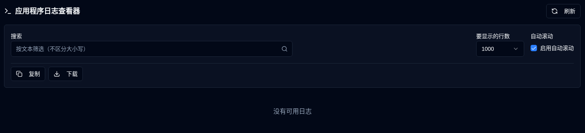

# 应用程序日志 {#application-logs}

应用程序日志查看器允许管理员在一个地方监视所有应用程序日志，具有过滤、导出和实时更新的功能，直接从Web界面进行。

 

## 可用操作 {#available-actions}

| 按钮                                                              | 描述                                                                                         |
|:--------------------------------------------------------------------|:----------------------------------------------------------------------------------------------------|
| <IconButton icon="lucide:refresh-cw" label="刷新" />            | 手动重新加载所选文件的日志。显示加载spinner，同时刷新并重置新行检测的跟踪。 |
| <IconButton icon="lucide:copy" label="复制到剪贴板" />         | 将所有过滤的日志行复制到剪贴板。尊重当前搜索过滤器。有助于快速共享或粘贴到其他工具中。 |
| <IconButton icon="lucide:download" label="导出" />               | 将日志作为文本文件下载。从当前选定的文件版本导出，并应用当前搜索过滤器（如果有）。文件名格式：`duplistatus-logs-YYYY-MM-DD.txt`（日期以ISO格式表示）。 |
| <IconButton icon="lucide:arrow-down-from-line" />                   | 快速跳转到显示的日志的开始。禁用自动滚动或导航长日志文件时很有用。 |
| <IconButton icon="lucide:arrow-down-to-line" />                    | 快速跳转到显示的日志的末尾。禁用自动滚动或导航长日志文件时很有用。 |

 

## 控件和过滤器 {#controls-and-filters}

| 控件 | 描述 |
|:--------|:-----------|
| **文件版本** | 选择要查看的日志文件：**当前**（活动文件）或旋转文件（`.1`，`.2`，等等，其中更高的数字是更旧的文件）。 |
| **要显示的行数** | 显示所选文件的最近**100**，**500**，**1000**（默认），**5000**或**10000**行。 |
| **自动滚动** | 启用时（默认为当前文件），自动滚动到新日志条目并每2秒刷新一次。仅适用于**当前**文件版本。 |
| **搜索** | 按文本（不区分大小写）过滤日志行。过滤器应用于当前显示的行。 |

 

日志显示头部显示过滤的行数、总行数、文件大小和最后修改的时间戳。

 
