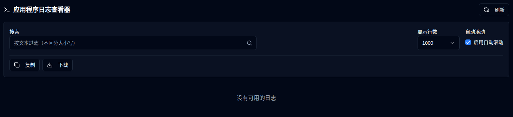

# 应用程序日志 {/* #application-logs */}

应用程序日志查看器允许管理员在一个地方监控所有应用程序日志，具有过滤、导出和实时更新功能，直接从网络界面操作。

 

## 可用操作 {/* #available-actions */}

| 按钮                                                              | 描述                                                                                         |
|:--------------------------------------------------------------------|:----------------------------------------------------------------------------------------------------|
| <IconButton icon="lucide:refresh-cw" label="刷新" />            | 从所选文件手动重新加载日志。在刷新时显示加载微调器，并重置新行检测的跟踪。 |
| <IconButton icon="lucide:copy" label="复制到剪贴板" />         | 将所有过滤后的日志行复制到剪贴板。遵循当前的搜索过滤器。适用于快速分享或粘贴到其他工具中。 |
| <IconButton icon="lucide:download" label="导出" />               | 将日志下载为文本文件。从当前选定的文件版本导出，并应用当前的搜索过滤器（如果有）。文件名格式：`duplistatus-logs-YYYY-MM-DD.txt`（ISO格式的日期）。 |
| <IconButton icon="lucide:arrow-down-from-line" />                   | 快速跳转到显示的日志开头。在自动滚动被禁用或在长日志文件中导航时很有用。 |
| <IconButton icon="lucide:arrow-down-to-line" />                    | 快速跳转到显示的日志结尾。在自动滚动被禁用或在长日志文件中导航时很有用。 |

 

## 控件和过滤器 {/* #controls-and-filters */}

| 控件 | 描述 |
|:--------|:-----------|
| **文件版本** | 选择要查看的日志文件：**当前**（活动文件）或轮换文件（`.1`、`.2`等，其中较高的数字表示较旧的文件）。 |
| **显示行数** | 从所选文件中显示最新的**100**、**500**、**1000**（默认）、**5000**或**10000**行。 |
| **自动滚动** | 启用时（当前文件的默认设置），自动滚动到新的日志条目，每2秒刷新一次。仅适用于**当前**文件版本。 |
| **搜索** | 按文本过滤日志行（不区分大小写）。过滤器适用于当前显示的行。 |

 

日志显示标题显示过滤后的行数、总行数、文件大小和最后修改时间戳。

 
