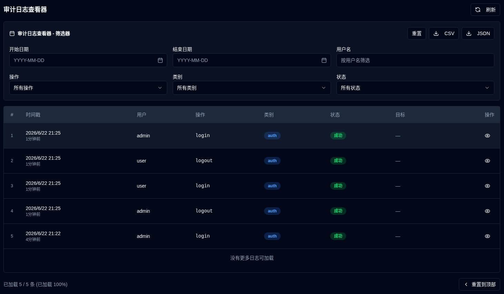

# 审计日志 {#audit-logs}

审计日志提供了系统更改和用户操作的全面记录，包括 **duplistatus**。这有助于跟踪配置更改、用户活动和系统操作，以实现安全和故障排除目的。

## 审计日志查看器 {#audit-log-viewer}

审计日志查看器显示了所有已记录事件的时间顺序列表，包括以下信息:

- **时间戳**: 事件发生的时间
- **用户**: 执行操作的用户名（或“系统”表示自动操作）
- **操作**: 执行的具体操作
- **类别**: 操作的类别（身份验证、用户管理、配置、备份操作、服务器管理、系统操作）
- **状态**: 操作是否成功或失败
- **目标**: 受影响的对象（如果适用）
- **详细信息**: 关于操作的额外信息

### 查看日志详细信息 {#viewing-log-details}

单击任何日志条目旁边的 <IconButton icon="lucide:eye" /> 眼睛图标以查看详细信息，包括:
- 完整时间戳
- 用户信息
- 完整操作详细信息（例如：更改的字段、统计信息等。）
- IP 地址和用户代理
- 错误消息（如果操作失败）

### 导出审计日志 {#exporting-audit-logs}

您可以以两种格式导出筛选后的审计日志:

| 按钮 | 描述 |
|:------|:-----------|
| <IconButton icon="lucide:download" label="CSV"/> | 以 CSV 文件形式导出日志，以进行电子表格分析 |
| <IconButton icon="lucide:download" label="JSON"/> | 以 JSON 文件形式导出日志，以进行程序化分析 |

:::note
导出的日志仅包括基于您当前激活的筛选器可见的日志。要导出所有日志，请先清除所有筛选器。
:::
