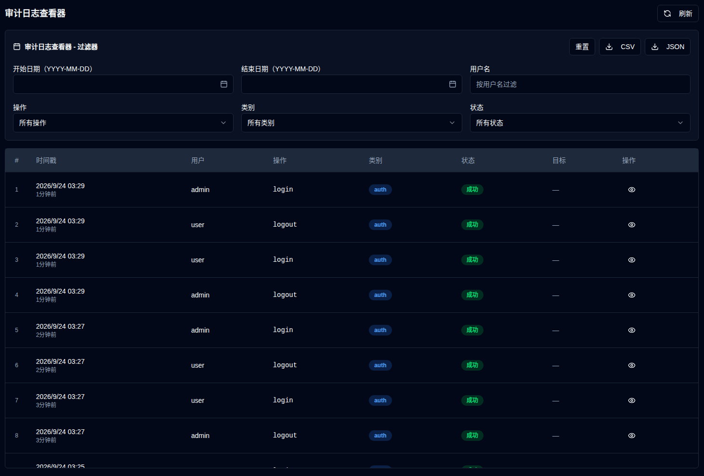

# 审计日志 {/* #audit-logs */}

审计日志提供了一个全面的记录，涵盖 **duplistatus** 中所有系统变更和用户操作。这有助于跟踪配置变更、用户活动和系统操作，以便于安全和故障排除。

## 审计日志查看器 {/* #audit-log-viewer */}

审计日志查看器显示了一个按时间顺序排列的所有已记录事件的列表，其中包含以下信息：

- **时间戳**：事件发生的时间
- **用户**：执行操作的用户名（对于自动化操作，显示为“系统”）
- **操作**：执行的具体操作
- **类别**：操作的类别（认证、用户管理、配置、备份操作、服务器管理、系统操作）
- **状态**：操作是否成功或失败
- **目标**：受影响的对象（如果适用）
- **详情**：关于操作的附加信息

### 查看日志详情 {/* #viewing-log-details */}

点击任何日志条目旁边的 <IconButton icon="lucide:eye" /> 眼睛图标，查看详细信息，包括：
- 完整时间戳
- 用户信息
- 完整操作详情（例如：更改的字段、统计信息等）
- IP 地址和用户代理
- 错误消息（如果操作失败）

### 导出审计日志 {/* #exporting-audit-logs */}

您可以将过滤后的审计日志导出为两种格式：

| 按钮 | 描述 |
|:------|:-----------|
| <IconButton icon="lucide:download" label="CSV"/> | 将日志导出为 CSV 文件，以便在电子表格中进行分析 |
| <IconButton icon="lucide:download" label="JSON"/> | 将日志导出为 JSON 文件，以便进行程序化分析 |

:::note
导出仅包含当前基于您的活动过滤器可见的日志。要导出所有日志，请先清除所有过滤器。
:::
