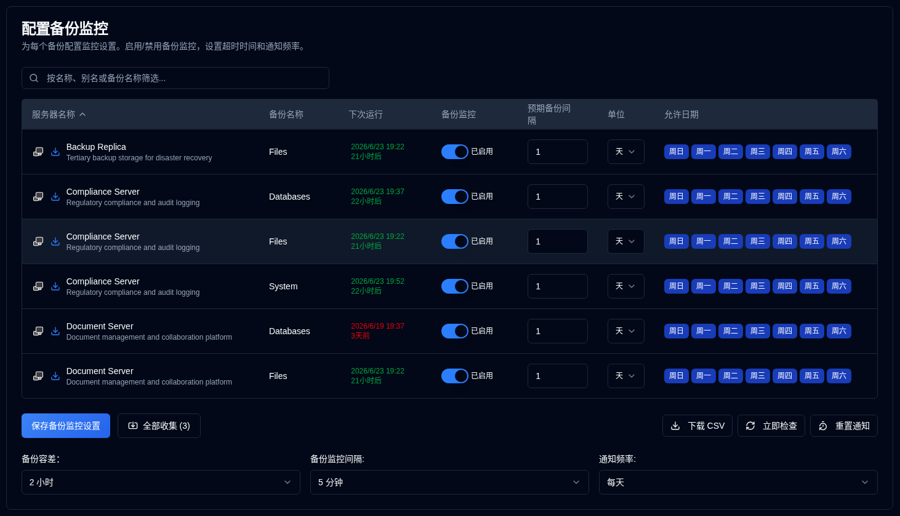

# 备份监控 {#backup-monitoring}

## 服务器过滤 {#server-filtering}

此页面上的服务器列表可以使用过滤字段进行过滤。

**过滤匹配：**
- 服务器 ID
- 服务器 URL
- 备份作业名称

这使得在管理多个系统时，快速找到特定的服务器或备份在监控设置中变得容易。

## 配置每个备份监控设置 {#configure-per-backup-monitoring-settings}

-  **服务器名称**：要监控的服务器名称，以检测过期备份。 
   - 点击 <SvgIcon svgFilename="duplicati_logo.svg" height="18"/> 打开 Duplicati 服务器的 Web 界面
   - 点击 <IIcon2 icon="lucide:download" height="18"/> 收集此服务器的备份日志。
- **备份名称**：要监控的备份名称，以检测过期备份。
- **下次运行**：下一次计划备份时间，如果计划在未来，则显示为绿色，如果过期，则显示为红色。悬停在“下次运行”值上，将显示一个工具提示，显示数据库中的上次备份时间戳，格式为完整日期/时间和相对时间。
- **备份监控**：启用或禁用此备份的备份监控。
- **预期备份间隔**：预期的备份间隔。
- **单位**：预期间隔的单位。
- **允许日期**：备份允许的星期几。

如果服务器名称旁边的图标变灰，则服务器未在 [设置 → 服务器设置](/user-guide/settings/server-settings) 中配置。

:::note
当您从 Duplicati 服务器收集备份日志时，**duplistatus** 自动更新备份监控间隔和配置。
:::

:::tip
为了获得最佳结果，在更改 Duplicati 服务器中的备份作业间隔配置后，请收集备份日志。这确保 **duplistatus** 与当前配置保持同步。
:::

## 全局配置 {#global-configurations}

这些设置适用于所有备份:

| 设置                         | 描述                                                                                                                                                                                                                                                                                                                             |
|:--------------------------------|:--------------------------------------------------------------------------------------------------------------------------------------------------------------------------------------------------------------------------------------------------------------------------|
| **备份容忍度**            | 预期备份时间之前添加的宽限期（允许的额外时间），在标记为过期之前。默认为 **1 小时**。                                                                                                                                                                                                             |
| **备份监控间隔** | 系统检查过期备份的频率。默认为 **5 分钟**。                                                                                                                                                                                                                                                            |
| **通知频率**      | 发送过期通知的频率：   **一次性`: Send **just one** notification when the backup becomes overdue.   `每天`: Send **daily** notifications while overdue (default).   `每周`: Send **weekly** notifications while overdue.   `每月**：在过期期间发送 **每月** 通知。 |

## 可用操作 {#available-actions}

| 按钮                                                              | 描述                                                                                                                           |
|:--------------------------------------------------------------------|:--------------------------------------------------------------------------------------------------------------------------------------|
| <IconButton label="保存备份监控设置" />              | 保存设置，清除任何已禁用备份的计时器，并运行逾期检查。                                                |
| <IconButton icon="lucide:import" label="全部收集 (#)"/>          | 从所有配置的服务器收集备份日志，在括号中显示收集的服务器数量。                                   |
| <IconButton icon="lucide:download" label="下载 CSV"/>           | 下载一个包含所有备份监控设置和数据库中的"上次备份时间戳 (DB)"的 CSV 文件。               |
| <IconButton icon="lucide:refresh-cw" label="立即检查"/>            | 立即运行逾期备份检查。在更改配置后，这很有用。它还触发 "下次运行" 的重新计算。 |
| <IconButton icon="lucide:timer-reset" label="重置通知"/> | 重置所有备份的上次发送的逾期通知。                                                                            |
