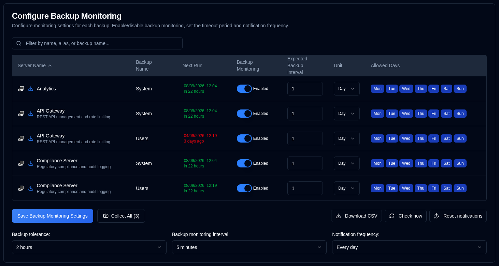

# 备份监控 {/* #backup-monitoring */}

## 服务器筛选 {/* #server-filtering */}

此页面上的服务器列表可以使用过滤字段进行筛选。

当**每日摘要**启用时，过期检测会继续，但会阻止向默认电子邮件收件人发送过期邮件。额外的邮件目的地将继续为匹配的事件发送（过期被视为警告）。请参见[每日摘要](daily-summary-settings.md)。

**筛选匹配：**
- 服务器 ID
- 服务器 URL
- 备份作业名称

这使得在管理多个系统时，可以轻松地在监控设置中快速定位特定服务器或备份。

## 配置每个备份的监控设置 {/* #configure-per-backup-monitoring-settings */}

-  **服务器名称**：要监控过期备份的服务器名称。
   - 单击<SvgIcon svgFilename="duplicati_logo.svg" height="18"/>打开 Duplicati 服务器的 Web 界面
   - 单击<IIcon2 icon="lucide:download" height="18"/>从此服务器收集备份日志。
- **备份名称**：要监控过期备份的备份名称。
- **下次运行**：下次计划备份时间，如果计划在未来则显示为绿色，如果已过期则显示为红色。将鼠标悬停在"下次运行"值上会显示一个工具提示，显示来自数据库的最后备份时间戳，格式为完整日期/时间及相对时间。
- **备份监控**：启用或禁用此备份的备份监控。
- **预期备份间隔**：预期的备份间隔。
- **单位**：预期间隔的单位。
- **允许的天数**：备份允许的星期几。

如果服务器名称旁边的图标变为灰色，则该服务器未在[设置 → 服务器设置](/user-guide/settings/server-settings)中配置。

:::note
当您从 Duplicati 服务器收集备份日志时，**duplistatus**会自动更新备份监控间隔和配置。
:::

:::tip
为了获得最佳效果，在更改 Duplicati 服务器中的备份作业间隔配置后，请收集备份日志。这可确保**duplistatus**与当前配置保持同步。
:::

## 全局配置 {/* #global-configurations */}

这些设置适用于所有备份：

| 设置                         | 说明                                                                                                                                                                                                                                                                                                                             |
|:--------------------------------|:----------------------------------------------------------------------------------------------------------------------------------------------------------------------------------------------------------------------------------------------------------------------------------------------------------------------------------------|
| **备份容差**            | 在标记为过期之前添加到预期备份时间的宽限期（允许的额外时间）。默认值为**1 小时**。                                                                                                                                                                                                             |
| **备份监控间隔** | 系统检查过期备份的频率。默认值为**5 分钟**。                                                                                                                                                                                                                                                            |
| **通知频率**      | 发送过期通知的频率：  **一次性`: Send **just one** notification when the backup becomes overdue.   `每天`: Send **daily** notifications while overdue (default).   `每周`: Send **weekly** notifications while overdue.   `每月**：在过期期间发送**月度**通知。 |

## 可用操作 {/* #available-actions */}

| 按钮 | 描述 |
|:--------------------------------------------------------------------|:--------------------------------------------------------------------------------------------------------------------------------------|
| <IconButton label="保存备份监控设置" /> | 保存设置，清除任何已禁用备份的计时器，并运行过期检查。 |
| <IconButton icon="lucide:import" label="收集所有 (#)"/> | 从所有已配置的服务器收集备份日志，在括号中显示要收集的服务器数量。 |
| <IconButton icon="lucide:download" label="下载 CSV"/> | 下载包含所有备份监控设置和数据库中的“最后备份时间戳（DB）”的 CSV 文件。 |
| <IconButton icon="lucide:refresh-cw" label="立即检查"/> | 立即运行过期备份检查。在更改配置后这很有用。它还会触发“下次运行”的重新计算。 |
| <IconButton icon="lucide:timer-reset" label="重置通知"/> | 重置所有备份的最后过期通知发送状态。 |
