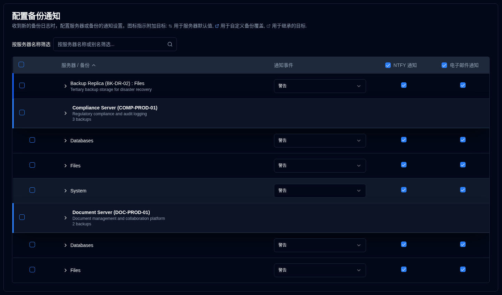
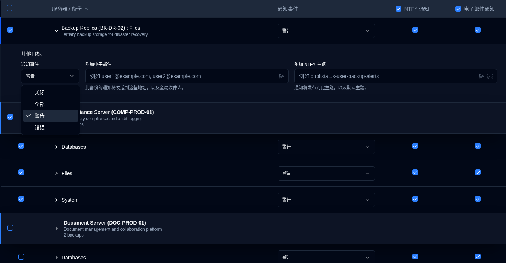

# 备份通知 {#backup-notifications}

使用此设置来发送通知，当 [新备份日志被接收](../../installation/duplicati-server-configuration.md) 时。

备份通知表按服务器组织。显示格式取决于服务器的备份数量：
- **多个备份**：显示服务器标题行，下面是单个备份行。点击服务器标题以展开或折叠备份列表。
- **单个备份**：显示 **合并行**，带有蓝色左边框，显示：
  -  **服务器名称 : 备份名称** 如果没有配置服务器别名，或者
  - **服务器别名（服务器名称） : 备份名称** 如果配置了。

此页面具有自动保存功能。您所做的任何更改都将被自动保存。

 

## 筛选 {#filter}

使用页面顶部的 **按服务器名称筛选** 字段快速按服务器名称或别名查找特定的备份。表格将自动筛选以显示仅匹配的条目。

 

## 配置每个备份通知设置 {#configure-per-backup-notification-settings}

| 设置                       | 描述                                               | 默认值 |
| :---------------------------- | :-------------------------------------------------------- | :------------ |
| **通知事件**       | 配置何时为新备份日志发送通知。 | **警告**    |
| **NTFY**                      | 为此备份启用或禁用 NTFY 通知。     | **已启用**     |
| **电子邮件**                     | 为此备份启用或禁用电子邮件通知。    | **已启用**    |

**通知事件选项：**

- **全部**：发送所有备份事件的通知。
- **警告**：仅发送警告和错误的通知（默认）。
- **错误**：仅发送错误的通知。
- **关闭**：禁用此备份的新备份日志的通知。

 

## 其他目标 {#additional-destinations}

其他通知目标允许您将通知发送到特定的电子邮件地址或 NTFY 主题，超出全局设置。系统使用层次继承模型，备份可以从其服务器继承默认设置，或使用备份特定的值覆盖它们。

其他目标配置由服务器和备份名称旁边的上下文图标指示：

- **服务器图标** <IconButton icon="lucide:settings-2" style={{border: 'none', padding: 0, color: 'inherit', background: 'transparent'}} />：在服务器级别配置默认其他目标时，出现在服务器名称旁边。

- **备份图标** <IconButton icon="lucide:external-link" style={{border: 'none', padding: 0, color: '#60a5fa', background: 'transparent'}} />（蓝色）：出现在备份名称旁边，当配置自定义其他目标（覆盖服务器默认值）时。

- **备份图标** <IconButton icon="lucide:external-link" style={{border: 'none', padding: 0, color: '#64748b', background: 'transparent'}} />（灰色）：出现在备份名称旁边，当备份从服务器默认值继承其他目标时。

如果没有显示图标，则服务器或备份没有配置其他目标。

### 服务器级别默认值 {#server-level-defaults}

您可以在服务器级别配置默认的附加目标，这些目标将自动继承到该服务器上的所有备份中。

1. 导航到 [设置 → 备份通知](backup-notifications-settings.md)。
2. 表格按服务器分组，具有不同的服务器标题行，显示服务器名称、别名和备份计数。
   - **注释**：对于只有一个备份的服务器，显示合并行而不是单独的服务器标题。服务器级别的默认值不能直接从合并行配置。如果您需要配置单个备份服务器的服务器默认值，可以通过暂时添加另一个备份到该服务器，或者备份的附加目标将自动继承任何现有的服务器默认值。
3. 点击服务器行中的任何位置以展开 **此服务器的默认附加目标** 部分。
4. 配置以下默认设置：
   - **通知事件**：选择触发附加目标通知的事件（**全部**、**警告**、**错误** 或 **关闭**）。
   - **附加电子邮件**：输入一个或多个将接收此服务器上所有备份通知的电子邮件地址（逗号分隔）。点击 <IconButton icon="lucide:send-horizontal" style={{border: 'none', padding: 0, color: 'inherit', background: 'transparent'}} /> 图标按钮向字段中的地址发送测试电子邮件。
   - **附加 NTFY 主题**：输入一个自定义的 NTFY 主题名称，所有此服务器上的备份通知将在此主题中发布。点击 <IconButton icon="lucide:send-horizontal" style={{border: 'none', padding: 0, color: 'inherit', background: 'transparent'}} /> 图标按钮向主题发送测试通知，或者点击 <IconButton icon="lucide:qr-code" style={{border: 'none', padding: 0, color: 'inherit', background: 'transparent'}} /> 图标按钮显示主题的二维码以配置您的设备接收通知。

**服务器默认值管理：**

- **同步到全部**：清除所有备份覆盖，使所有备份继承服务器默认值。
- **全部清除**：清除服务器默认值和所有备份的所有附加目标，同时保持继承结构。

### 每个备份配置 {#per-backup-configuration}

个别备份自动继承服务器默认值，但您可以为特定的备份作业覆盖它们。

1. 点击备份行中的任何位置以展开其 **附加目标** 部分。
2. 配置以下设置：
   - **通知事件**：选择触发附加目标通知的事件（**全部**、**警告**、**错误** 或 **关闭**）。
   - **附加电子邮件**：输入一个或多个将接收通知的电子邮件地址（逗号分隔），除了全局接收者。点击 <IconButton icon="lucide:send-horizontal" style={{border: 'none', padding: 0, color: 'inherit', background: 'transparent'}} /> 图标按钮向字段中的地址发送测试电子邮件。
   - **附加 NTFY 主题**：输入一个自定义的 NTFY 主题名称，通知将在此主题中发布，除了默认主题。点击 <IconButton icon="lucide:send-horizontal" style={{border: 'none', padding: 0, color: 'inherit', background: 'transparent'}} /> 图标按钮向主题发送测试通知，或者点击 <IconButton icon="lucide:qr-code" style={{border: 'none', padding: 0, color: 'inherit', background: 'transparent'}} /> 图标按钮显示主题的二维码以配置您的设备接收通知。

**继承指示器：**

- **链接图标** <IconButton icon="lucide:link" style={{border: 'none', padding: 0, color: '#3b82f6', background: 'transparent'}} /> 蓝色：表示值继承自服务器默认值。点击字段将创建一个覆盖用于编辑。
- **断开链接图标** <IconButton icon="lucide:link-2-off" style={{border: 'none', padding: 0, color: '#3b82f6', background: 'transparent'}} /> 蓝色：表示值已被覆盖。点击图标以恢复继承。

**附加目标行为：**

- 配置附加目标时，将向全局设置和附加目标发送通知。
- 附加目标的通知事件设置独立于主通知事件设置。
- 如果附加目标设置为 **关闭**，则不会向这些目标发送通知，但主通知将根据主设置正常工作。
- 当备份继承服务器默认值时，对服务器默认值的任何更改将自动应用于该备份（除非它已被覆盖）。

 

## 批量编辑 {#bulk-edit}

您可以使用批量编辑功能同时编辑多个备份的其他目标设置。这在您需要将相同的其他目标应用于许多备份作业时尤其有用。

1. 导航到[设置 → 备份通知](backup-notifications-settings.md)。
2. 使用第一列中的复选框来选择您要编辑的备份或服务器。
   - 使用标题行中的复选框来选中或取消选中全部可见的备份。
   - 您可以在选择之前使用筛选器来缩小列表范围。
3. 选择备份后，将显示一个批量操作栏，显示所选备份的数量。
4. 点击 **批量编辑** 打开编辑对话框。
5. 配置其他目标设置：
   - **通知事件**：为所有选定的备份设置通知事件。
   - **附加电子邮件**：输入要应用于所有选定备份的电子邮件地址（用逗号分隔）。
   - **附加 NTFY 主题**：输入要应用于所有选定备份的 NTFY 主题名称。
   - 批量编辑对话框中有测试按钮，用于在将电子邮件地址和 NTFY 主题应用于多个备份之前进行验证。
6. 点击 **保存** 将设置应用于所有选定的备份。

**批量清除:**

要从选定的备份中删除所有其他目标设置：

1. 选择要清除的备份。
2. 在批量操作栏中点击 **批量清除**。
3. 在对话框中确认操作。

这将删除所选备份的所有附加电子邮件地址、NTFY 主题和通知事件。清除后，备份将恢复为从服务器默认设置继承（如果已配置）。

 
