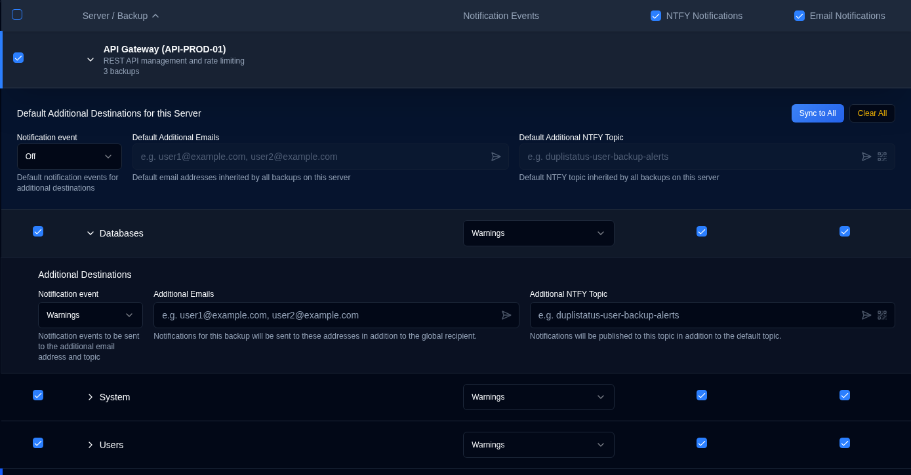

# 备份通知 {/* #backup-notifications */}

使用此设置在收到[新备份日志](../../installation/duplicati-server-configuration.md)时发送通知。

备份通知表按服务器组织。显示格式取决于服务器的备份数量：
- **多个备份**：显示一个服务器标题行，下面是各个备份行。点击服务器标题可以展开或折叠备份列表。
- **单个备份**：显示一个带有蓝色左边框的**合并行**，显示：
  -  **服务器名称 : 备份名称**（如果未配置服务器别名），或者
  - **服务器别名（服务器名称） : 备份名称**（如果已配置）。

此页面具有自动保存功能。您所做的任何更改将自动保存。

当**每日摘要**启用时，默认电子邮件接收者的电子邮件将被抑制。本页面上的其他电子邮件目标将继续接收匹配事件。此页面上的设置将被保留，并在每日摘要关闭时再次激活。请参见[每日摘要](daily-summary-settings.md)。

 

## 筛选 {/* #filter */}

使用页面顶部的**按服务器名称筛选**字段快速查找特定备份。表格将自动筛选以仅显示匹配的条目。

 

## 配置每个备份的通知设置 {/* #configure-per-backup-notification-settings */}

| 设置                       | 描述                                               | 默认值 |
| :---------------------------- | :-------------------------------------------------------- | :------------ |
| **通知事件**       | 配置何时发送新备份日志的通知。 | **警告**    |
| **NTFY**                      | 启用或禁用此备份的NTFY通知。     | **启用**     |
| **电子邮件**                     | 启用或禁用此备份的电子邮件通知。    | **启用**    |

**通知事件选项：**

- **所有**：发送所有备份事件的通知。
- **警告**：仅发送警告和错误的通知（默认）。
- **错误**：仅发送错误的通知。
- **关闭**：禁用此备份的新备份日志通知。

 

## 其他目标 {/* #additional-destinations */}

其他通知目标允许您将通知发送到特定电子邮件地址或NTFY主题，超出全局设置。系统使用层次继承模型，备份可以从其服务器继承默认设置，或用备份特定值覆盖它们。

其他目标配置通过服务器和备份名称旁边的上下文图标指示：

- **服务器图标** <IconButton icon="lucide:settings-2" style={{border: 'none', padding: 0, color: 'inherit', background: 'transparent'}} />：当在服务器级别配置了默认其他目标时，出现在服务器名称旁边。

- **备份图标** <IconButton icon="lucide:external-link" style={{border: 'none', padding: 0, color: '#60a5fa', background: 'transparent'}} />（蓝色）：当配置了自定义其他目标（覆盖服务器默认值）时，出现在备份名称旁边。

- **备份图标** <IconButton icon="lucide:external-link" style={{border: 'none', padding: 0, color: '#64748b', background: 'transparent'}} />（灰色）：当备份从服务器默认值继承其他目标时，出现在备份名称旁边。

如果没有显示图标，则服务器或备份未配置其他目标。

### 服务器级别默认值 {/* #server-level-defaults */}

您可以在服务器级别配置默认的其他目标，所有该服务器上的备份将自动继承这些目标。

1. 导航到 [设置 → 备份通知](backup-notifications-settings.md)。
2. 表格按服务器分组，具有不同的服务器标题行，显示服务器名称、别名和备份计数。
   - **注意**：对于只有一个备份的服务器，将显示合并的行而不是单独的服务器标题。无法直接从合并行配置服务器默认值。如果您需要为单备份服务器配置服务器默认值，可以通过临时添加另一个备份来实现，或者备份的其他目标将自动从任何现有的服务器默认值继承。
3. 单击服务器行中的任何位置以展开 **此服务器的默认附加目标** 部分。
4. 配置以下默认设置：
   - **通知事件**：选择哪些事件触发通知到其他目标（**所有**、**警告**、**错误**或**关闭**）。
   - **附加电子邮件**：输入一个或多个电子邮件地址（以逗号分隔），这些地址将接收此服务器上所有备份的通知。单击 <IconButton icon="lucide:send-horizontal" style={{border: 'none', padding: 0, color: 'inherit', background: 'transparent'}} /> 图标按钮向字段中的地址发送测试电子邮件。
   - **附加 NTFY 主题**：输入自定义 NTFY 主题名称，此服务器上所有备份的通知将发布到该主题。单击 <IconButton icon="lucide:send-horizontal" style={{border: 'none', padding: 0, color: 'inherit', background: 'transparent'}} /> 图标按钮向主题发送测试通知，或单击 <IconButton icon="lucide:qr-code" style={{border: 'none', padding: 0, color: 'inherit', background: 'transparent'}} /> 图标按钮显示主题的二维码以配置您的设备接收通知。

**服务器默认值管理：**

- **同步所有**：清除所有备份覆盖，使所有备份继承服务器默认值。
- **清除所有**：清除服务器默认值和所有备份中的所有其他目标，同时保持继承结构。

### 每个备份的配置 {/* #per-backup-configuration */}

单个备份自动继承服务器默认值，但您可以为特定备份作业覆盖它们。

1. 单击备份行中的任何位置以展开其 **其他目标** 部分。
2. 配置以下设置：
   - **通知事件**：选择哪些事件触发通知到其他目标（**所有**、**警告**、**错误**或**关闭**）。
   - **附加电子邮件**：输入一个或多个电子邮件地址（以逗号分隔），这些地址将接收通知，除了全局收件人。单击 <IconButton icon="lucide:send-horizontal" style={{border: 'none', padding: 0, color: 'inherit', background: 'transparent'}} /> 图标按钮向字段中的地址发送测试电子邮件。
   - **附加 NTFY 主题**：输入自定义 NTFY 主题名称，通知将发布到该主题，除了默认主题。单击 <IconButton icon="lucide:send-horizontal" style={{border: 'none', padding: 0, color: 'inherit', background: 'transparent'}} /> 图标按钮向主题发送测试通知，或单击 <IconButton icon="lucide:qr-code" style={{border: 'none', padding: 0, color: 'inherit', background: 'transparent'}} /> 图标按钮显示主题的二维码以配置您的设备接收通知。

**继承指示器：**

- **链接图标** <IconButton icon="lucide:link" style={{border: 'none', padding: 0, color: '#3b82f6', background: 'transparent'}} /> 蓝色：表示该值继承自服务器默认值。单击该字段将创建一个覆盖以进行编辑。
- **断开链接图标** <IconButton icon="lucide:link-2-off" style={{border: 'none', padding: 0, color: '#3b82f6', background: 'transparent'}} /> 蓝色：表示该值已被覆盖。单击该图标以恢复继承。

**其他目标行为：**

- 通知会在配置时发送到全局设置和其他目标。
- 其他目标的通知事件设置独立于主通知事件设置。
- 如果其他目标设置为**关闭**，则不会向这些目标发送通知，但主通知仍将根据主要设置正常工作。
- **逾期**警报被视为其他通知事件过滤器的**警告**：当事件为**所有**或**警告**时发送，而在事件为**错误**或**关闭**时则不发送。相同的过滤器适用于附加 NTFY 主题。
- 当备份继承自服务器默认值时，对服务器默认值的任何更改将自动应用于该备份（除非已被覆盖）。
- 当[每日摘要](daily-summary-settings.md)启用时，其他电子邮件目标仍会接收匹配事件；只有默认电子邮件收件人被抑制。

 

## 批量编辑 {/* #bulk-edit */}

您可以使用批量编辑功能一次编辑多个备份的其他目标设置。这在您需要将相同的其他目标应用于多个备份作业时特别有用。

1. 导航到[设置 → 备份通知](backup-notifications-settings.md)。
2. 使用第一列中的复选框选择您要编辑的备份或服务器。
   - 使用标题行中的复选框选择或取消选择所有可见备份。
   - 您可以使用过滤器在选择之前缩小列表。
3. 一旦选择了备份，批量操作栏将出现，显示所选备份的数量。
4. 点击**批量编辑**以打开编辑对话框。
5. 配置其他目标设置：
   - **通知事件**：为所有选定的备份设置通知事件。
   - **附加电子邮件**：输入电子邮件地址（用逗号分隔），以应用于所有选定的备份。
   - **附加 NTFY 主题**：输入一个 NTFY 主题名称，以应用于所有选定的备份。
   - 批量编辑对话框中提供测试按钮，以在应用于多个备份之前验证电子邮件地址和 NTFY 主题。
6. 点击**保存**以将设置应用于所有选定的备份。

**批量清除：**

要从选定的备份中删除所有其他目标设置：

1. 选择您要清除的备份。
2. 在批量操作栏中点击**批量清除**。
3. 在对话框中确认操作。

这将删除所选备份的所有附加电子邮件地址、NTFY 主题和通知事件。清除后，备份将恢复为继承服务器默认值（如果配置了任何）。

 
