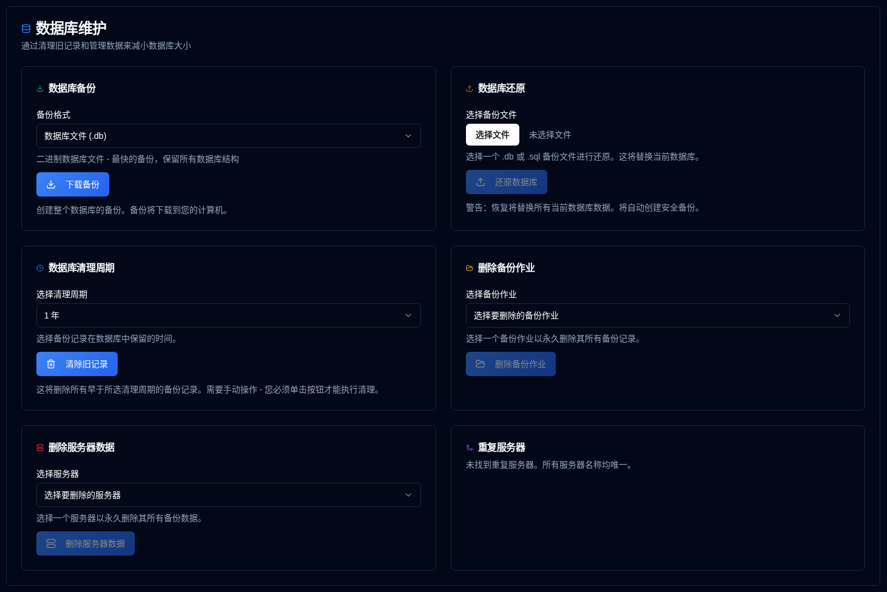

# 数据库维护 {#database-maintenance}

通过数据库维护操作管理您的备份数据并优化性能。

 

## 数据库备份 {#database-backup}

创建整个数据库的备份，以便安全保管或迁移。

1.  导航到 [设置 → 数据库维护](database-maintenance.md)。
2.  在 **数据库备份** 部分，选择一个备份格式：
    - **数据库文件 (.db)**：二进制格式 - 最快的备份，保留所有数据库结构
    - **SQL 转储 (.sql)**：文本格式 - 人类可读的 SQL 语句，可以在还原之前编辑
3.  点击 <IconButton icon="lucide:download" label="下载备份" />。
4.  备份文件将以时间戳文件名下载到您的计算机。

**备份格式：**

- **.db 格式**：推荐用于定期备份。使用 SQLite 的备份 API 创建数据库文件的精确副本，确保即使在使用数据库时也保持一致性。
- **.sql 格式**：用于迁移、检查或在还原之前需要编辑数据时。包含所有必要的 SQL 语句来重建数据库。

**最佳实践：**

- 在进行重大操作（清理、合并等）之前创建定期备份
- 将备份存储在与应用程序分开的安全位置
- 定期测试还原程序以确保备份有效

 

## 数据库还原 {#database-restore}

从以前创建的备份文件还原您的数据库。

1.  导航到 [设置 → 数据库维护](database-maintenance.md)。
2.  在 **数据库还原** 部分，点击文件输入并选择一个备份文件：
    - 支持的格式：`.db`、`.sql`、`.sqlite`、`.sqlite3`
    - 最大文件大小：100MB
3.  点击 <IconButton icon="lucide:upload" label="还原数据库" />。
4.  在对话框中确认操作。

**还原过程：**

- 在还原之前自动创建当前数据库的安全备份
- 用备份文件替换当前数据库
- 为安全而清除所有会话（用户必须重新登录）
- 在还原后验证数据库完整性
- 清除所有缓存以确保获取新数据

**还原格式：**

- **.db 文件**：直接替换数据库文件。最快的还原方法。
- **.sql 文件**：执行 SQL 语句来重建数据库。如果需要，可以实现选择性还原。

:::warning
还原数据库将 **替换所有当前数据**。此操作无法撤消。  
自动创建安全备份，但建议在还原之前创建自己的备份。
 
**重要提示：** 还原后，所有用户会话都将被清除以确保安全。您需要重新登录。
:::

**故障排除：**

- 如果还原失败，原始数据库将从安全备份自动还原
- 确保备份文件不受损坏且与预期格式匹配
- 对于大型数据库，还原过程可能需要几分钟

 

---

 

:::note
这适用于以下所有维护功能：所有仪表板、详细页面和图表上的统计信息都是使用 **duplistatus** 数据库中的数据计算得出的。删除旧信息将影响这些计算。
 
如果您不小心删除了数据，可以使用 [收集备份日志](../collect-backup-logs.md) 功能来恢复它。
:::

 

## 数据清理周期 {#data-cleanup-period}

删除过时的备份记录以释放存储空间并提高系统性能。

1.  导航到 [设置 → 数据库维护](database-maintenance.md)。
2.  选择一个保留周期：
    - **6 个月**：保留最近 6 个月的记录。
    - **1 年**：保留最近 1 年的记录。
    - **2 年**：保留最近 2 年的记录（默认）。
    - **删除所有数据**：删除所有备份记录和服务器。 
3.  点击 <IconButton icon="lucide:trash-2" label="清除旧记录" />。
4.  在对话框中确认操作。

**清理效果：**

- 删除选定周期之前的备份记录
- 更新所有相关统计信息和指标

:::warning

选择 "删除所有数据" 选项将 **永久删除系统中的所有备份记录和配置设置**。

强烈建议在执行此操作之前创建一个数据库备份。

:::

 

## 删除备份作业数据 {#delete-backup-job-data}

删除特定的备份作业（类型）数据。

1.  导航到 [设置 → 数据库维护](database-maintenance.md)。
2.  从下拉列表中选择一个备份作业。
    - 备份将按服务器别名或名称，然后按备份名称排序。
3.  点击 <IconButton icon="lucide:folder-open" label="删除备份作业" />。
4.  在对话框中确认操作。

**删除效果：**

- 永久删除与此备份作业/服务器相关的所有数据。
- 清除相关配置设置。
- 更新仪表板统计信息。

 

## 删除服务器数据 {#delete-server-data}

删除特定的服务器及其所有关联的备份数据。

1.  导航到 [设置 → 数据库维护](database-maintenance.md)。
2.  从下拉列表中选择一个服务器。
3.  点击 <IconButton icon="lucide:server" label="删除服务器数据" />。
4.  在对话框中确认操作。

**删除效果：**

- 永久删除选定的服务器及其所有备份记录
- 清除相关配置设置
- 更新仪表板统计信息

 

## 合并重复服务器 {#merge-duplicate-servers}

检测并合并具有相同名称但不同 ID 的重复服务器。使用此功能将它们合并为一个服务器条目。

当 Duplicati 的 `machine-id` 在升级或重新安装后发生变化时，就会发生这种情况。仅当存在重复服务器时才显示重复服务器。如果没有检测到重复项，节将显示一条消息，指示所有服务器具有唯一名称。

1.  导航到 [设置 → 数据库维护](database-maintenance.md).
2.  如果检测到重复服务器，会出现 **合并重复服务器** 部分。
3.  审查重复服务器组列表：
    - 每个组显示具有相同名称但不同 ID 的服务器
    - **目标服务器**（按创建日期最新）被突出显示
    - 将被合并的 **旧服务器 ID** 列出
4.  通过勾选每个组旁边的复选框来选择要合并的服务器组。
5.  点击 <IconButton icon="lucide:git-merge" label="合并选定的服务器" />.
6.  在对话框中确认操作。

**合并过程：**

- 所有旧服务器 ID 都合并到目标服务器（按创建日期最新）
- 所有备份记录和配置都转移到目标服务器
- 对于同一个备份名称，重复的 `backup_id` 值被合并为一个 ID（最近的备份行获胜）
- 旧服务器条目被删除
- 仪表板统计信息会自动更新

:::info[IMPORTANT]
此操作无法撤消。在确认之前建议进行数据库备份。  
:::

 
