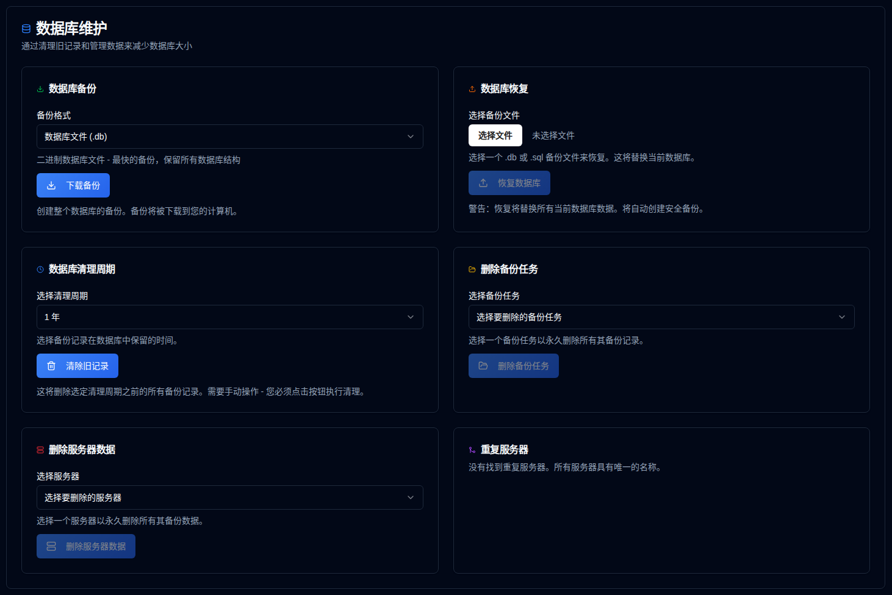

# 数据库维护 {/* #database-maintenance */}

通过数据库维护操作管理您的备份数据并优化性能。

 

## 数据库备份 {/* #database-backup */}

为安全保存或迁移目的创建整个数据库的备份。

1.  导航至 [设置 → 数据库维护](database-maintenance.md)。
2.  在 **数据库备份** 部分，选择备份格式：
    - **数据库文件 (.db)**: 二进制格式 - 最快的备份，完全保留所有数据库结构
    - **SQL 转储 (.sql)**: 文本格式 - 人类可读的 SQL 语句，可在恢复前编辑
3.  单击 <IconButton icon="lucide:download" label="下载备份" />。
4.  备份文件将下载到您的计算机，文件名带有时间戳。

**备份格式：**

- **.db 格式**: 推荐用于常规备份。使用 SQLite 的备份 API 创建数据库文件的精确副本，确保即使在数据库使用过程中也保持一致性。
- **.sql 格式**: 适用于迁移、检查或需要在恢复前编辑数据时。包含重新创建数据库所需的所有 SQL 语句。

**最佳实践：**

- 在进行重大操作（清理、合并等）之前定期创建备份
- 将备份存储在与应用程序分离的安全位置
- 定期测试恢复程序以确保备份有效

 

## 数据库恢复 {/* #database-restore */}

从先前创建的备份文件恢复数据库。

1.  导航至 [设置 → 数据库维护](database-maintenance.md)。
2.  在 **数据库恢复** 部分，单击文件输入框并选择一个备份文件：
    - 支持的格式：`.db`, `.sql`, `.sqlite`, `.sqlite3`
    - 最大文件大小：100MB
3.  单击 <IconButton icon="lucide:upload" label="恢复数据库" />。
4.  在对话框中确认操作。

**恢复过程：**

- 恢复前会自动创建当前数据库的安全备份
- 当前数据库将被备份文件替换
- 为安全起见，所有会话都将清除（用户必须重新登录）
- 恢复后将验证数据库完整性
- 清除所有缓存以确保数据最新

**恢复格式：**

- **.db 文件**: 直接替换数据库文件。最快的恢复方法。
- **.sql 文件**: 执行 SQL 语句以重新创建数据库。如需要，允许选择性恢复。

:::warning
恢复数据库将 **替换所有当前数据**。此操作无法撤消。  
会自动创建安全备份，但建议在恢复前创建自己的备份。
 
**重要：** 恢复后，为安全起见，所有用户会话都将清除。您需要重新登录。
:::

**故障排除：**

- 如果恢复失败，原始数据库将从安全备份中自动恢复
- 确保备份文件未损坏且符合预期格式
- 对于大型数据库，恢复过程可能需要几分钟时间

 

---

 

:::note
这适用于以下所有维护功能：仪表板上的所有统计信息、详细页面和图表都是使用 **duplistatus** 数据库中的数据计算的。删除旧信息将影响这些计算。

如果意外删除数据，可以使用[收集备份日志](../collect-backup-logs.md)功能进行恢复。
:::

cron 服务还会在每周日 04:00 UTC 时对数据库进行 **压缩**。该操作会删除其服务器已不存在的备份记录、没有剩余备份报告的服务器记录、遗留的备份监控和逾期通知设置、旧的每日摘要传递记录，并运行 SQLite `VACUUM` 来回收文件空间。删除服务器或备份任务仍会立即清理匹配的设置。

 

## 数据清理周期 {/* #data-cleanup-period */}

删除过时的备份记录以释放存储空间并提高系统性能。

1.  导航到[设置 → 数据库维护](database-maintenance.md)。
2.  选择保留周期：
    - **6 个月**：保留最近 6 个月的记录。
    - **1 年**：保留最近一年的记录。
    - **2 年**：保留最近 2 年的记录（默认）。
    - **删除所有数据**：删除所有备份记录和服务器。
3.  单击 <IconButton icon="lucide:trash-2" label="清除旧记录" />。
4.  在对话框中确认操作。

**清理效果：**

- 删除所选周期之前的备份记录
- 更新所有相关统计信息和指标

:::warning

选择“删除所有数据”选项将从系统中**永久删除所有备份记录和配置设置**。

强烈建议在此操作之前创建数据库备份。

:::

 

## 删除备份任务数据 {/* #delete-backup-job-data */}

删除特定备份任务（类型）的数据。

1.  导航到[设置 → 数据库维护](database-maintenance.md)。
2.  从下拉列表中选择一个备份任务。
    - 备份将按服务器别名或名称，然后是备份名称排序。
3.  单击 <IconButton icon="lucide:folder-open" label="删除备份任务" />。
4.  在对话框中确认操作。

**删除效果：**

- 永久删除与此备份任务/服务器关联的所有数据。
- 清理关联的配置设置。
- 相应更新仪表板统计数据。

 

## 删除服务器数据 {/* #delete-server-data */}

删除特定服务器及其所有关联的备份数据。

1.  导航到[设置 → 数据库维护](database-maintenance.md)。
2.  从下拉列表中选择一个服务器。
3.  单击 <IconButton icon="lucide:server" label="删除服务器数据" />。
4.  在对话框中确认操作。

**删除效果：**

- 永久删除所选服务器及其所有备份记录
- 清理关联的配置设置
- 相应更新仪表板统计数据

 

## 合并重复服务器 {/* #merge-duplicate-servers */}

检测并合并具有相同名称但不同 ID 的重复服务器。使用此功能将它们合并为单个服务器条目。

当 Duplicati 的 `machine-id` 在升级或重新安装后发生更改时，可能会出现这种情况。仅在存在重复服务器时才显示重复服务器。如果没有检测到重复项，该部分将显示一条消息，表明所有服务器都具有唯一名称。

1.  导航到 [设置 → 数据库维护](database-maintenance.md)。
2.  如果检测到重复服务器，将出现一个 **合并重复服务器** 部分。
3.  查看重复服务器组列表：
    - 每个组显示具有相同名称但不同 ID 的服务器
    - **目标服务器**（按创建日期最新）已高亮显示
    - 将要合并的 **旧服务器 ID** 单独列出
4.  通过选中每个组旁边的复选框来选择要合并的服务器组。
5.  单击 <IconButton icon="lucide:git-merge" label="合并所选服务器" />。
6.  在对话框中确认操作。

**合并过程：**

- 所有旧服务器 ID 都合并到目标服务器（按创建日期最新）
- 所有备份记录和配置都转移到目标服务器
- 相同备份名称的重复 `backup_id` 值被合并为单个 ID（最近的备份行优先）
- 旧服务器条目被删除
- 仪表板统计信息会自动更新

:::info[重要]
此操作无法撤消。建议在确认前进行数据库备份。
:::

 
