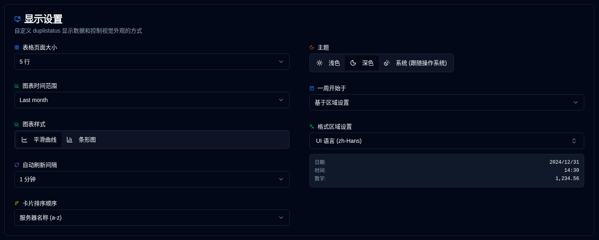

# 显示 {#display}

配置用户界面和显示首选项。

 

| 设置                   | 描述                                         | 默认值      |
|:--------------------------|:----------------------------------------------------|:-------------------|
| **表格大小**            | 服务器详细信息页面每页显示的行数。 | 5 行             |
| **主题**                 | 选择浅色、深色或匹配操作系统外观（更喜欢浅色/深色模式）。 | 跟随操作系统设置 |
| **图表时间范围**      | 图表中显示的时间间隔。可用选项：**1W**（最近 7 天），**2W**（最近 14 天），**1M**（最近 30 天），**3M**（最近 90 天）。您也可以直接从图表标题切换时间范围。 | 1 个月            |
| **图表样式**           | 选择平滑线图或条形图可视化。两种模式都使用时间桶聚合以实现最佳显示。您也可以直接从图表标题切换。 | 平滑曲线       |
| **格式区域设置**         | 选择一个独立于 UI 语言的格式区域设置（支持 416 个区域设置）。这会影响日期、时间和数字的显示方式。选择后会显示实时预览。示例：UI 语言 = 德语，格式区域设置 = 英语（英国）→ 德语 UI 与英国日期格式。 | 基于 UI 语言 |
| **自动刷新间隔** | 页面自动刷新的频率。              | 1 分钟           |
| **卡片排序顺序**      | 仪表盘上卡片的排序方式。              | 服务器名称 (a-z)  |
| **一周开始于**         | 配置一周开始于哪一天。                     | 基于区域设置    |

 

:::tip
**快速访问**：您可以通过在应用程序工具栏中右键单击自动刷新按钮快速访问此页面。
:::
