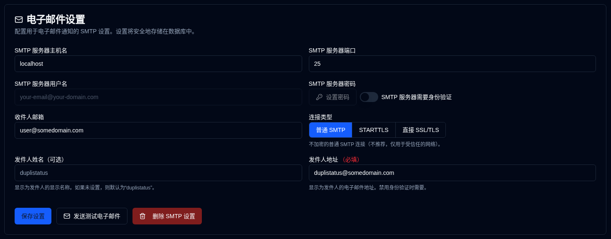

# 电子邮件 {#email}

**duplistatus** 支持通过 SMTP 发送电子邮件通知作为 NTFY 通知的替代或补充。电子邮件配置现在通过 Web 界面管理，并在数据库中使用加密存储以增强安全性。

| 设置                 | 描述                                                      |
|:------------------------|:-----------------------------------------------------------------|
| **SMTP 服务器主机**    | 您的电子邮件提供商的 SMTP 服务器 (例如，`smtp.gmail.com`)。      |
| **SMTP 服务器端口**    | 端口号 (通常为 `25` 的普通 SMTP，`587` 的 STARTTLS 或 `465` 的直接 SSL/TLS)。 |
| **连接类型**     | 选择普通 SMTP、STARTTLS 或直接 SSL/TLS。默认为新配置的直接 SSL/TLS。 |
| **SMTP 身份验证** | 切换以启用或禁用 SMTP 身份验证。当禁用时，用户名和密码字段不需要。 |
| **SMTP 用户名**       | 您的电子邮件地址或用户名 (当身份验证启用时需要)。 |
| **SMTP 密码**       | 您的电子邮件密码或应用程序特定密码 (当身份验证启用时需要)。 |
| **发件人名称**         | 在电子邮件通知中显示的发件人名称 (可选，默认为 "duplistatus")。 |
| **发件人地址**        | 显示为发件人的电子邮件地址。对于普通 SMTP 连接或禁用身份验证时需要。默认为 SMTP 用户名，当身份验证启用时。请注意，一些电子邮件提供商将用 `From Address` 覆盖 `SMTP Server Username`。 |
| **收件人电子邮件**     | 接收通知的电子邮件地址。必须是有效的电子邮件地址格式。 |

侧边栏中 **电子邮件** 旁边的 <IIcon2 icon="lucide:mail" color="green"/> 绿色图标表示您的设置有效。如果图标是 <IIcon2 icon="lucide:mail" color="yellow"/> 黄色，则您的设置无效或未配置。

图标显示为绿色，当所有必需字段都设置时：SMTP 服务器主机、SMTP 服务器端口、收件人电子邮件和 (SMTP 用户名 + 密码当身份验证需要时) 或 (发件人地址当身份验证不需要时)。

当配置不完全时，会显示一个黄色警报框，通知您在电子邮件设置正确填写之前不会发送任何电子邮件。[备份通知](backup-notifications-settings.md) 选项卡中的电子邮件复选框也将被灰显并显示 "(禁用)" 标签。

 

## 可用操作 {#available-actions}

| 按钮                                                           | 描述                                              |
|:-----------------------------------------------------------------|:---------------------------------------------------------|
| <IconButton label="保存设置" />                             | 保存对 NTFY 设置所做的更改。              |
| <IconButton icon="lucide:mail" label="发送测试电子邮件"/>         | 使用 SMTP 配置发送测试电子邮件。测试电子邮件显示 SMTP 服务器主机名、端口、连接类型、身份验证状态、用户名 (如果适用)、收件人电子邮件、发件人地址、发件人名称和测试时间戳。 |
| <IconButton icon="lucide:trash-2" label="删除 SMTP 设置"/> | 删除 / 清除 SMTP 配置。                   |

 

:::info[IMPORTANT]
  您必须使用 <IconButton icon="lucide:mail" label="发送测试电子邮件"/> 按钮来确保您的电子邮件设置有效，然后才能依赖它进行通知。

 即使您看到一个绿色 <IIcon2 icon="lucide:mail" color="green"/> 图标，且一切看起来都已配置，电子邮件可能仍然无法发送。
 
 **duplistatus** 只检查您的 SMTP 设置是否已填写，而不是电子邮件是否实际可以被送达。
:::

 

## 常见 SMTP 提供商 {#common-smtp-providers}

**Gmail:**

- 主机: `smtp.gmail.com`
- 端口: `587` (STARTTLS) 或 `465` (直接 SSL/TLS)
- 连接类型: 对于端口 587 使用 STARTTLS，对于端口 465 使用直接 SSL/TLS
- 用户名: 您的 Gmail 地址
- 密码: 使用应用程序密码（不是您的常规密码）。在 https://myaccount.google.com/apppasswords 生成一个
- 身份验证: 必需

**Outlook/Hotmail:**

- 主机: `smtp-mail.outlook.com`
- 端口: `587`
- 连接类型: STARTTLS
- 用户名: 您的 Outlook 电子邮件地址
- 密码: 您的账户密码
- 身份验证: 必需

**Yahoo Mail:**

- 主机: `smtp.mail.yahoo.com`
- 端口: `587`
- 连接类型: STARTTLS
- 用户名: 您的 Yahoo 电子邮件地址
- 密码: 使用应用程序密码
- 身份验证: 必需

### 安全最佳实践 {#security-best-practices}

- 考虑为通知使用专用电子邮件账户
 - 使用 "发送测试电子邮件" 按钮测试您的配置
 - 设置被加密并安全存储在数据库中
 - **使用加密连接** - STARTTLS 和直接 SSL/TLS 被推荐用于生产环境
 - 普通 SMTP 连接（端口 25）可用于可信的本地网络，但不推荐在非可信网络上用于生产环境
