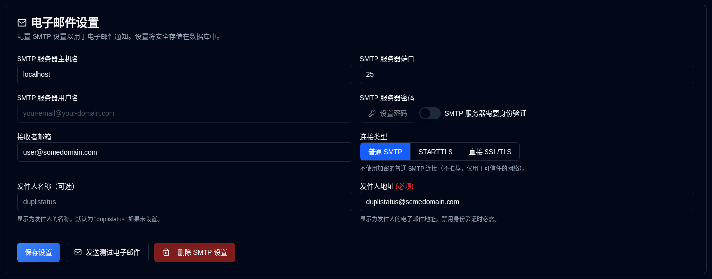

# 电子邮件 {/* #email */}

**duplistatus** 支持通过 SMTP 发送电子邮件通知，作为 NTFY 通知的替代或补充。电子邮件配置现在通过 Web 界面管理，并在数据库中加密存储以增强安全性。

| 设置                    | 描述                                                             |
|:------------------------|:-----------------------------------------------------------------|
| **SMTP 服务器主机**    | 您的电子邮件提供商的 SMTP 服务器（例如 `smtp.gmail.com`）。      |
| **SMTP 服务器端口**    | 端口号（通常 Plain SMTP 为 `25`，STARTTLS 为 `587`，Direct SSL/TLS 为 `465`）。 |
| **连接类型**     | 在 Plain SMTP、STARTTLS 或 Direct SSL/TLS 之间选择。新配置默认为 Direct SSL/TLS。 |
| **SMTP 认证** | 切换以启用或禁用 SMTP 认证。禁用时，用户名和密码字段不是必需的。 |
| **SMTP 用户名**       | 您的电子邮件地址或用户名（启用认证时必需）。 |
| **SMTP 密码**       | 您的电子邮件密码或应用专用密码（启用认证时必需）。 |
| **发件人姓名**         | 在电子邮件通知中显示的发件人名称（可选，默认为 "duplistatus"）。 |
| **发件人地址**        | 显示为发件人的电子邮件地址。Plain SMTP 连接或禁用认证时必需。启用认证时默认为 SMTP 用户名。请注意，某些电子邮件提供商会将 `From Address` 覆盖为 `SMTP Server Username`。 |
| **接收者邮箱**     | 接收通知的电子邮件地址。必须是有效的电子邮件地址格式。 |

侧边栏中 **电子邮件** 旁边的 <IIcon2 icon="lucide:mail" color="green"/> 绿色图标表示您的设置有效。如果图标是 <IIcon2 icon="lucide:mail" color="yellow"/> 黄色的，则表示您的设置无效或未配置。

当所有必填字段都设置时，图标显示为绿色：SMTP 服务器主机、SMTP 服务器端口、接收者邮箱，以及（需要认证时的 SMTP 用户名 + 密码）或（不需要认证时的发件人地址）。

当配置未完全配置时，会显示黄色警报框，告知您在正确填写电子邮件设置之前不会发送任何电子邮件。[备份通知](backup-notifications-settings.md) 选项卡中的电子邮件复选框也将变为灰色并显示 "(已禁用)" 标签。

 

## 可用操作 {/* #available-actions */}

| 按钮                                                             | 描述                                                     |
|:-----------------------------------------------------------------|:---------------------------------------------------------|
| <IconButton label="保存设置" />                             | 保存对 NTFY 设置所做的更改。              |
| <IconButton icon="lucide:mail" label="发送测试邮件"/>         | 使用 SMTP 配置发送测试电子邮件消息。测试邮件显示 SMTP 服务器主机名、端口、连接类型、认证状态、用户名（如适用）、接收者邮箱、发件人地址、发件人姓名和测试时间戳。 |
| <IconButton icon="lucide:trash-2" label="删除 SMTP 设置"/> | 删除/清除 SMTP 配置。当 [每日摘要](daily-summary-settings.md) 启用时禁用，因为该模式需要电子邮件。 |

 

:::info[重要]
  在依赖电子邮件发送通知之前，您必须使用<IconButton icon="lucide:mail" label="发送测试电子邮件"/>按钮确保电子邮件设置正常工作。

 即使您看到绿色的<IIcon2 icon="lucide:mail" color="green"/>图标和一切看似已配置完毕，电子邮件也可能无法发送。
 
 **duplistatus**仅检查您的SMTP设置是否已填写，而不检查电子邮件是否真正能够送达。

 如果后续发送失败，管理员会在工具栏中看到红色警报图标。请参阅[发送失败](../overview.md#delivery-failures)。
:::

 

## 常用 SMTP 提供商 {/* #common-smtp-providers */}

**Gmail：**

- 主机：`smtp.gmail.com`
- 端口：`587`（STARTTLS）或 `465`（直接 SSL/TLS）
- 连接类型：端口 587 使用 STARTTLS，端口 465 使用直接 SSL/TLS
- 用户名：您的 Gmail 地址
- 密码：使用应用密码（不是您的常规密码）。在 https://myaccount.google.com/apppasswords 生成一个
- 身份验证：必需

**Outlook/Hotmail：**

- 主机：`smtp-mail.outlook.com`
- 端口：`587`
- 连接类型：STARTTLS
- 用户名：您的 Outlook 电子邮件地址
- 密码：您的账户密码
- 身份验证：必需

**Yahoo 邮箱：**

- 主机：`smtp.mail.yahoo.com`
- 端口：`587`
- 连接类型：STARTTLS
- 用户名：您的 Yahoo 电子邮件地址
- 密码：使用应用密码
- 身份验证：必需

### 安全最佳实践 {/* #security-best-practices */}

- 考虑使用专用的电子邮件账户进行通知
 - 使用“发送测试电子邮件”按钮测试您的配置
 - 设置已加密并安全存储在数据库中
 - **使用加密连接** - 生产环境建议使用 STARTTLS 和直接 SSL/TLS
 - 普通 SMTP 连接（端口 25）可用于受信任的本地网络，但不建议在不受信任的网络上用于生产环境
