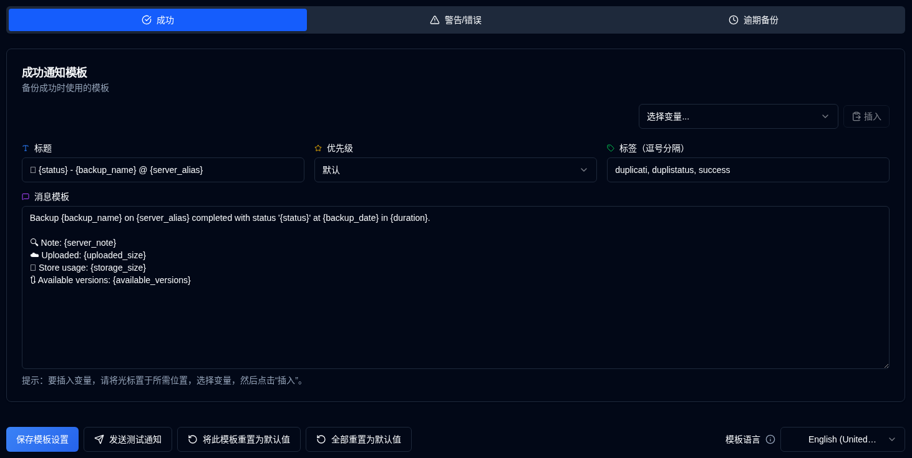

# 模板 {#templates}

**duplistatus** 使用三个模板用于通知消息。这些模板用于 NTFY 和 电子邮件 通知。

此页面包含一个 **模板语言** 选择器，用于设置默认模板的区域设置。更改语言会更新新默认值的区域设置，但**不会**更改现有模板的文本。要将新语言应用于模板，可以手动编辑，或使用 **将此模板重置为默认值**（针对当前标签页）或 **全部重置为默认值**（针对所有三个模板）。

| 模板           | 描述                                         |
| :----------------- | :-------------------------------------------------- |
| **成功**        | 备份成功完成时使用。            |
| **警告/错误**  | 备份完成时带有警告或错误时使用。 |
| **逾期备份** | 备份逾期时使用。                      |

 

## 模板语言 {#template-language}

页面顶部的**模板语言**选择器让您选择默认模板的语言（英语、德语、法语、西班牙语、葡萄牙语、印地语（罗马体）和简体中文）。更改语言会更新默认值的区域设置，但现有的自定义模板会保留其当前文本，直到您更新它们或使用其中一个重置按钮。

 

## 可用操作 {#available-actions}

| 按钮                                                              | 描述                                                                                         |
|:--------------------------------------------------------------------|:----------------------------------------------------------------------------------------------------|
| <IconButton label="保存模板设置" />                      | 保存设置时更改模板。该按钮保存显示的模板（成功、警告/错误或逾期备份）。 |
| <IconButton icon="lucide:send" label="发送测试通知"/>     | 更新模板后检查模板。变量将被替换为其名称进行测试。对于电子邮件通知，模板标题成为电子邮件主题行。 |
| <IconButton icon="lucide:rotate-ccw" label="将此模板重置为默认"/> | 恢复 **所选模板**（当前选项卡）的默认模板。重置后请记得保存。 |
| <IconButton icon="lucide:rotate-ccw" label="全部重置为默认值"/> | 将所有三个模板（成功、警告/错误、逾期备份）恢复为所选模板语言的默认值。记得在重置后保存。 |

 

## 变量 {#variables}

所有模板都支持将被替换为实际值的变量。以下表格显示了可用的变量:

| 变量               | 描述                                     | 可用在     |
|:-----------------------|:------------------------------------------------|:-----------------|
| `{server_name}`        | 服务器名称。                             | 所有模板    |
| `{server_alias}`       | 服务器别名。                            | 所有模板    |
| `{server_note}`        | 服务器注释。                            | 所有模板    |
| `{server_url}`         | Duplicati 服务器的 Web 配置 URL   | 所有模板    |
| `{backup_name}`        | 备份名称。                             | 所有模板    |
| `{status}`             | 备份状态（成功，警告，错误，严重错误）。 | 成功，警告 |
| `{backup_date}`        | 备份的日期和时间。                    | 成功，警告 |
| `{duration}`           | 备份的持续时间。                         | 成功，警告 |
| `{uploaded_size}`      | 上传的数据量。                        | 成功，警告 |
| `{storage_size}`       | 存储使用信息。                      | 成功，警告 |
| `{available_versions}` | 可用备份版本的数量。            | 成功，警告 |
| `{file_count}`         | 处理的文件数。                      | 成功，警告 |
| `{file_size}`          | 备份文件的总大小。                  | 成功，警告 |
| `{messages_count}`     | 消息数量。                             | 成功，警告 |
| `{warnings_count}`     | 警告数量。                             | 成功，警告 |
| `{errors_count}`       | 错误数量。                               | 成功，警告 |
| `{log_text}`           | 日志消息（警告和错误）              | 成功，警告 |
| `{last_backup_date}`   | 上次备份的日期。                        | 逾期          |
| `{last_elapsed}`       | 自上次备份以来经过的时间。             | 逾期          |
| `{expected_date}`      | 预期备份日期。                           | 逾期          |
| `{expected_elapsed}`   | 自预期日期以来经过的时间。           | 逾期          |
| `{backup_interval}`    | 间隔字符串（例如，"1D"，"2W"，"1M"）。       | 逾期          |
| `{overdue_tolerance}`  | 逾期容忍度设置。                      | 逾期          |
