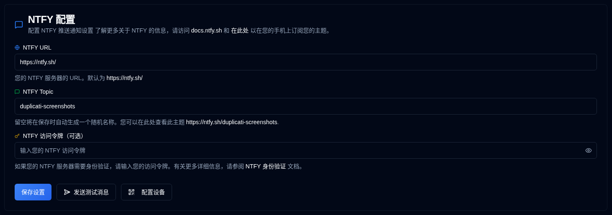

# NTFY {#ntfy}

[NTFY](https://github.com/binwiederhier/ntfy) 是一个简单的通知服务，可以将推送通知发送到您的手机或桌面。该部分允许您设置通知服务器连接和身份验证。

| 设置               | 描述                                                                                                                                   |
|:----------------------|:----------------------------------------------------------------------------------------------------------------------------------------------|
| **NTFY URL**          | 您的 NTFY 服务器的 URL（默认为公共 `https://ntfy.sh/`）。                                                                      |
| **NTFY Topic**        | 您的通知的唯一标识符。如果留空，系统将自动生成一个随机主题，或者您可以指定自己的主题。 |
| **NTFY Access Token** | 针对已身份验证的 NTFY 服务器的可选访问令牌。如果您的服务器不需要身份验证，请留空此字段。               |

 

侧边栏中 **NTFY** 旁边的 <IIcon2 icon="lucide:message-square" color="green"/> 绿色图标表示您的设置有效。如果图标是 <IIcon2 icon="lucide:message-square" color="yellow"/> 黄色，则您的设置无效。
当配置无效时，[`Backup Notifications`](backup-notifications-settings.md) 选项卡中的 NTFY 复选框也将被灰显。

## 可用操作 {#available-actions}

| 按钮                                                                | 描述                                                                                                  |
|:----------------------------------------------------------------------|:-------------------------------------------------------------------------------------------------------------|
| <IconButton label="保存设置" />                                  | 保存对 NTFY 设置所做的任何更改。                                                                  |
| <IconButton icon="lucide:send-horizontal" label="发送测试消息"/> | 向您的 NTFY 服务器发送测试消息以检查您的配置。                                         |
| <IconButton icon="lucide:qr-code" label="配置设备"/>          | 显示一个 QR 码，允许您快速为 NTFY 通知配置您的移动设备或桌面。 |

## 设备配置 {#device-configuration}

在配置设备之前，您应该在设备上安装 NTFY 应用程序（[查看此处](https://ntfy.sh/））。单击 <IconButton icon="lucide:qr-code" label="配置设备"/> 按钮或在应用程序工具栏中右键单击 <SvgButton svgFilename="ntfy.svg" /> 图标，将显示一个 QR 码。扫描此 QR 码将自动使用正确的 NTFY 主题配置您的设备以接收通知。

 

 

:::caution
如果您使用没有访问令牌的公共 **ntfy.sh** 服务器，任何人都可以使用您的主题名称查看您的通知。 
 
为了提供一定的隐私保护，会生成一个随机的 12 个字符的主题，提供超过 3 千万亿（3,000,000,000,000,000,000,000）种可能的组合，使其难以猜测。

为了提高安全性，请考虑使用 [访问令牌身份验证](https://docs.ntfy.sh/config/#access-tokens) 和 [访问控制列表](https://docs.ntfy.sh/config/#access-control-list-acl) 来保护您的主题，或者 [自托管 NTFY](https://docs.ntfy.sh/install/#docker) 以获得完全的控制权。

⚠️ **您负责保护您的 NTFY 主题。请自行决定是否使用此服务。**
:::

 
 

:::note
所有产品名称、标志和商标都是其各自所有者的财产。图标和名称仅用于识别目的，不意味着认可。
:::
