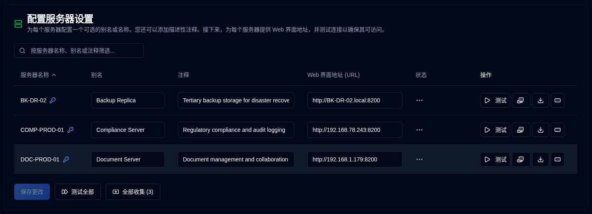

# 服务器 {#server}

您可以在此处配置服务器的替代名称（别名）、描述其功能的注释以及 Duplicati 服务器的 Web 地址。

| 设置                         | 描述                                                                                                                                                  |
|:--------------------------------|:---------------------------------------------------------------------------------------------------------------------------------------------------------------------------------------------|
| **服务器名称**                 | 在 Duplicati 服务器中配置的服务器名称。如果服务器设置了密码，则会出现一个 <IIcon2 icon="lucide:key-round" color="#42A5F5"/>。                                         |
| **别名**                       | 服务器的昵称或人类可读的名称。当您悬停在别名上时，它将显示其名称；在某些情况下，为了使其清晰，它将显示别名和名称之间的括号。 |
| **注释**                        | 用于描述服务器功能、安装位置或其他任何信息的自由文本。当配置时，它将在服务器的名称或别名旁边显示。                 |
| **Web 界面地址 (URL)** | 配置访问 Duplicati 服务器 UI 的 URL。支持 `HTTP` 和 `HTTPS` URL。                                                                                           |
| **状态**                      | 显示测试或收集备份日志的结果                                                                                                                                              |
| **操作**                     | 您可以测试、打开 Duplicati 界面、收集日志并设置密码，见下文了解更多详细信息。                                                                                         |

 

:::note
如果 Web 界面地址 (URL) 未配置，则 <SvgIcon svgFilename="duplicati_logo.svg" /> 按钮将在所有页面中被禁用，且服务器将不在 [Duplicati 配置](../duplicati-configuration.md) <SvgButton svgFilename="duplicati_logo.svg" href="../duplicati-configuration"/> 列表中显示。
:::

 

## 每个服务器的可用操作 {#available-actions-for-each-server}

| 按钮                                                                                                      | 描述                                                             |
|:------------------------------------------------------------------------------------------------------------|:------------------------------------------------------------------------|
| <IconButton icon="lucide:play" label="测试"/>                                                               | 测试与 Duplicati 服务器的连接。                            |
| <SvgButton svgFilename="duplicati_logo.svg" />                                                              | 在新浏览器标签页中打开 Duplicati 服务器的 Web 界面。         |
| <IconButton icon="lucide:download" />                                                                       | 从 Duplicati 服务器收集备份日志。                          |
| <IconButton icon="lucide:rectangle-ellipsis" /> &nbsp; 或 <IIcon2 icon="lucide:key-round" color="#42A5F5"/> | 更改或设置 Duplicati 服务器的密码以收集备份。 |

 

:::info[IMPORTANT]

为了保护您的安全，您只能执行以下操作:
- 为服务器设置密码
- 完全删除（删除）密码
 密码存储在数据库中以加密形式存储，并且永远不会在用户界面中显示。
:::

 

## 所有服务器的可用操作 {#available-actions-for-all-servers}

| 按钮                                                     | 描述                                     |
|:-----------------------------------------------------------|:------------------------------------------------|
| <IconButton label="保存更改" />                        | 保存对服务器设置所做的更改。   |
| <IconButton icon="lucide:fast-forward" label="测试全部"/>  | 测试与所有 Duplicati 服务器的连接。   |
| <IconButton icon="lucide:import" label="全部收集 (#)"/> | 从所有 Duplicati 服务器收集备份日志。 |

 
