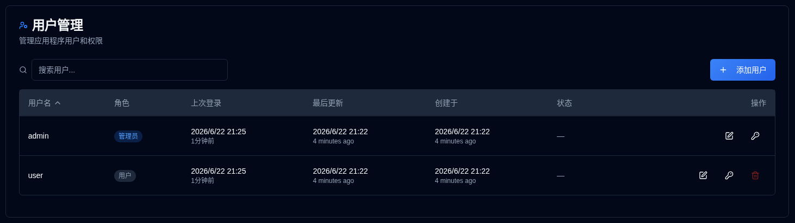

# 用户 {#users}

管理用户账户，权限和访问控制的 **duplistatus**。此部分允许管理员创建，修改和删除用户账户。

>[!TIP] 
> 默认的 `admin` 账户可以被删除。要做到这一点，首先创建一个新的管理员用户，使用该账户登录， 
> 然后删除 `admin` 账户。
> 
> 默认的 `admin` 账户密码是 `Duplistatus09`。您将被要求在第一次登录时更改它。

## 访问用户管理 {#accessing-user-management}

您可以通过两种方式访问用户管理部分：

1. **从用户菜单**：点击 [应用程序工具栏](../overview.md#application-toolbar) 中的 <IconButton icon="lucide:user" label="用户名" />   并选择 "管理员用户"。

2. **从设置**：点击 <IconButton icon="lucide:settings"/> 和 **用户** 在设置侧边栏中

## 创建新用户 {#creating-a-new-user}

1. 点击 <IconButton icon="lucide:plus" label="添加用户"/> 按钮
2. 输入用户详细信息：
   - **用户名**：必须是 3-50 个字符，唯一，大小写不敏感
   - **管理员**：检查以授予管理员权限
   - **要求密码更改**：检查以强制在第一次登录时更改密码
   - **密码**： 
     - 选项 1：检查 "自动生成密码" 以创建安全的临时密码
     - 选项 2：取消检查并输入自定义密码
3. 点击 <IconButton icon="lucide:user-plus" label="创建用户" />。

## 编辑用户 {#editing-a-user}

1. 点击用户旁边的 <IconButton icon="lucide:edit" /> 编辑图标
2. 修改以下任意内容：
   - **用户名**：更改用户名（必须唯一）
   - **管理员**：切换管理员权限
   - **要求密码更改**：切换密码更改要求
3. 点击 <IconButton icon="lucide:check" label="保存更改" />。

## 重置用户密码 {#resetting-a-user-password}

1. 点击用户旁边的 <IconButton icon="lucide:key-round" /> 密钥图标
2. 确认密码重置
3. 将生成并显示新的临时密码
4. 复制密码并安全地提供给用户

## 删除用户 {#deleting-a-user}

1. 点击用户旁边的 <IconButton icon="lucide:trash-2" /> 删除图标
2. 在对话框中确认删除。 **用户删除是永久的，无法撤消。**

## 账户锁定 {#account-lockout}

账户在多次失败的登录尝试后会被自动锁定：
- **锁定阈值**：5 次失败的尝试
- **锁定持续时间**：15 分钟
- 被锁定的账户在锁定期限过期之前无法登录

## 恢复管理员访问 {#recovering-admin-access}

如果您丢失了管理员密码或被锁定出您的账户，您可以使用管理员恢复脚本恢复访问权限。请参阅[管理员账户恢复](../admin-recovery.md)指南，以获取在Docker环境中恢复管理员访问权限的详细说明。
