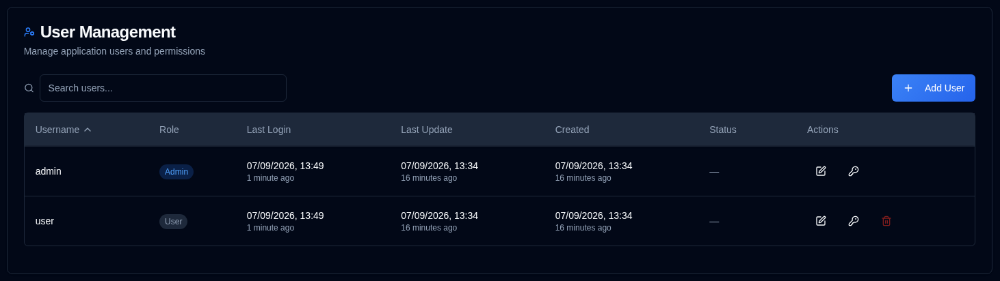

# 用户 {/* #users */}

管理 **duplistatus** 的用户账户、权限和访问控制。本节允许管理员创建、修改和删除用户账户。

>[!TIP] 
> 默认的 `admin` 账户可以被删除。要执行此操作，首先创建一个新的管理员用户，使用该账户登录，
> 然后删除 `admin` 账户。
>
> `admin` 账户的默认密码是 `Duplistatus09`。您需要在首次登录时更改它。

## 访问用户管理 {/* #accessing-user-management */}

您可以通过两种方式访问用户管理部分：

1. **从用户菜单**：单击 [应用程序工具栏](../overview.md#application-toolbar) 中的 <IconButton icon="lucide:user" label="用户名" /> 并选择"管理员用户"。

2. **从设置**：单击设置侧边栏中的 <IconButton icon="lucide:settings"/> 和 **用户**

## 创建新用户 {/* #creating-a-new-user */}

1. 单击 <IconButton icon="lucide:plus" label="添加用户"/> 按钮
2. 输入用户详细信息：
   - **用户名**：必须为 3-50 个字符，唯一，不区分大小写
   - **管理员**：勾选以授予管理员权限
   - **要求密码更改**：勾选以强制在首次登录时更改密码
   - **密码**：
     - 选项 1：勾选"自动生成密码"以创建安全的临时密码
     - 选项 2：取消勾选并输入自定义密码
3. 单击 <IconButton icon="lucide:user-plus" label="创建用户" />。

## 编辑用户 {/* #editing-a-user */}

1. 点击用户旁边的 <IconButton icon="lucide:edit" /> 编辑图标
2. 修改以下任意项：
   - **用户名**：更改用户名（必须唯一）
   - **管理员**：切换管理员权限。开启此选项可访问所有服务器并清除自定义服务器列表。关闭此选项将重置为所有服务器
   - **要求更改密码**：切换是否要求更改密码
3. 点击 <IconButton icon="lucide:check" label="保存更改" />。

## 重置用户密码 {/* #resetting-a-user-password */}

1. 点击用户旁的 <IconButton icon="lucide:key-round" /> 密钥图标
2. 建议密码已自动填入并显示。编辑会隐藏密码；点击查看图标可再次显示，然后复制。
3. 默认勾选 **下次登录时要求更改密码**。如果用户需要保留此密码，请取消勾选。
4. 点击 **重置密码**。密码将不再显示。

## 删除用户 {/* #deleting-a-user */}

1. 单击用户旁边的 <IconButton icon="lucide:trash-2" /> 删除图标
2. 在对话框中确认删除。**用户删除是永久性的且无法撤消。**

## 服务器可见性 {/* #server-visibility */}

管理员始终可以看到所有服务器。在用户列表中，**所有服务器**是一个开关。保持开启状态，以应用于当前和未来的所有服务器。将其关闭可展开行并选择服务器。表头复选框用于选择或清除可见行。保存后，每个选定的服务器将显示为别名（名称），并带有编辑图标以更改列表。新服务器在勾选前保持隐藏状态。不勾选任何项意味着用户看不到任何服务器。此时，仪表板、服务器详情、备份历史、图表和设置列表将仅包含这些服务器。针对其他服务器的直接链接或 API 请求将被视为未找到。外部 API 密钥不受此授权的限制。

## 账户锁定 {/* #account-lockout */}

多次登录尝试失败后，账户将自动锁定：
- **锁定阈值**：5 次失败尝试
- **锁定持续时间**：15 分钟
- 锁定的账户在锁定期结束前无法登录

## 恢复管理员访问 {/* #recovering-admin-access */}

如果您丢失了管理员密码或被锁定账户，您可以使用管理员恢复脚本来恢复访问。请参阅 [管理员账户恢复](../admin-recovery.md) 指南，了解在 Docker 环境中恢复管理员访问的详细说明。

如果浏览器在登录表单之前显示**拒绝访问**（HTTP 403），请改用[被IP白名单锁定](../troubleshooting.md#locked-out-by-ip-allowlist)进行恢复。
