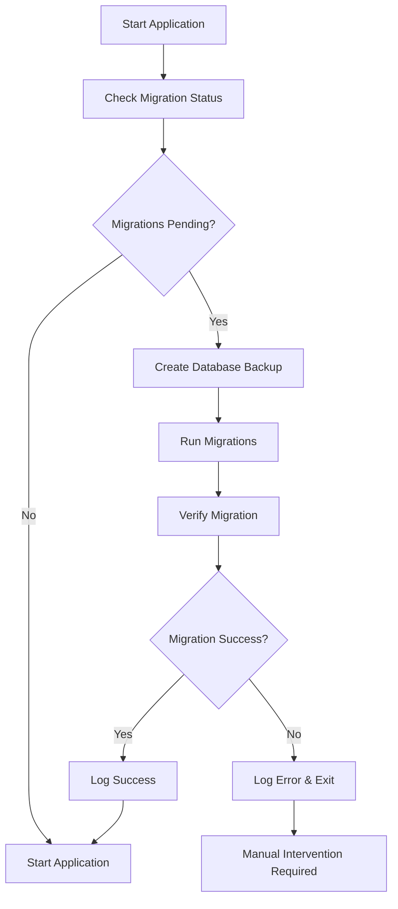

# Migration Overview


Overview of database migrations and version upgrades for duplistatus.

## Migration System

duplistatus includes an automated migration system that handles database schema updates when upgrading between versions.

### How It Works

1. **Automatic Detection**: The system detects pending migrations on startup
2. **Backup Creation**: A backup of the current database is created before migration
3. **Schema Updates**: Database schema is updated to the new version
4. **Data Migration**: Existing data is migrated to the new schema
5. **Verification**: Migration is verified and logged

### Migration Process



## Version History

### Version 0.7.27 Migration
Major schema changes introduced in version 0.7.27:

- **Server Table**: Renamed `machines` to `servers`
- **API Changes**: Updated response formats
- **New Features**: Enhanced notification system
- **Database Optimization**: Improved indexing and performance

### Version 0.8.x Migration
Additional improvements in version 0.8.x:

- **Enhanced Monitoring**: New overdue backup detection
- **Improved Notifications**: Better notification templates
- **Performance**: Database query optimization
- **Security**: Enhanced authentication and validation

## Migration Safety

### Automatic Backups
Before any migration, the system automatically creates a backup:

```
backups-copy-YYYY-MM-DDTHH-MM-SS.db
```

### Rollback Procedure
If a migration fails, you can rollback:

1. Stop the duplistatus container
2. Replace the current database with the backup
3. Restart with the previous version
4. Report the issue for investigation

### Data Preservation
All existing data is preserved during migration:
- Server configurations
- Backup history
- Notification settings
- User preferences

## Monitoring Migrations

### Log Messages
Look for these messages in the logs:

```
Found X pending migrations
Running consolidated migration X.0...
Migration X.0 completed successfully
Database backup created: /path/to/backup.db
All migrations completed successfully
```

### Error Handling
If migration fails, you'll see:

```
Migration X.0 failed: [error details]
Database backup available at: /path/to/backup.db
Manual intervention required
```

## Best Practices

### Before Migration
1. **Backup**: Create an additional manual backup
2. **Test**: Test migration in a development environment
3. **Monitor**: Watch the migration process
4. **Document**: Note any custom configurations

### After Migration
1. **Verify**: Check that all data is present
2. **Test**: Test application functionality
3. **Monitor**: Watch for any issues
4. **Update**: Update any external integrations

## Troubleshooting

### Common Issues

#### Migration Timeout
- **Cause**: Large database or slow system
- **Solution**: Increase timeout settings or run during low usage

#### Disk Space
- **Cause**: Insufficient space for backup
- **Solution**: Free up disk space before migration

#### Permission Issues
- **Cause**: Database file permissions
- **Solution**: Check file ownership and permissions

### Recovery Steps

1. **Stop Application**: Stop the duplistatus container
2. **Restore Backup**: Copy backup file to database location
3. **Check Permissions**: Ensure proper file permissions
4. **Restart**: Start with previous version
5. **Investigate**: Check logs for root cause

## Migration Scripts

### Manual Migration
If needed, you can run migrations manually:

```bash
# Check migration status
docker exec duplistatus node scripts/check-migrations.js

# Run specific migration
docker exec duplistatus node scripts/run-migration.js --version 0.7.0

# Create manual backup
docker exec duplistatus node scripts/backup-database.js
```

### Database Inspection
Inspect the database structure:

```bash
# Connect to database
docker exec -it duplistatus sqlite3 /app/data/backups.db

# Check tables
.tables

# Check migration history
SELECT * FROM migrations;

# Check schema
.schema
```

## Support

### Getting Help
If you encounter migration issues:

1. **Check Logs**: Review container logs for error details
2. **Documentation**: Consult this migration guide
3. **Community**: Ask for help in GitHub discussions
4. **Issues**: Report bugs in GitHub issues

### Reporting Issues
When reporting migration issues, include:

- Current version
- Target version
- Error messages
- Database size
- System specifications
- Migration logs

## Next Steps

- **Version 0.7 Migration**: Learn about [Version 0.7 Changes](version-0.7.md)
- **API Changes**: Review [API Breaking Changes](api-changes.md)
- **Troubleshooting**: Check [User Guide Troubleshooting](../user-guide/troubleshooting.md)
- **Support**: Get help from the [Community](https://github.com/wsj-br/duplistatus/discussions)
