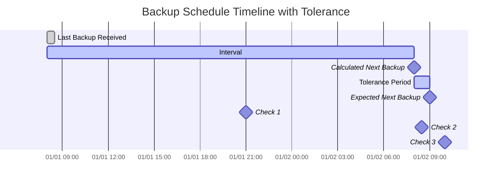

# Enhanced Overdue Monitoring (Version 0.8.x)

Version 0.8.x introduces enhanced overdue monitoring with support for custom intervals that match your Duplicati server configuration exactly.

## Enhanced Features

- **Custom Interval Support**: Configure intervals using Duplicati-compatible format (e.g., "1D12h" for 1 day and 12 hours)
- **Automatic Synchronisation**: When collecting backup logs, **duplistatus** automatically updates overdue intervals from your Duplicati configuration
- **Duplicati-Server Compatibility**: Intervals support the same formats used by Duplicati (days, weeks, months, and custom combinations)
- **Bulk Collection**: Collect backup logs from all configured servers with a single action
- **Individual Notifications**: Enable NTFY and/or email notifications independently for each backup job

## Configuration Options

**Per-Backup Settings:**

- **Expected Backup Interval**: Custom interval format (e.g., "1D", "1W", "2M", "1D12h30m")
- **Notification Channels**: Separate toggles for NTFY and email notifications
- **Overdue Monitoring**: Enable/disable overdue checks per backup
- **Reset Function**: Reset overdue notification timers individually

**Global Settings:**

- **Overdue Tolerance**: Grace period before marking backups as overdue (5 minutes to 1 day)
- **Notification Frequency**: How often to send overdue notifications (one time, daily, weekly, monthly)
- **Monitoring Interval**: How frequently to check for overdue backups (1 to 2 hours)

## Automatic Configuration

When you collect backup logs from a Duplicati server, **duplistatus** automatically:

- Extracts the backup schedule from the Duplicati configuration
- Updates the overdue monitoring intervals to match exactly
- Synchronises allowed weekdays and scheduled times
- Preserves your notification preferences

> [!TIP]
> For best results, collect backup logs after changing backup job intervals in your Duplicati server. This ensures **duplistatus** stays synchronised with your current configuration.

 

## Overdue Check Process

**How it works:**

| **Step** | **Value**                  | **Description**                                   | **Example**        |
| :------: | :------------------------- | :------------------------------------------------ | :----------------- |
|    1     | **Last Backup**            | The timestamp of the last successful backup.      | `2024-01-01 08:00` |
|    2     | **Expected Interval**      | The configured backup frequency.                  | `1 day`            |
|    3     | **Calculated Next Backup** | `Last Backup` + `Expected Interval`               | `2024-01-02 08:00` |
|    4     | **Tolerance**              | The configured grace period (extra time allowed). | `1 hour`           |
|    5     | **Expected Next Backup**   | `Calculated Next Backup` + `Tolerance`            | `2024-01-02 09:00` |

A backup is considered **overdue** if the current time is later than the `Expected Next Backup` time.

**Examples based on the timeline above:**

- At `2024-01-01 21:00` (🔹Check 1), the backup is **on time**.
- At `2024-01-02 08:30` (🔹Check 2), the backup is **on time**, as it is still within the tolerance period.
- At `2024-01-02 10:00` (🔹Check 3), the backup is **overdue**, as this is after the `Expected Next Backup` time.

  
